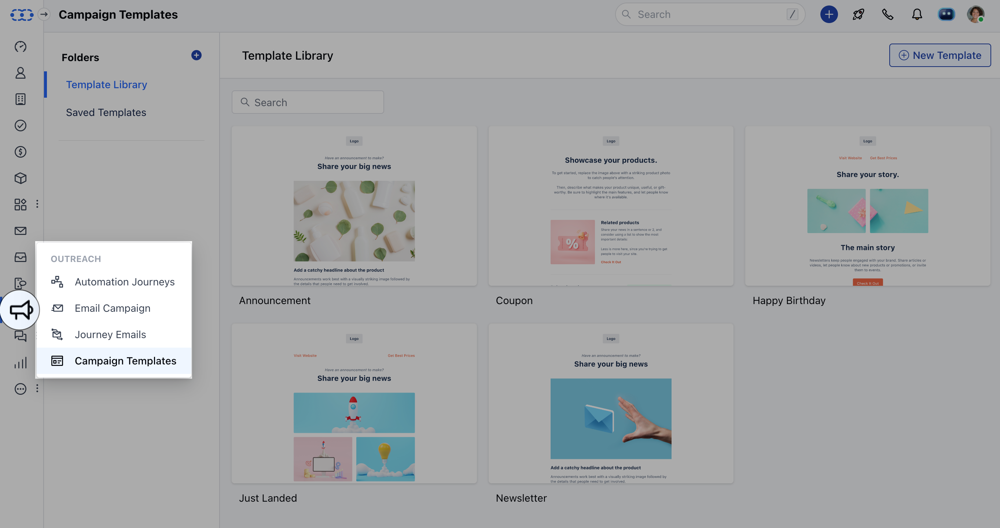
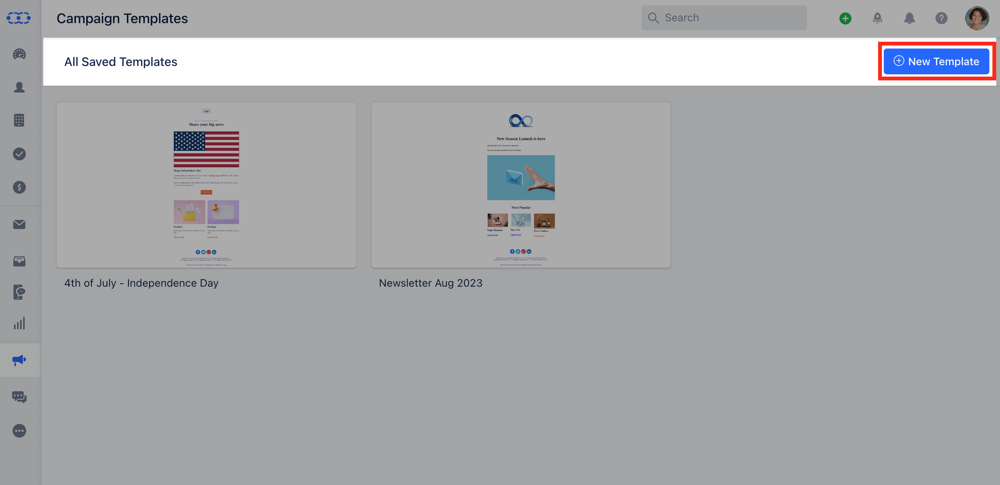
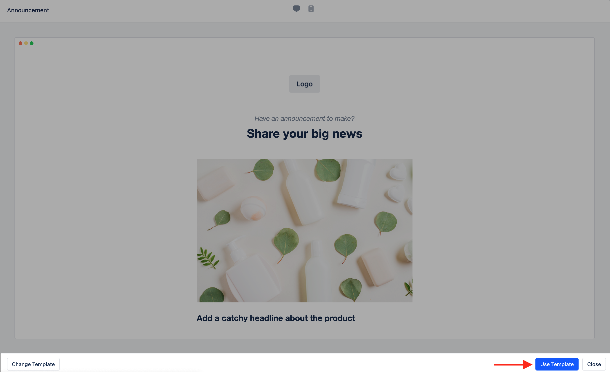
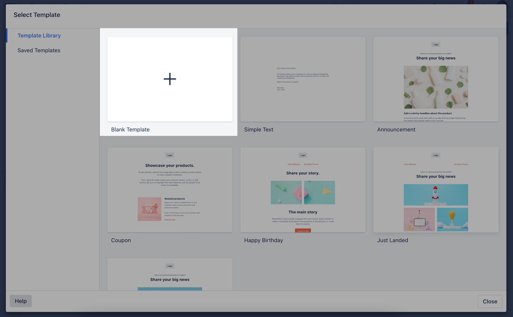
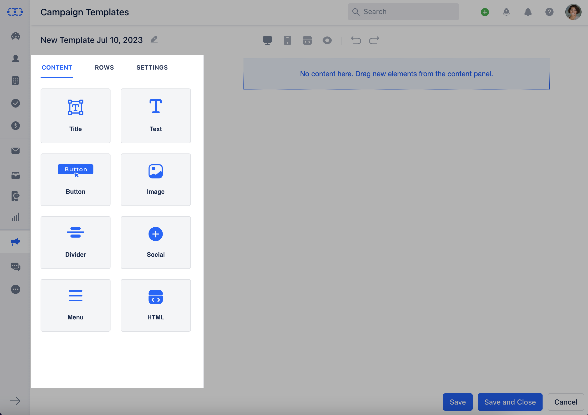
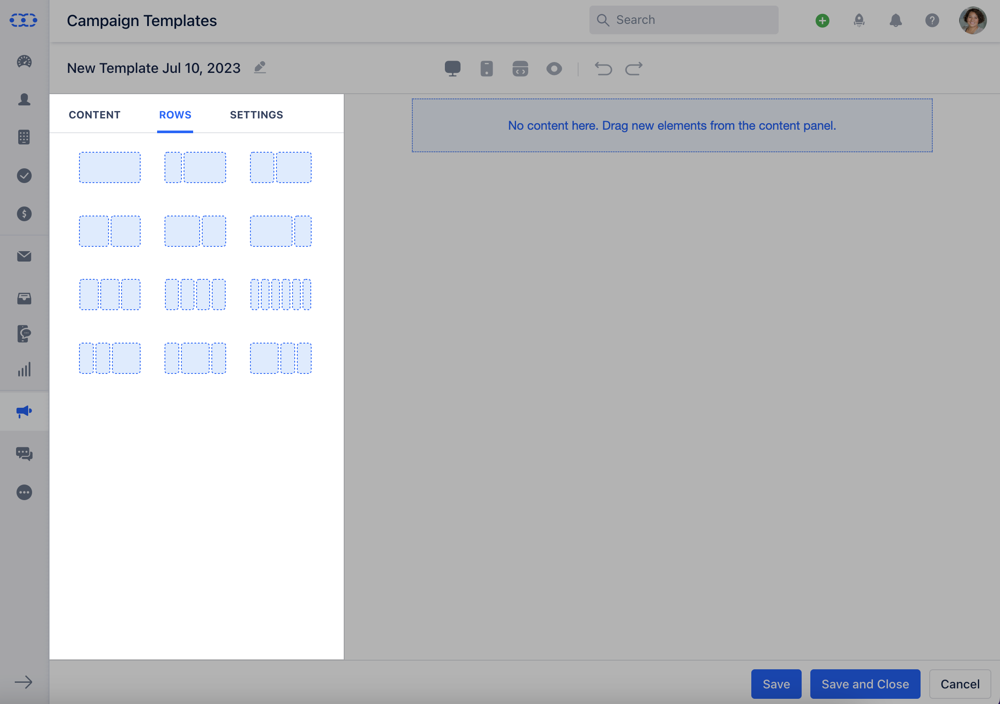
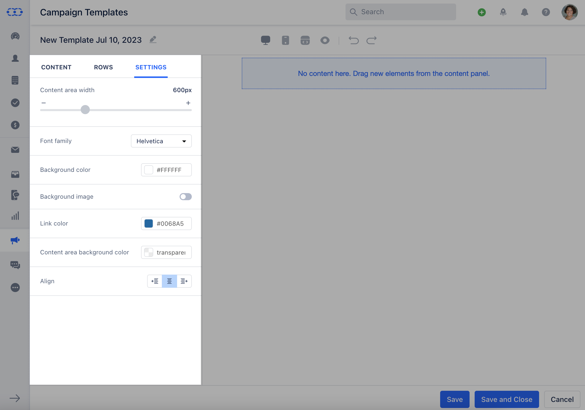
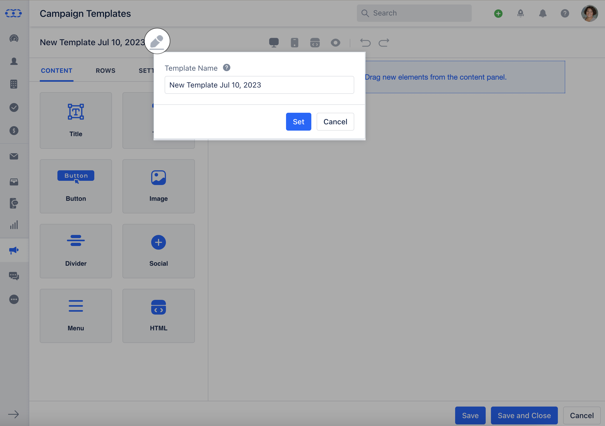
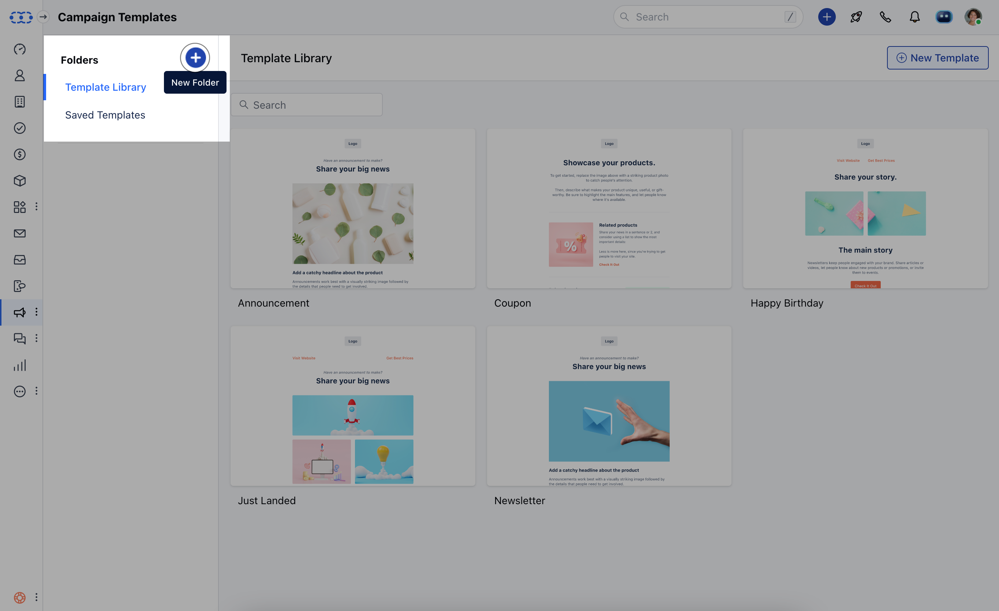
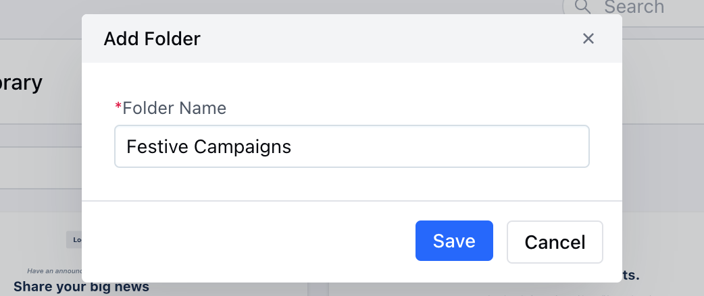

A campaign template provides you with a set of processes to create high-impact, repeatable marketing campaigns. Using templates can help speed up your campaign creation process and reduce errors. Salesmate has simplified this task for you. It allows you to create and personalize your own template and use it for different types of campaigns.

###  **Topics covered:**

[**How to Use Prebuild Templates**](#how-to-use-the-prebulid-templates)
**
[How to Create a New Template](#how-to-create-a-new-template)
**
[**How to Create New Template Folders**](#how-to-create-new-template-folders)
**To create Campaign templates:**Navigate to the **Outreach Icon** on the left menu barClick on **Campaign Template**

Click on **\+ New Template**

A Template Library would open with the Pre-build Templates and the option to create a New Template

###  How to Use the Prebulid Templates

To use the Pre-build Templates,

Click on the **Template** that you would like to use.The Template will get opened in a **Preview mode** Click on **Use Template**. Edit the Template as per your choice.

###  How to Create a New Template

To create a New Template

Click on **Blank Template**

Drag and drop the given blocks for adding any related Content

- **Title:** Can be used to display your product Titles in different formats.

- **Text:** Can be used to add your Text Content, you can use the text toolbar to change the formatting of the text.

- **Button:** This is useful for offering the message recipient options to choose from, such as pre-determined responses to a question, or actions to take or to redirect them to the specific page.

- **Images:** Can be used to add Images or gif's to your Templates

- **Divider:** Cab be used to divide the Content into parts

- **Social Links:** Can be used to add your Organizations social links

- **Menu:** Can be used to provide different options in a Template

- **HTML:** Can be used to create a Template using the HTML code

A User can Use any of the below rows as per the Template requirements

Once the Content is added, you can change the following details under **Settings**,** Content Area Width **Font Family **Background Colour **Background Image **Link Color **Content Area Background Color **Alignment **

Once all is done, click on Save Your Template would now be successfully created.Once the Template is ready click on the **Pencil Icon** on the top right to update the **Template name.

- **Hit ** Save **

**

###  How to Create New Template Folders

To create new Template Folders,

Navigate to the **Outreach Icon** on the left menu barClick on **Campaign Template**

Click on the Add **New Folder** option

Enter the **Folder Name** Click on ** Save **

**
