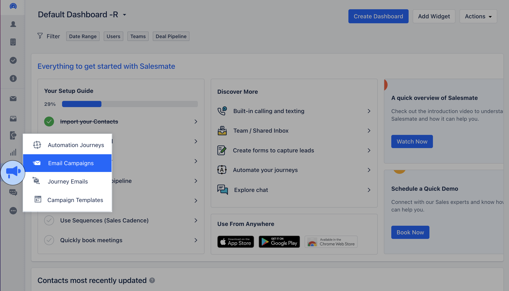
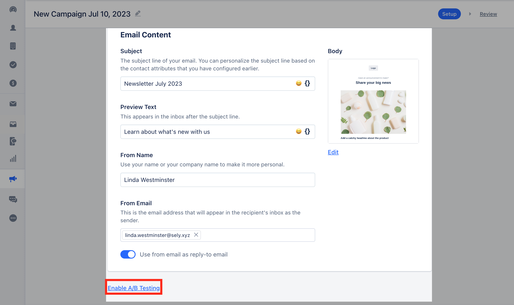
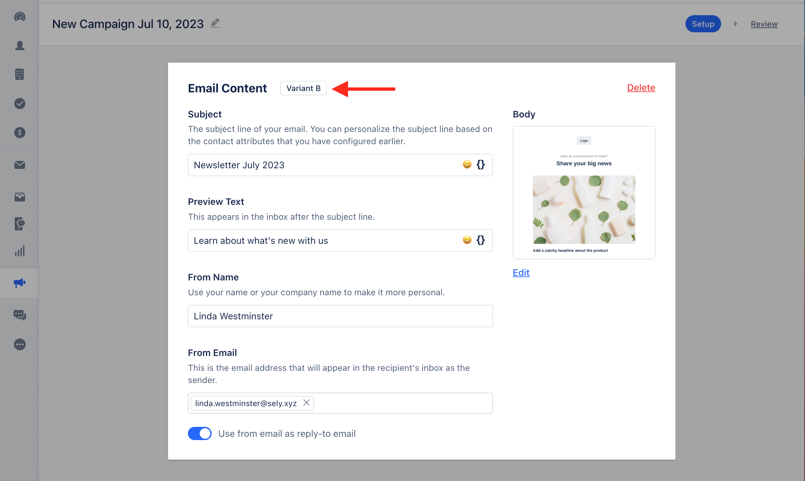
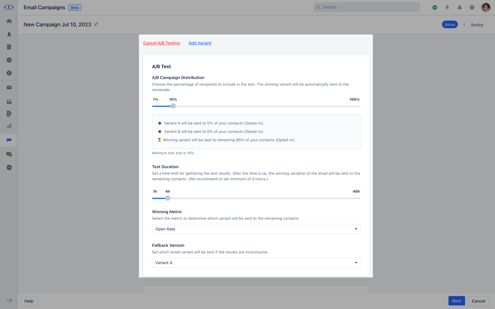

Campaign A/B Split is a common technique used in marketing campaigns to compare the performance of two different variations of a campaign. The purpose is to determine which version performs better in terms of a specific metric or goal. It involves dividing the target audience into two groups and presenting each group with a different version of the campaign.Topics Covered:

- [**How to Use Campaign A/B Testing**](#how-to-use-campaign-ab-testing)
- [**A/B Test Configuartion**](#ab-test-configuration-ab-campaign-distributionchoose-the-percentage-of-receipts-to-include-in-the-test-so-that-the-winning-variant-will-automatically-be-sent-to-the-remaindersuppose-you-select-ab-campaign-distribution-as-40-then-it-would-be-tested-with-20-of-emails-will-be-sent-to-variant-a-and-20-of-the-emails-will-be-sent-to-variant-b-winning-variant-will-be-sent-to-the-remaining-60-of-the-contacts)

### How to Use Campaign A/B Testing

Navigate to the **Outreach Icon** on the left menu barClick on **Email Campaign**

Click on **+Campaign** Head over to** Enable **A/B Testing.

Once you enable this option a new variant will get created replicating all the values from the previous variant to the new A/B Split.

You can make changes to the Template or the Subject Line of the new Variant based on your requirement.Salesmate allows you to create a maximum of **3 variants** for a campaignIf you cancel A/B Testing, then all variants will get canceled except the one that was created first.

### A/B Test Configuration **A/B Campaign Distribution:**Choose the percentage of receipts to include in the Test so that the winning variant will automatically be sent to the remainder.Suppose you select A/B Campaign Distribution as 40% then it would be tested with 20% of emails will be sent to Variant A and 20 % of the emails will be sent to Variant B. Winning variant will be sent to the remaining 60% of the contacts.

- **Test Duration

- **You need to be set for the time to test the variant. After the time is up the winning variant will be sent to remaining contacts.You need to set a minimum of 4 hrs of duration time and the Maximum test duration time for any campaign would be up to 48hrs. You cannot set the slider to be below 10%100% A/B Distribution will be equally set distribution and there would be no Fall back version.

- **Winning Metric -**You need to select the metric parameter in order to determine the winning variant.

- **Open Rate -**The number Of times the email is been opened **Click Rate -**How many times links have been clicked.

- **Click-through Rate -**Links Clicked from opened emails in a given time.

- **Fallback version -**You must set which email variant will be sent if the result is inconclusive.

####**Here, the winning variant template will be sent to the remaining contacts once the test duration is completed.**

