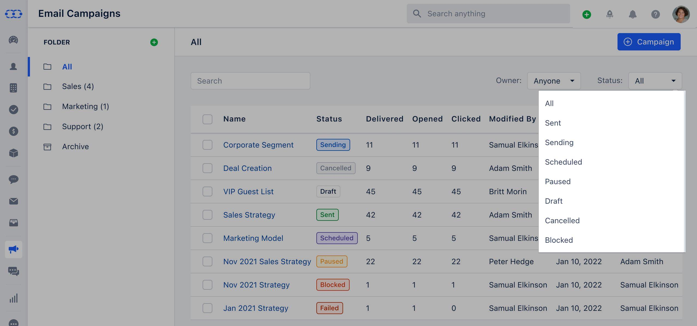

Journey emails are special
[Email Campaign](https://support.salesmate.io/hc/en-us/articles/19840698098329)
that is automatically sent to contacts when they reach the "Send Campaign" action within an
[Automation Journey](#how-to-create-journey-emails)
.Topics covered:**
[How to Create Journey Emails](#how-to-create-journey-emails)
**
[How to Configure Automation Journey](#how-to-configure-automation-journey)
**
[** Journey Email Listing Page **](https://support.salesmate.io/hc/en-us/articles/19889997400473-How-to-use-Journey-Emails#h_01H4ZZFBPXV5533APWGRFCQWQP)

### How to Create Journey Emails

Navigate to the **Outreach Icon** on the left menu bar.Click on **Journey Emails.

If you haven't created any Journey Emails It will take you to the page where you can **click on Create Journey Email.**

- *Create a new Journey** by selecting a Campaign Template you've previously created.

- **Subscription Type:**Subscription types are carefully crafted to precisely capture the email subscription preferences of your contacts.

- **Email Content:**- **Subject:** Subject line of your Email.

- **Preview Text:** Text to appear after the subject line.

- **From Name:** Sender's Name.

- **From Email:** Sender's Email address that will appear in the recipient's inbox.

- **Footer Details:** The email footer is the section where subscribers can find the sender's information.

- **Tracking:** Enable the tracking option according to your preferred tracking method.

- **Note:** The process for creating a Journey Email is similar to creating a new [Email Campaign](https://support.salesmate.io/hc/en-us/articles/19840698098329), with a few differences:

Few actions in configuring Campaign Settings will not be displayed for Journey Emails. These include:**Recipients **Delivery Options **Email Throttle **The option to enable** A/B Testing is not available ** for Journey Emails.

Proceed to the **next page**, preview the template, and voila! You are now ready to **publish.

### How To Configure Automation Journey

Once published, head to the [Automation Journey](#how-to-create-journey-emails) section.**Create automation** and **set up a trigger** for when the Journey Email should be sent to the contacts.Use the **"Send Campaign" action** in the automation and select the recently created Journey Email.

Publish the automation with the assigned trigger and the selected Journey Email will be set to be sent whenever the trigger condition is met.
