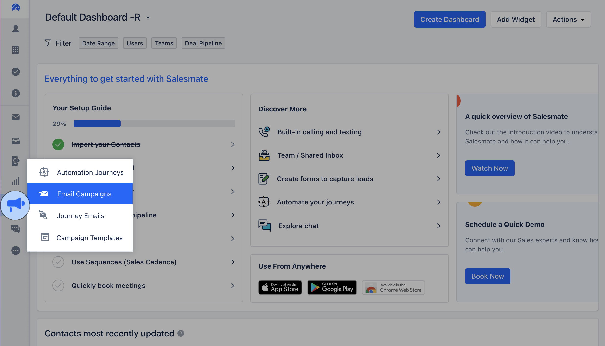
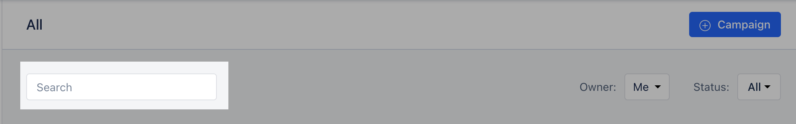
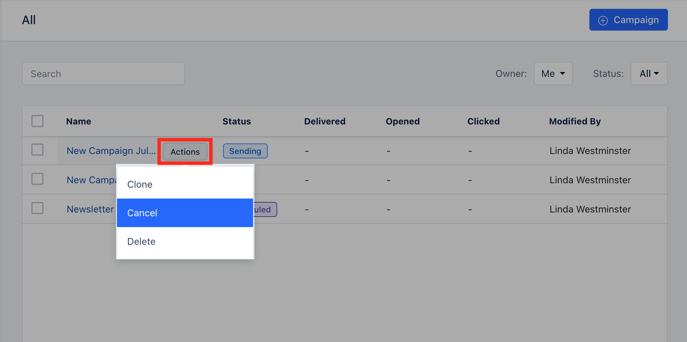
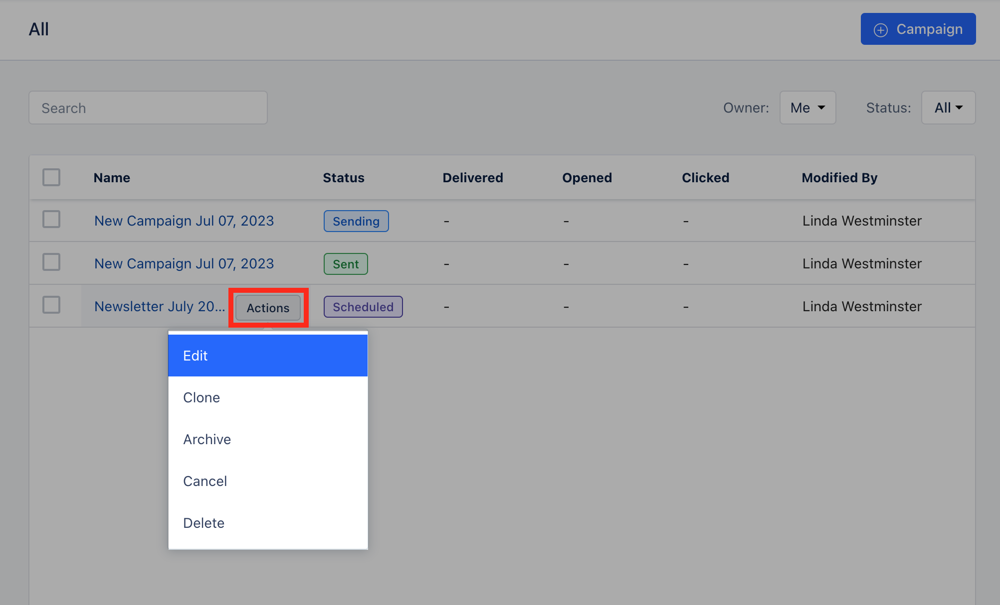
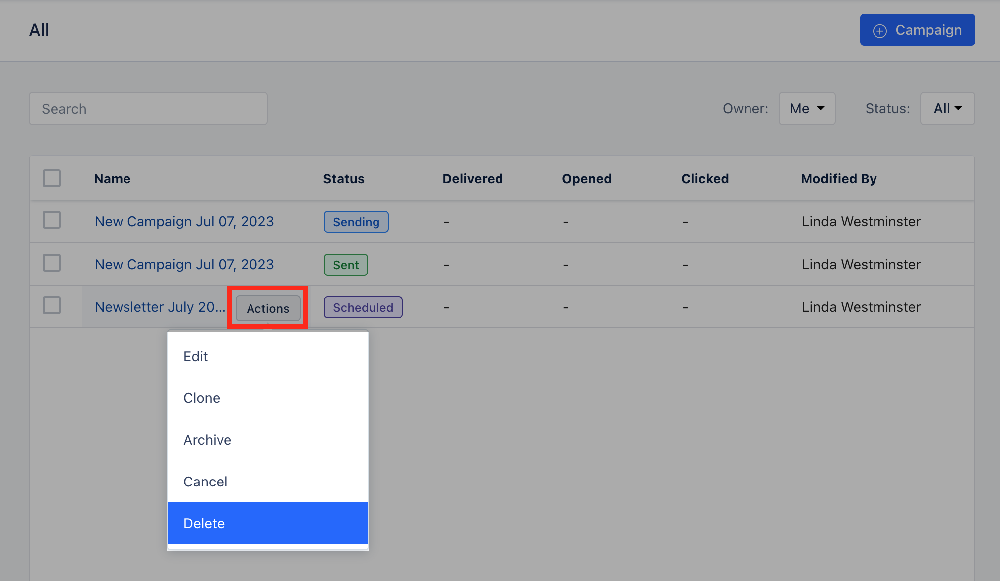

Email Campaigns can be managed from the Listing page.**Topics Covered:**[**Campaign Listing Page**](https://support.salesmate.io/hc/en-us/articles/19889934252569-Managing-Email-Campaign#h_01H4ZDTDJDYC3GX3W1064856QX)[**How to Cancel the Campaign**](https://support.salesmate.io/hc/en-us/articles/19889934252569-Managing-Email-Campaign#h_01H4QW1WWRSW9SGNY9VRRXCZ0F)[**How to Edit the Campaign**](https://support.salesmate.io/hc/en-us/articles/19889934252569-Managing-Email-Campaign#h_01H4ZDTZR616JN4DEB8XP6NSJD)[**How to Delete the Campaign**](https://support.salesmate.io/hc/en-us/articles/19889934252569-Managing-Email-Campaign#h_01H4ZDV69A83X44XRWT364X6GZ)

To perform the above actions you would have to navigate to Email Campaign,

Navigate to the**Outreach Icon**on the left menu barClick on**Email Campaign**

### Campaign Listing Page

Once you click on the Email Campaign you will be directed to the Listing Page.You can Filter the option using the following options**Owner**: Options available here are,**Me(default)****Anyone****List of all Active Users****Status:**Options available here are,**All**(default)**Draft**\- When you create a campaign and do not send it yet, it will get saved in “Draft” mode.**Canceled**\- When a campaign is canceled by the user then its status changes to “Canceled”.**Sending**\- When a campaign is still been getting sent, its status will get displayed as "Sending".**Sent**\- When emails are sent to all recipients, then the status is set as “Sent”.**Scheduled**\- When a campaign is scheduled for later, its status is “Scheduled”.**Paused**- When a campaign gets blocked the account is flagged for verification, and other campaigns will get paused automatically.**Blocked**- When the campaign is blocked due to a high bounce rate or DKIM, its status is set to “Blocked”.**Failed**\- When the list or view selected by the recipient gets deleted before execution time, the campaign is marked as Failed.

**Note:**Contact Salesmate Support to reactivate the**Paused**or**Blocked**CampaignsClick on Help Icon to initiate a**Chat**with**Salesmate Support**.**Free-Form Search -**This will allow users to search for a campaign by its name.

The list of columns that will be available in the grid:**Name**\- Title of the campaign.**Status**\- Current status of the campaign.**Delivered**\- Count of emails delivered to the contacts.**Opened**\- Count of emails opened by the contacts.**Clicked**\- Count of emails in which links were clicked by the contacts.**Modified By**- The name of the user who last modified the campaign.**Modified Date**- The date on which the campaign was last modified.**Sent By**\- The name of the user who last sent the campaign. The value will appear once the campaign has been sent.**Sent Date**- The date on which the campaign was sent.**Owner**\- The name of the user who created the campaign. This value will never change.

### How to Cancel the Campaign

To cancel the Email Campaign,

Click on the**Name**of the Campaign that you wish to Cancel, the**Action**button will appear next to it.Click on the**Action**button and select**Cancel**

**Note:**Please note that you can only cancel the Campaigns that are in Sending status or are been Scheduled for later.

### How to Edit the Campaign

To Edit the Campaign,

Click on the**Name**of the Campaign that you wish to Cancel, the**Action**button will appear next to it.Click on the**Action**button and select**Edit****

****Note:**You can only Edit the campaign with the following status:

DraftScheduledFailed

### How to Delete the Campaign

To delete the Campaign,

Click on the**Name**of the Campaign that you wish to Cancel, the**Action**button will appear next to it.Click on the**Action**button and select**Delete****

**Confirm the**Delete****

****Note:**Once you delete the Campaign, this process is irreversible.
