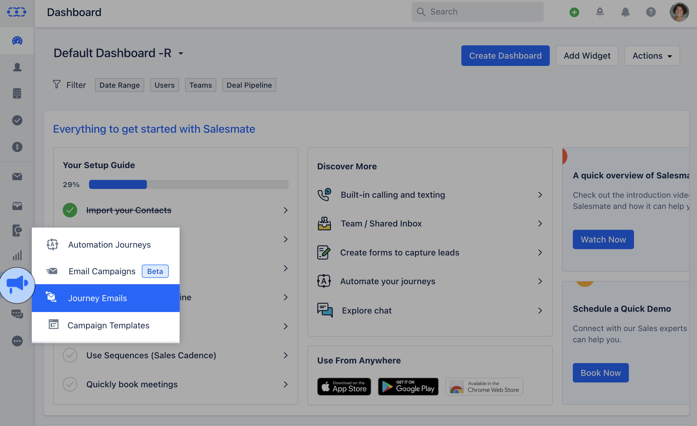
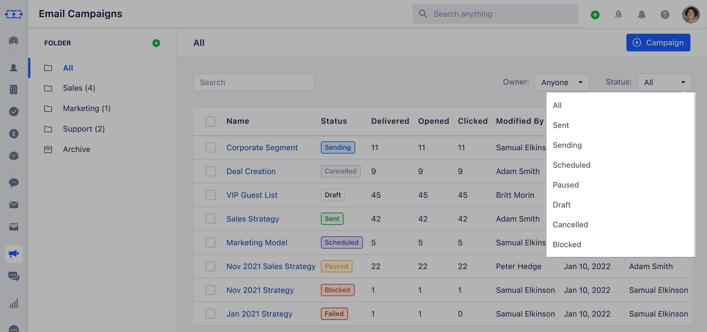
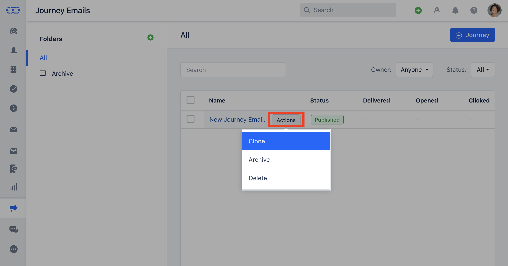
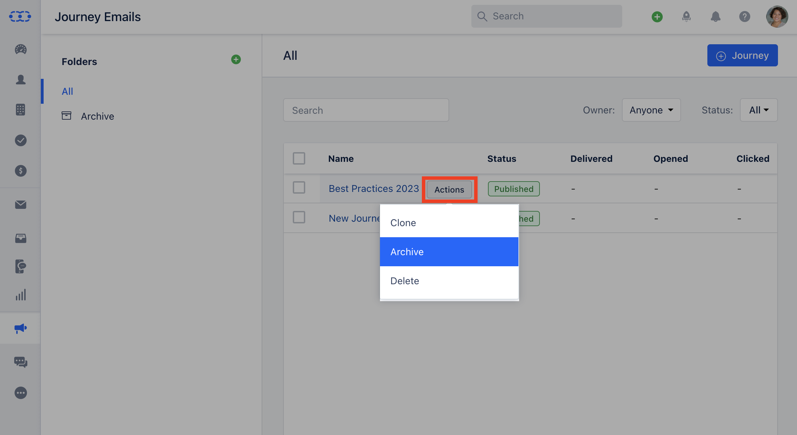
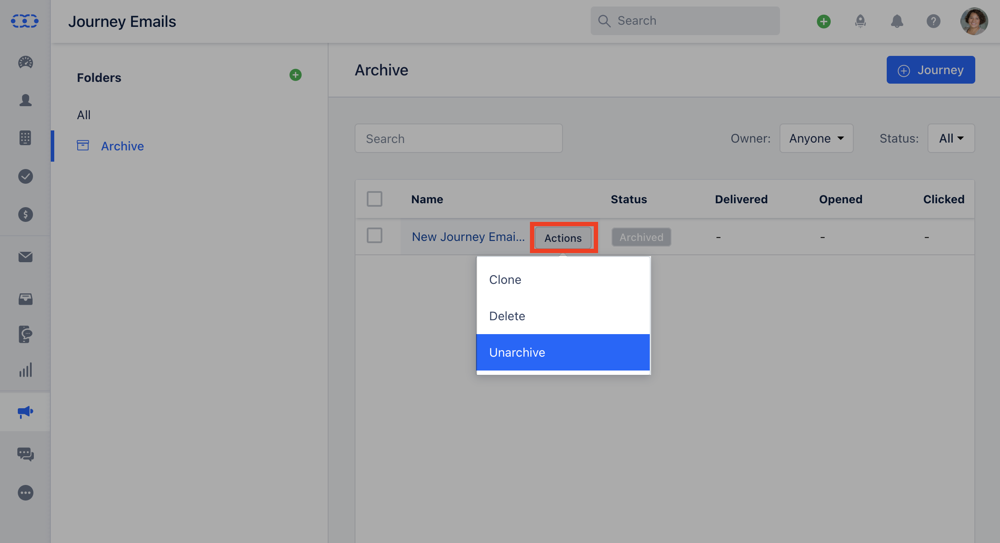

Journey Emails can be managed from the Listing Page.**Topics Covered:**[**Journey Emails Listing Page**](https://support.salesmate.io/hc/en-us/articles/20531492688537-Managing-Journey-Emails#h_01H51P235VPF9BM66P99SXN6VX)[**How to Edit Journey Email**](https://support.salesmate.io/hc/en-us/articles/20531492688537#h_01HQ57RC2XDRWC6J4TFCPPRA8T)[**How to Clone Journey Email**](https://support.salesmate.io/hc/en-us/articles/20531492688537-Managing-Journey-Emails#h_01H51RJAYV6JYM1GWBTYWP7C56)[**How to Archive Journey Email**](https://support.salesmate.io/hc/en-us/articles/20531492688537-Managing-Journey-Emails#h_01H51RJNWG3JH5B6N1TTMPG3ZE)[**How to Delete Journey Email**](https://support.salesmate.io/hc/en-us/articles/20531492688537-Managing-Journey-Emails#h_01H51T73NP9WNCEK2WFXB2863R)

To perform the above actions you would have to navigate to Journey Emails,

Navigate to the**Outreach Icon**on the left menu barClick on**Journey Emails**

### Journey Email Listing Page

Once you publish Journey, you will be redirected to the listing page where everything is the same as [**Campaign Listing Page**](https://support.salesmate.io/hc/en-us/articles/19889934252569#h_01H4ZDTDJDYC3GX3W1064856QX)Once you click on the Email Campaign you will be directed to the Listing Page. You can Filter the option using the following options**Owner**: Options available here are,**Me(default)****Anyone****List of all Active Users****

**### How to Edit Journey Email

To Edit the Journey email,

Click on the**Journey Email**you wish to Edit, the**Action**button will appear next to it.Click on the**Action**button and select**Edit.**### How to Clone Journey Email

Click on the**Journey Email**you wish to Clone, the**Action**button will appear next to it.Click on the**Action**button and select**Clone.****

**### How to Archive Journey Email

Click on the**Journey Email**you wish to Clone, the**Action**button will appear next to it.Click on the**Action**button and select**Archive****

**When you archive a journey email then it is moved to the Archived folder and its status is set to “Archived”If you wish to Unrchive the Journey Email you can do so from Archived Folder.

### How to Delete Journey Email

Click on the**Journey Email**you wish to Clone, the**Action**button will appear next to it.Click on the**Action**button and select**Delete**All associated analytics will be lost, and this action is irreversibleThis Journey Email cannot be deleted while in use by Automation Journeys. You can archive it instead or remove it from the automation to perform a delete operation

