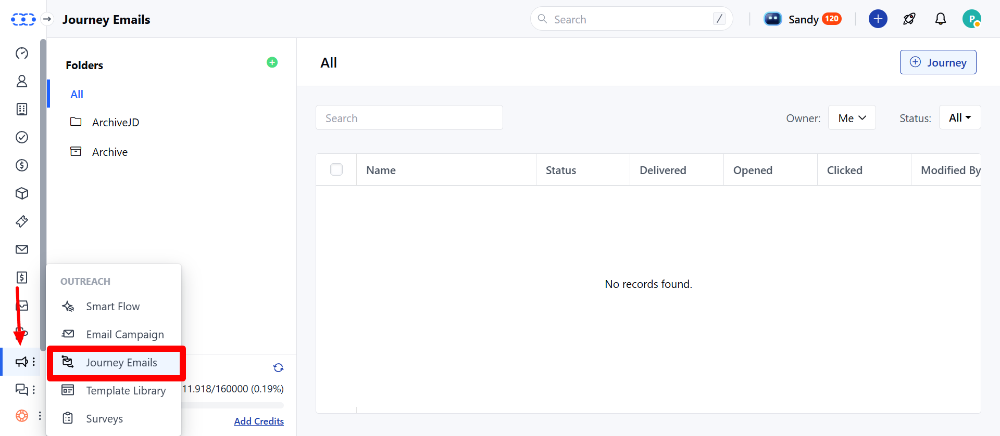
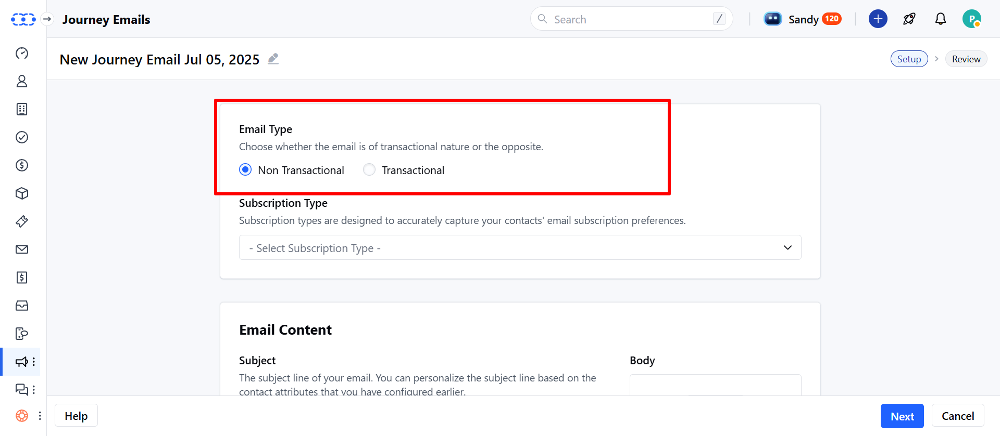
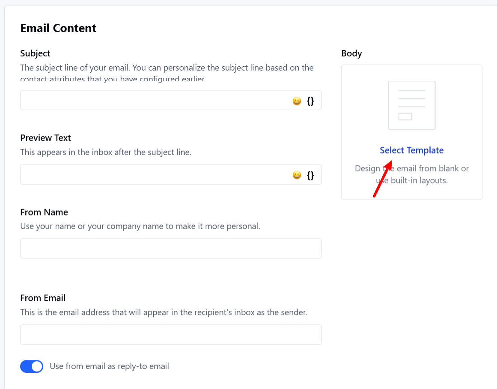
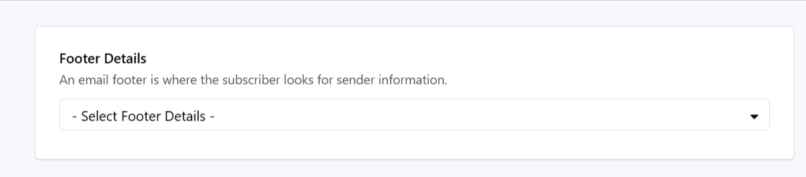
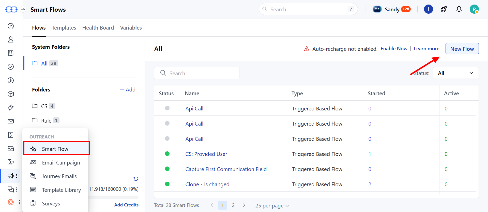
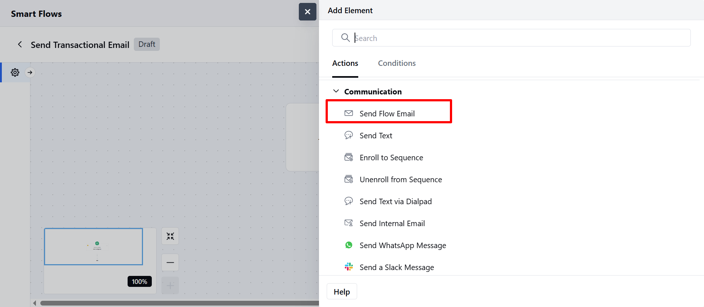

Transactional emails are system-triggered communications sent to contacts based on a specific action, such as order confirmations, password resets, or alerts. Here's how you can create and send them effectively in your Smart Flow.

### Topics covered:

[Difference between Transactional and Non Transactional Emails](https://support.salesmate.io/hc/en-us/articles/48071913159449-Sending-Transactional-Emails-using-Journey-Emails#h_01K06XE95E30JM87QZQAX3X7GY)[How to Create a Transactional Email Template](https://support.salesmate.io/hc/en-us/articles/48071913159449-Sending-Transactional-Emails-using-Journey-Emails#h_01JZBBB1WT1X8M4KEJ0KA5PMZ2)[How to Send Transactional Emails via Smart Flow](https://support.salesmate.io/hc/en-us/articles/48071913159449-Sending-Transactional-Emails-using-Journey-Emails#h_01JZBBB1WTW5T66YG27MSGWGH3)

### Difference between Transactional and Non Transactional Emails

Examples of transactional emails include order confirmations, password reset links, shipping updates, and invoice or payment receipts. These emails are sent directly to individuals based on a specific action they’ve taken, making them one-to-one communications. They are strictly functional in nature, focused on completing or confirming a transaction, and do not require the recipient’s marketing consent. Since they are not promotional, an unsubscribe link is not required.Non-transactional emails are promotional in nature and are typically sent to a larger audience to drive engagement or sales. Examples include newsletters, limited-time offers, product announcements, and event invitations. These emails are not triggered by a user action but are instead part of a broader marketing strategy. Because they promote content or services, they require the recipient’s prior consent and must include an option to unsubscribe, as mandated by email compliance regulations.

### How to Create a Transactional Email Template

Navigate to the**Outreach**section from the left menu bar.Click on Journey Emails.

Just like creating a Journey Email, begin the setup process—but with a few key modifications mentioned below

#### Email Type Selection

In the**Email Type**field, choose whether the email is**Transactional**or**Non-Transactional**. Please select "**Transactional**" under Email Type.If**Transactional**is selected,**Subscription Type**will not be required.

**Template Setup**Choose an existing template or create one from scratch.Provide sender information:**From Name****From Email****Subject****Reply-To Email****

****Footer Behavior in Transactional Emails**If the template**includes footer variables**and a footer is selected, the selected footer will**replace**the existing variables.If the template**does not include footer variables**but a footer is selected, the footer will**not**be applied.

### How to Send Transactional Emails via Smart Flow

Go to**Smart Flow**under**Outreach**section and create a new**Smart Flow**.

Use the action**Send Flow Email**. Choose the transactional template you created under the action.

The email will be delivered to all contacts entering this flow—**regardless of their subscription preferences**.**Note**:

Transactional emails**do not require**a footer. No warning will appear if footer variables are missing.If you'd like to include an unsubscribe link, you’ll need to**manually add**it to the template.
