Universal Layouts in Salesmate help you create email templates faster while keeping your brand’s design consistent. Instead of building every email from scratch, you can use a reusable template and simply drag and drop content blocks.**Note:**Universal Layouts are available on all Salesmate plans that include**Email Campaign**features. Any team member with the**“Manage Campaign Templates”**permission can create, edit, and manage these layouts.

#### Topics Covered:

[Creating a Universal Layout](https://support.salesmate.io/hc/en-us/articles/49433056940057-Universal-Layouts-for-Email-Campaign-Templates#h_01K2ES0774716FHKEFYMP7BH03)[How to Use the Pre-built Layout](https://support.salesmate.io/hc/en-us/articles/49433056940057-Universal-Layouts-for-Email-Campaign-Templates#h_01H4ZW6B62DZSB2AQFFR1F5EQ4)[How to Create a New Layout](https://support.salesmate.io/hc/en-us/articles/49433056940057-Universal-Layouts-for-Email-Campaign-Templates#h_01H4ZW6JZHFVYTK1K4ZZ1Z56PP)[Actions You Can Perform on a Layout](https://support.salesmate.io/hc/en-us/articles/49433056940057-Universal-Layouts-for-Email-Campaign-Templates#h_01K2FPJ44VZY99N1H8DMVS0436)

### How to Create a Universal Layout:

Navigate to the**Outreach Icon**on the left Menu Bar.Click on**Template Library**

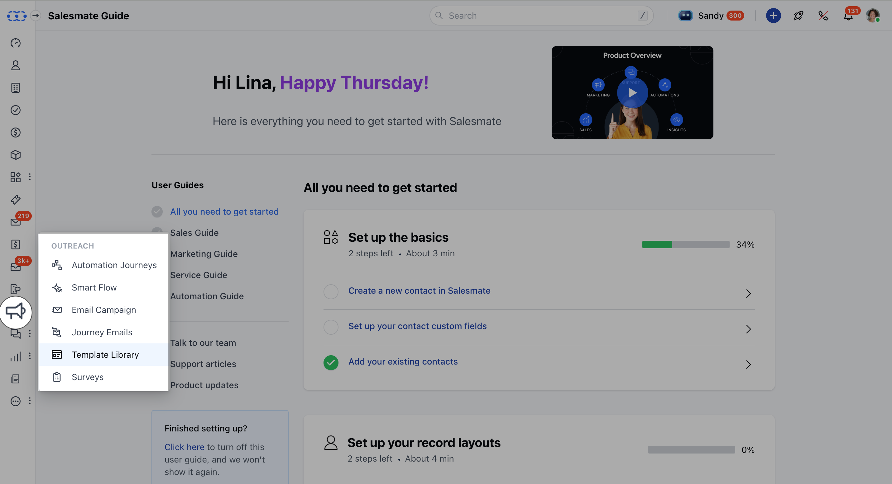

Head over to**Universal Layout.**

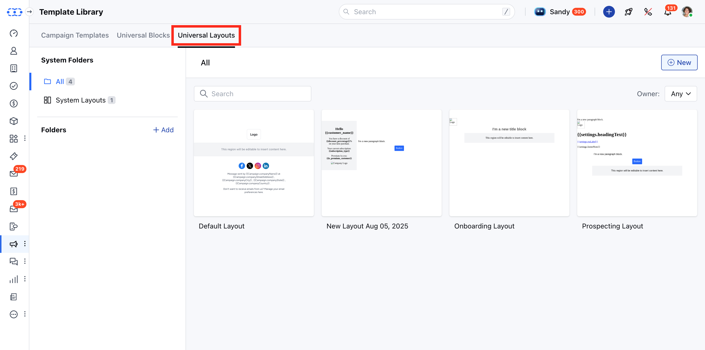

A Template Library would open with the Pre-build Templates and the option to create a New Template.

### How to Use the Pre-built Layout

To use the Pre-build Templates,

Click on the**Layout**that you would like to use.The Layout will open in a**Preview mode**Click on**Use Template**.

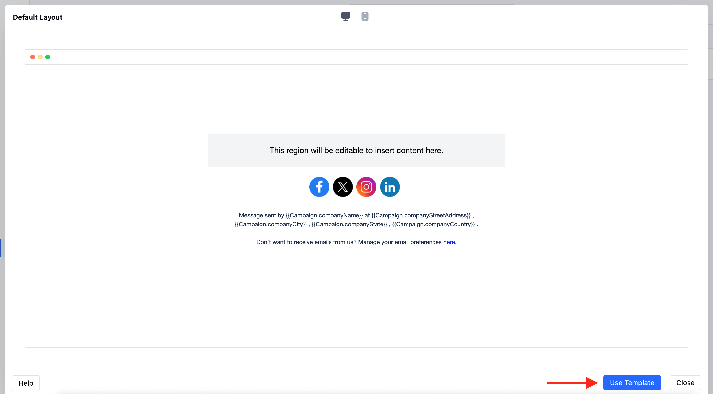

Edit the layout as per your choice.

### How to Create a New Layout

To create a New Template

Navigate to the**Universal Layout**Hit**+New.****

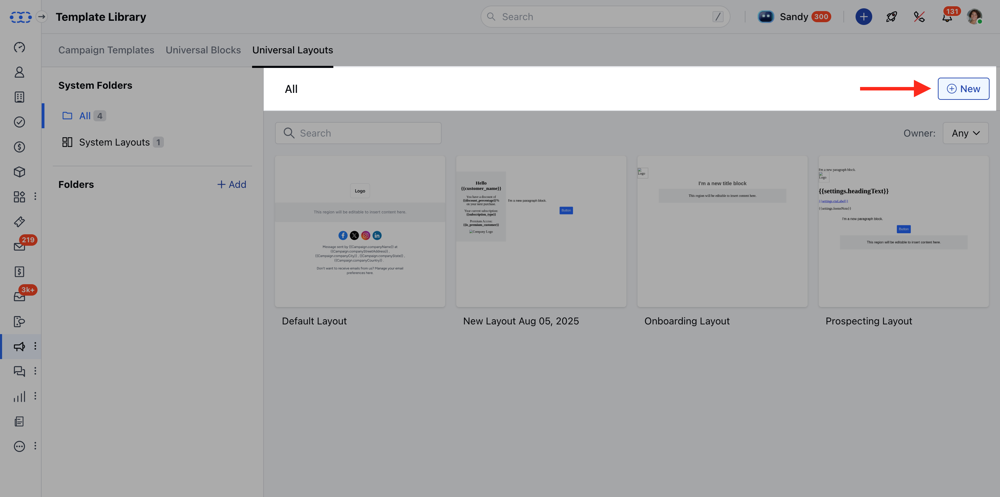

**Select the**Blank Layout****

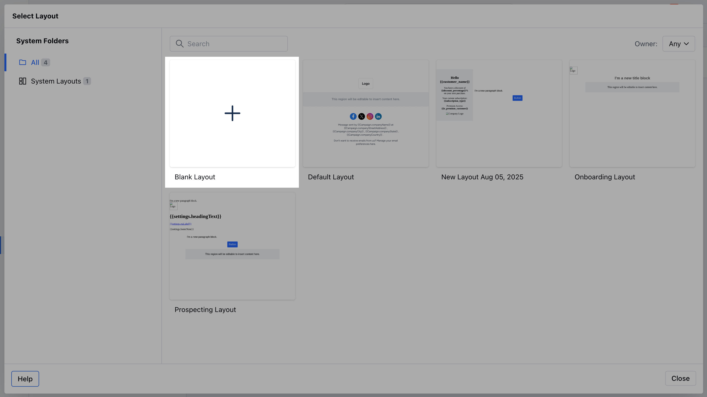

**Drag and drop the given blocks to add any related Content.**Title**: Add a large heading text to make your message stand out.**Text**: Insert regular text for descriptions or detailed information.**Button**: Add a clickable button that can link to a webpage or form.**Survey**: Insert a survey block to collect feedback directly from recipients.**Image**: Place images such as banners, product photos, or logos.**Divider**: Add a horizontal line to separate sections in your email.**Social**: Include social media icons for platforms like Facebook, Twitter, or LinkedIn.**Menu**: Add a navigation menu with multiple links.**Droppable Area**: Create an area where you can drag and drop other content blocks while building templates.**Deal****Product**: Showcase products or deals directly in your email.

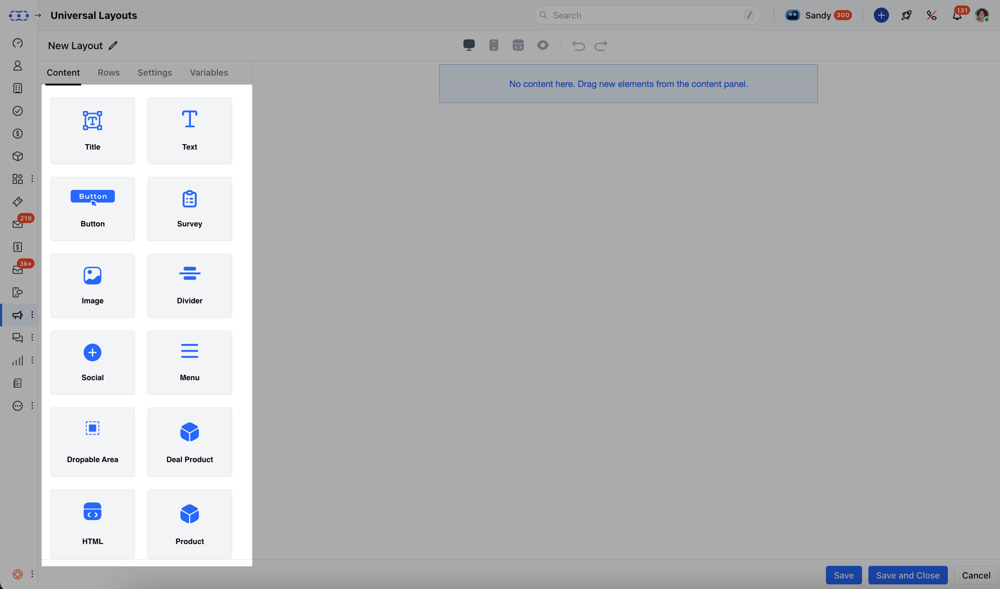

You can use any of the**rows**below as per the Template requirements.

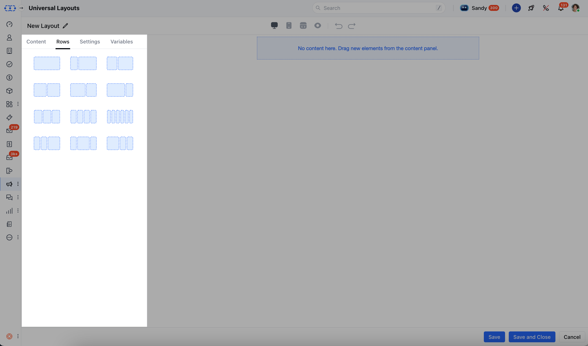

Once the Content is added, you can change the following details under**Settings**,**Content Area Width****Font Family****Background Colour****Background Image****Link Color****Content Area Background Color****Alignment**

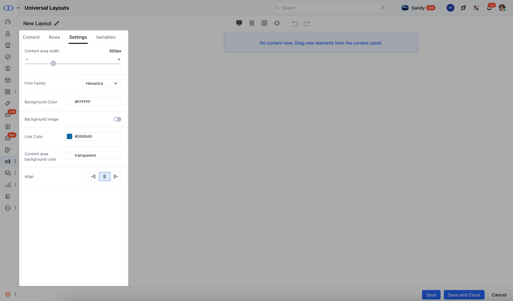

**Variables****Tab**: Create editable variables (like brand colors, logo, button labels) that make it easy for non-technical users to customize the email without touching code.

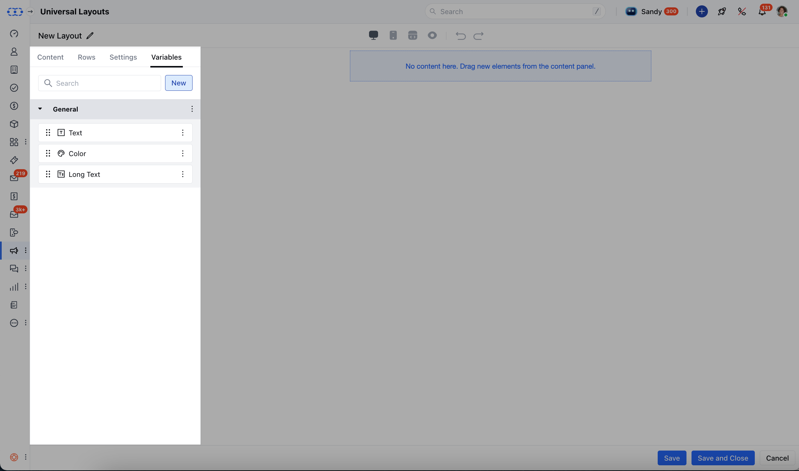

To add a new variable, click on the**‘New’**button under the Variables tab, name it, and set its value. These variables can be reused across the layout for consistency. You can also refer to this for more information. [Learn more](https://support.salesmate.io/hc/en-us/articles/49496937632665-Variables-in-Universal-Layouts-and-Blocks)

Once all is done, click on**Save**Your**Layout**would now be successfully created.Once the Layout is ready, click on the**Pencil Icon**on the top right to update the**Template name.**Hit**Save**### Actions You Can Perform on a Layout:**Edit**: Update or change the layout’s design and editable areas.**Clone**: Duplicate the layout (works just like template cloning).**Move to****Folder**: Organize layouts by moving them into different folders.**Template****Usage**: View where the layout is currently being used (campaigns, journey emails, or templates).**Delete**: Remove the layout if it’s no longer needed.

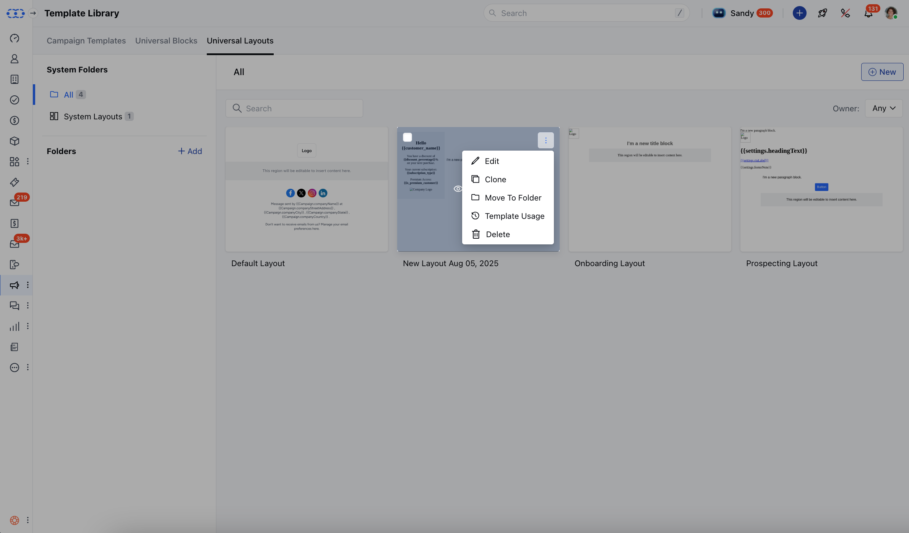

Please note that, when attempting to delete a Universal Layout, the system first checks if it is being used anywhere. If the layout is in use, deletion will not be possible. It will give you an error that,
"You cannot delete the**Layout**. It is being used in the following places. Please remove the dependencies to proceed with deletion."

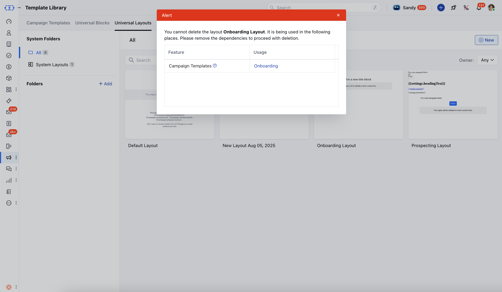

**Note:**If you delete a droppable area from your layout, any content placed there will not appear in your emails.
