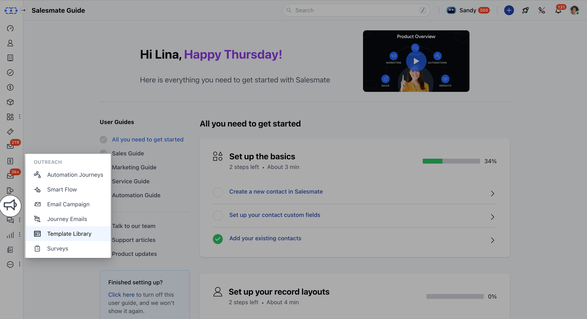
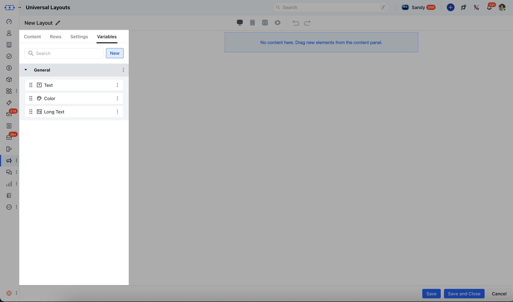
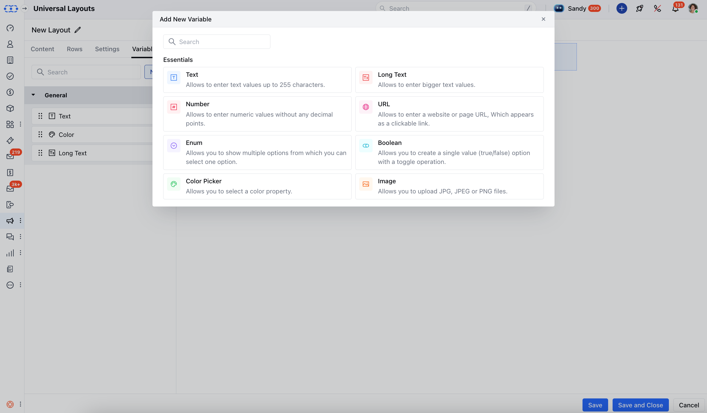

Variables help you customize your Universal Layouts and Universal Blocks in Salesmate CRM without editing the design every time. They make your templates flexible and reusable, so you can maintain brand consistency while personalizing your messages and campaigns.**Note:**You’ll need permission to manage Universal Layouts or Universal Blocks to configure variables.

#### Topics Covered:

[Steps to Add Variables](https://support.salesmate.io/hc/en-us/articles/49496937632665-Variables-in-Universal-Layouts-and-Blocks#h_01K1ZS7Q09941AMGF7N7M5P936)[Configure Variable Types](https://support.salesmate.io/hc/en-us/articles/49496937632665-Variables-in-Universal-Layouts-and-Blocks#h_01K1ZQD567F2TPXR17GCFM99NM)[Save the Variable](https://support.salesmate.io/hc/en-us/articles/49496937632665-Variables-in-Universal-Layouts-and-Blocks#h_01K1ZQD57V1Q46X7Z863N559W7)

### Steps to Add Variables

From the left menu, open the**Template Library**.

At the top left, choose either**Universal Layouts**or**Universal Blocks**. Click**New**to create a new layout or block, or select one to update.Inside the editor, go to the**Variables**tab and click**New**.

Choose a variable type and fill in the details. Each type has its own options, explained below.

### Configure Variable Types

Choose a variable type and set it up with these options:

**Text**:**Name**: What the variable is called in the editor (e.g., Welcome Message)**Variable Name**: Give it an Internal name. This is only used for internal reference (e.g., welcome\_message)**Section**: Where this text will show up in your layout or block**Default Value**: The starting value (e.g., Hello!), which you can change later**Validation**: Add rules to restrict input**Mark Required**: Make this field required if needed**Color Picker**:**Name**: Label for the color (e.g., Button Color)**Variable Name**: Give it an Internal name. This is only used for internal reference (e.g., button\_color)**Section**: Where this color will be used**Default Value**: Choose a default color**Image**:**Name**: This will be the name shown in the editor (e.g., Banner Image)**Variable Name**: Give it an Internal name. This is only used for internal reference (e.g., banner\_image)**Section**: Where the image will be placed**Default Value**: A default image to display**Default Embedded URL**: Use a URL to embed the image**Default ALT Text**: Add a short description for accessibility**Mark Required**: Make the image required if needed**URL**:**Name**: The name label shown in the editor (e.g., Website Link)**Variable Name**: Give it an Internal name. This is only used for internal reference (e.g., website\_link)**Section**: This is where the link appears**Default Value**: You can add a sample URL (e.g., [https://example.com](https://example.com/))**Validation**: Add input rules to allow only valid URLs**Mark Required**: Make it mandatory if needed**Boolean**:**Name**: Give it an appropriate name (e.g., Show Banner)**Variable Name**: Give it an Internal name. This is only used for internal reference (e.g., show\_banner)**Section**: This is where the toggle applies**Default Value**: Choose whether it’s on or off by default**Number**:**Name**: Give it an appropriate name (e.g., Discount Percentage)**Variable Name**: Give it an Internal name. This is only used for internal reference (e.g., discount\_percentage)**Section**: This is where the number is used**Default Value**: Give it a default value (e.g., 10)**Validation**: This will limit the inputs as per your needs (e.g., numbers only)**Mark Required**: Make the field required if necessary**Enum**:**Name**: Label in the editor (e.g., Button Style)**Variable Name**: Give it an Internal name. This is only used for internal reference (e.g., button\_style)**Section**: Where the dropdown appears**Options**: Add at least two choices (e.g., Primary, Secondary)**Default Value**: Set one option as default**Mark Required**: Make a selection mandatory**Text Area**:**Name**: This is the Editor label (e.g., Footer Text)**Variable Name**: Give it an Internal name. This is only used for internal reference (e.g., footer\_text)**Section**: This is where the text appears**Default Value**: Add sample or default content (e.g., Thank you for choosing us!)**Validation**: Add rules for input in the text area.**Mark Required**: Make the field mandatory if needed

### Save the Variable

Click**Save**to store the variable configuration in your Universal Layout or Universal Block.
