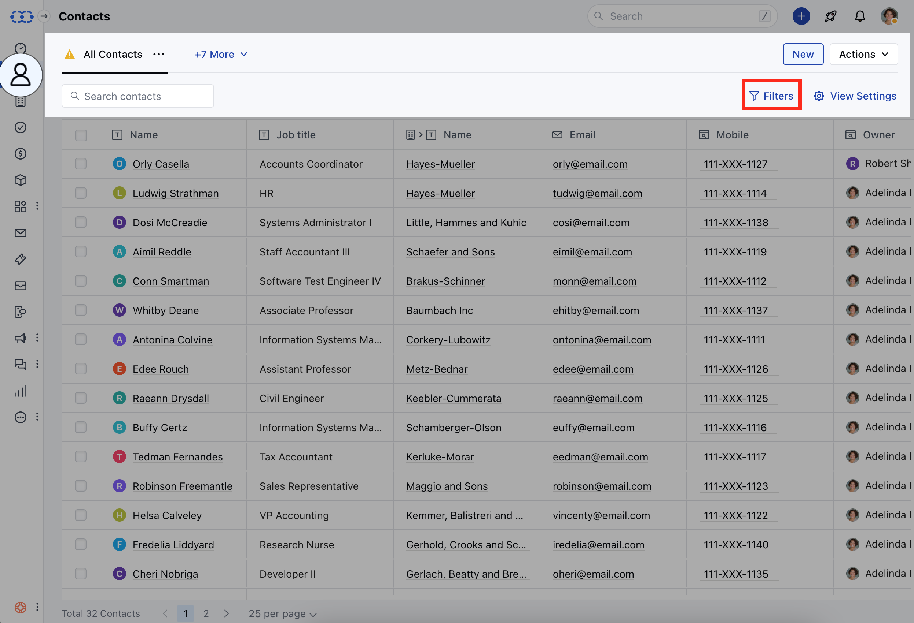
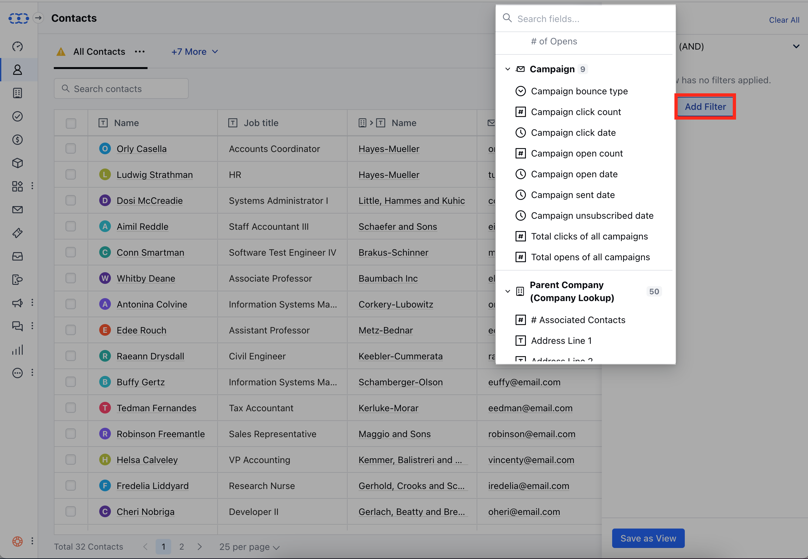

You have the capability to filter contacts based on various criteria within email campaigns.To Filters the Contact based on Campaign criteria,

Navigate to the **Contact Module** from the left sidebarHead over to the **Filters** option

Click on the **Add Filters** optionLocate the **Campaign Filters** optionHere, you get the list of the following Campaign filter options **Campaign Bounce Type**- This option allows you to filter contacts based on the type of bounce **Campaign Click Count**-This option allows you to filter contacts based on the number of clicks they have made in a specific campaign.

- **Campaign Click Date**- This option allows you to filter contacts based on the date of their clicks within a specific campaign.

- **Campaign Open Count**- This option allows you to filter contacts based on the number of times they have opened a specific campaign.

- **Campaign Open Date**- This option allows you to filter contacts based on the date of their interactions, specifically the opening of emails, within a particular campaign.

- **Campaign Sent Date**- This option allows you to filter contacts based on the date a specific campaign was sent to them.

- **Campaign Unsubscribed Date**- This option allows you to filter contacts based on the date they unsubscribed from a specific campaign.

- **Total Clicks of All Campaigns**-This option allows you to filter contacts based on the total number of clicks they have accumulated across all campaigns.

- **Total Opens of All Campaigns**-This option allows you to filter contacts based on the total number of times they have opened emails across all campaigns.

