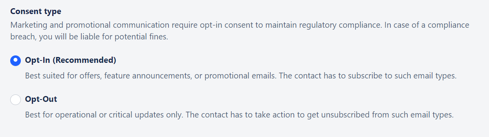

In the digital era, building strong relationships with your audience is vital. By seeking permission before sending emails, you demonstrate respect for your users' privacy and preferences. This step builds trust and sets the foundation for meaningful engagement.
Neglecting to obtain user consent can have severe consequences for your organization. When users receive unsolicited emails, they may perceive them as spam. This not only leads to poor user experience but can also harm your domain's reputation and impact email deliverability.**With Salesmate, you get two types of consent:****Opt-In:**It’s best for offers, products, and feature announcements. The user needs to opt for this subscription type to receive communication.**Opt-Out:**It’s best for critical and operational-based communication. The user will need to take action to get removed from the subscription.

