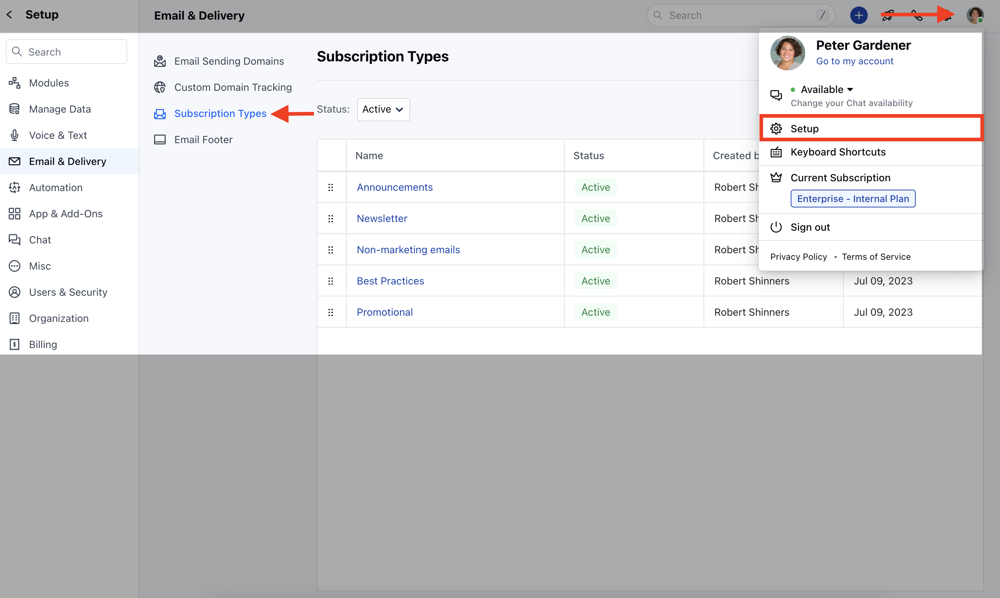
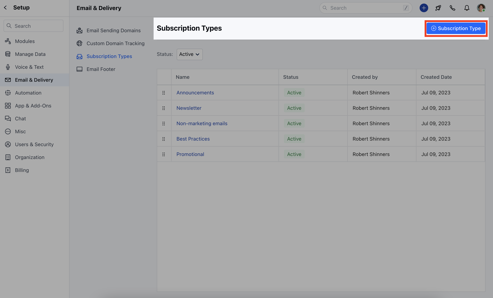
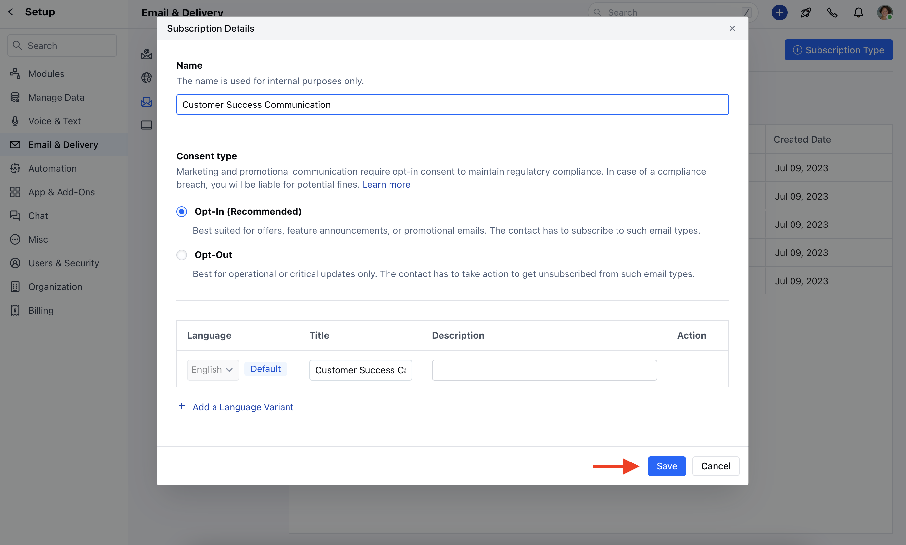
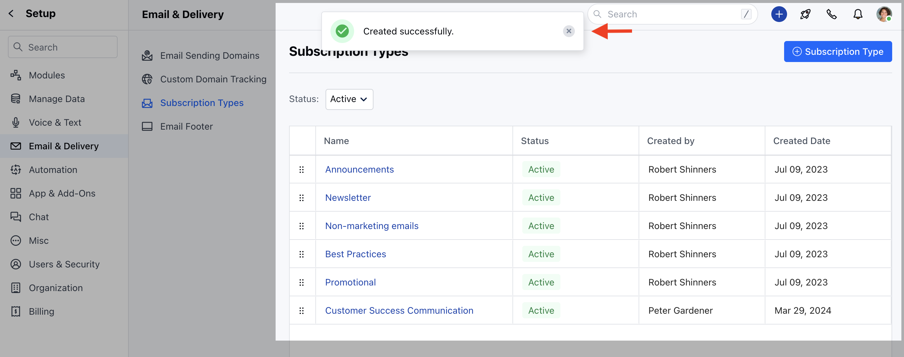
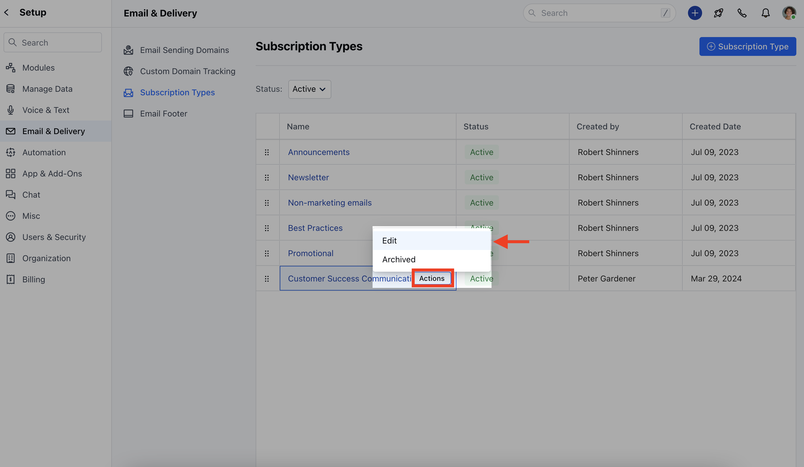
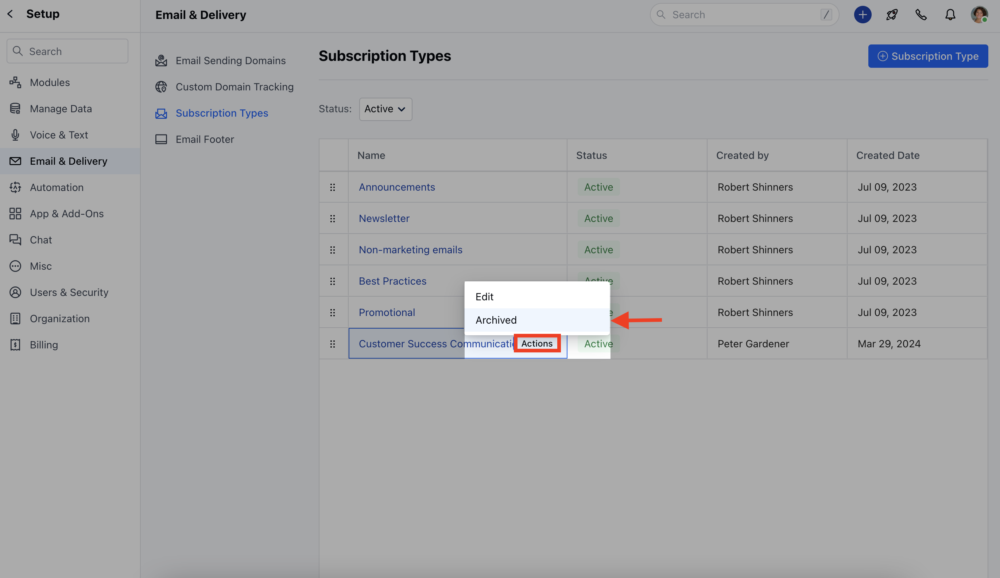
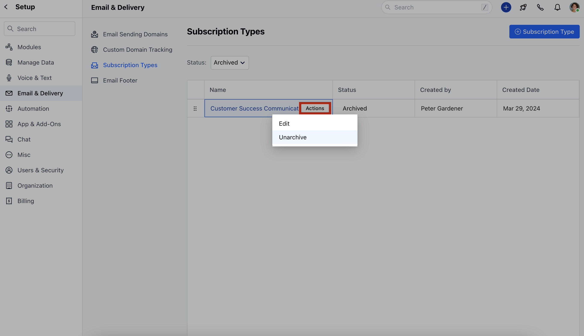

As an organization, you send different types of emails to your customers, e.g., newsletters, Promotional emails, Product Updates, or urgent updates. With subscription types, a customer can opt out of irrelevant messages without losing updates for important ones.Topics Covered:

[**How do the Subscription Types work?

- **](#how-do-the-subscription-types-work)[**How to Set Up a New Subscription Type?

- **](#how-to-set-up-a-new-subscription-type)[**How to Edit Subscription Type?

- **](#how-to-set-up-a-new-subscription-type)[**How to Archive Subscription Type?

- **](#how-to-set-up-a-new-subscription-type)[**How to Unarchive Subscription Type?

- **](#how-to-set-up-a-new-subscription-type)

### How do the Subscription Types work?

By default, Salesmate provides different subscription types that can be used to send marketing emails. When a customer clicks on the Unsubscribe link from the email, they can either choose to unsubscribe from all the emails or only the nonrelevant types.

- **Announcements:** Offers, features, or product announcements

- **Newsletter:** Get the latest news and updates regularly.

- **Non-marketing emails:** Get emails with a transactional nature.

- **Best Practices:** Tips, tricks, and recommendations.

- **Promotional:** Get marketing and promotional offers for you.

### How to Set Up a New Subscription Type?

To Set up a New Subscription Type,

Navigate to your **Profile Icon** on the top right cornerClick on **Setup** Head over to **Email & Delivery** Click on **Subscription Types**

Click on **\+ Subscription Type**

Here, you need to add,- **Name:** Enter the name for the Subscription Type

- **Consent Type:** Select Opt-In or Opt-Out
- [Click here to learn more about the Consent type](https://support.salesmate.io/hc/en-us/articles/19613366377241)
- **Language:** The default language would be **English,**If you wish to select a different language you can do it by ** Add a Language Variant **Description:** Add the relevant information about the subscription typeClick on** Save **.

A notification pop-up will appear once the subscription is successfully added.

### How to Edit Subscription Type?

To Edit the Subscription Type,

Navigate to your **Profile Icon** on the top right cornerClick on **Setup** Head over to **Email & Delivery** Click on **Subscription Types**

Click on the Subscription Type that you would like to **Edit.

- **Once you click on it, the **Actions** button will appear next to it.Click on **Actions** Select **Edit**

### How to Archive Subscription Type?

To Archive the Subscription Type,

Navigate to your **Profile Icon** on the top right cornerClick on **Setup** Head over to **Email & Delivery** Click on **Subscription Types**

Click on the Subscription Type Name, the **Actions** button will appear next to it.Click on **Actions** Select **Archive**

### How to Unarchive Subscription Type?

To Unarchive the Subscription Type,

Navigate to your **Profile Icon** on the top right cornerClick on **Setup** Head over to **Email & Delivery** Click on **Subscription Types**

Head over to StatusSelect Archive from dropdownClick on the Subscription Type Name, the **Actions** button will appear next to itClick on **Actions** Select **Unarchive**

