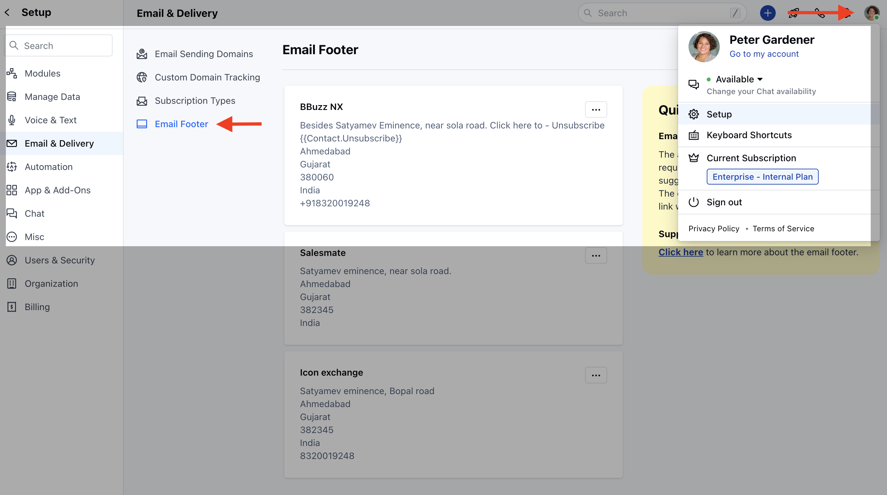
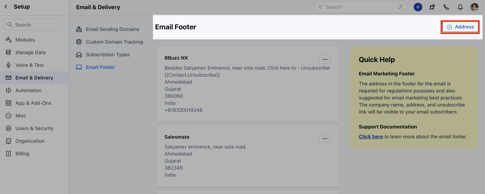
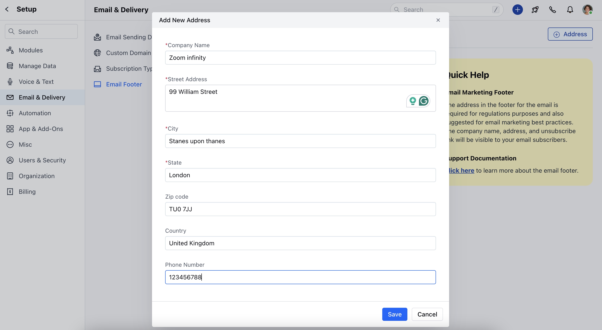
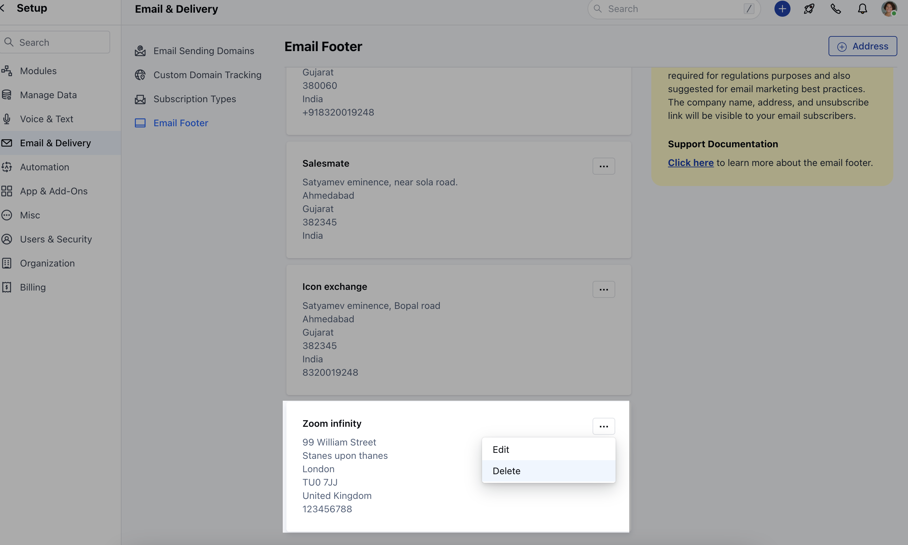
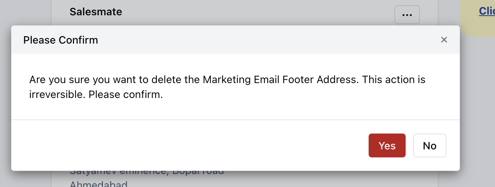

- *The footer section of your email resides at the very bottom, following all the main content and your email signature.

- ** Including an email address in the footer is not only necessary to comply with regulations but is also recommended for effective email marketing.Topics Covered **
- [How to Create a New Email Marketing Footer](#how-to-create-a-new-email-marketing-footer)
**
[Deleting an Email Footer](#deleting-email-marketing-footer)
**

### How to Create a New Email Marketing Footer

To create a New Marketing Footer

Navigate to your **Profile Icon** on the Top right cornerClick on **Setup** Head over to **Email & Delivery** Click on **Email Footer**

Click on **+ Address**

Enter the following details ** Company Name **Street Address **City **State **Zip Code **Country **Phone Number **Click on** Save **

On success "**Created successfully**" message will be displayedThe first footer that is added by user becomes the default footer

### Deleting Email Marketing Footer

To delete the Email Marketing Footer,

Navigate to your **Profile Icon** on the Top right cornerClick on **Setup** Head over to **Email & Delivery** Click on **Email Footer**

Click on three dots present on the right of the **Footer Address** that you wish to **Delete**. Click on **Delete** option

Confirm the **Delete.

####** Note:**Default Email Marketing Footer** cannot be** Deleted **.
