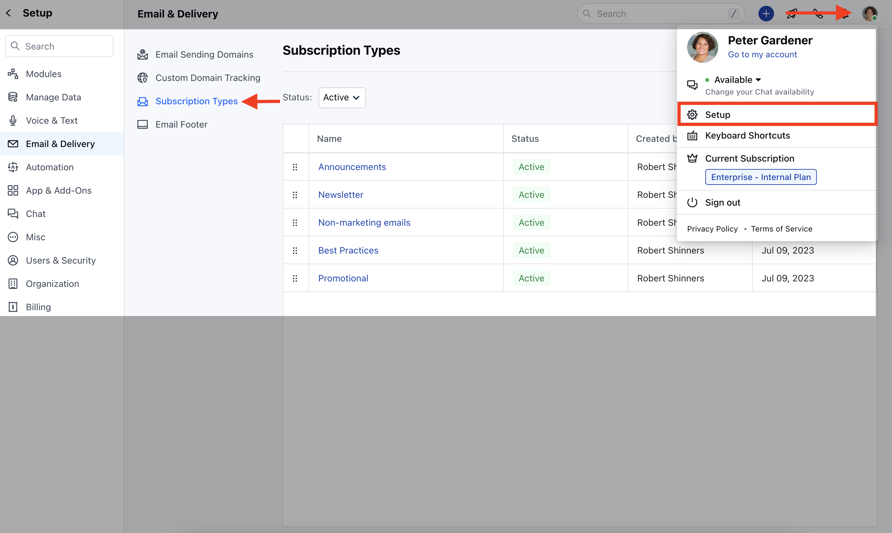
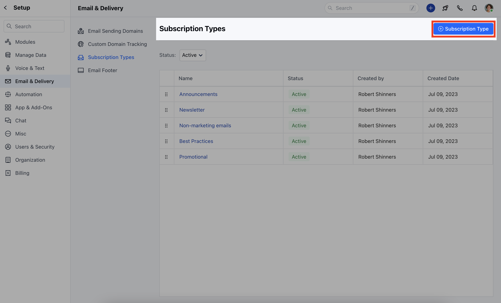
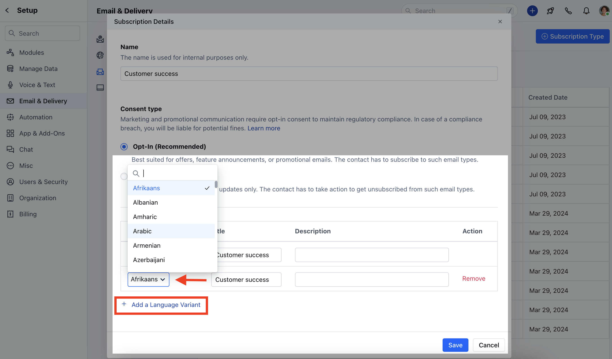
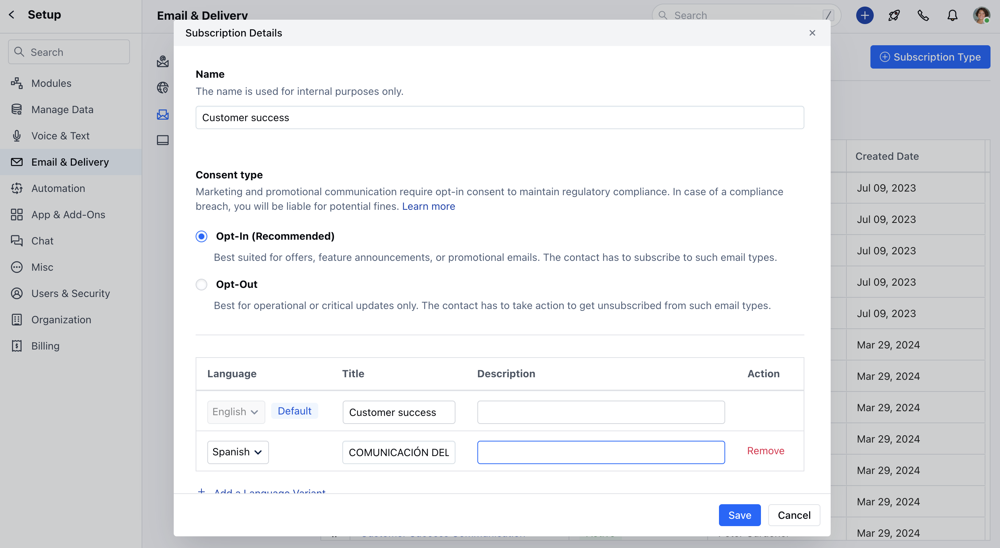
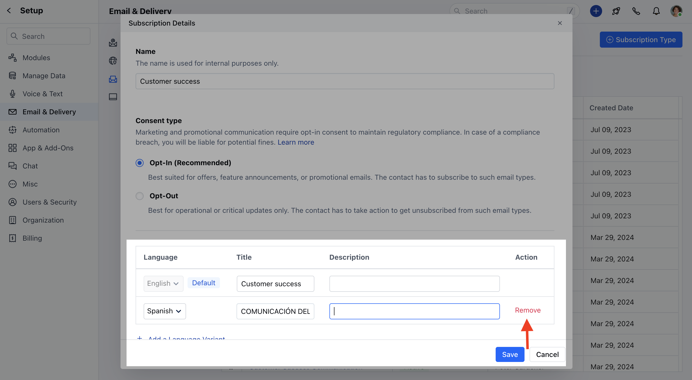

Salesmate provides an option to Set Up the new Subscription type in your preferred language.To set up a new Subscription Type in different languages,

Navigate to your **Profile Icon** on the top right cornerClick on **Setup** Head over to **Email & Delivery** Click on **Subscription Types**

Click on **\+ Subscription Type**

Here, you need to add,- **Name:** Give a name to the subscription type

- **Consent Type:** Select Opt-In or Opt-Out
- [Click here to learn more about the Consent type](https://support.salesmate.io/hc/en-us/articles/19613366377241)
- **Language:** Select the language, by default it will be **English** To add a different language, click on **Add a Language Variant**

Once the language is selected the Title and Description will get auto-copied from the English language variant by default which can be updated by the User.Click on **Save**

If you wish to Remove the Language Variant, you can do so by clicking on the **Remove** option next to the Variant.

####**Note:**The default language cannot be changed.The same Language Variant cannot be used more than once
