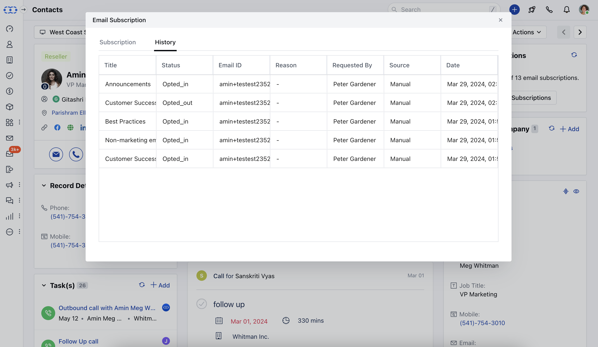

The user can view the email subscriptions of a contact in the contact details, but to do that we will need a widget that displays this information.To view the details,

Go to the Detail page of the Contact **Email Subscriptions** widget should appear on the right-hand sidebar.The widget will display the number of subscriptions that the contact has opted-in for out of the total active subscriptions.You can click on the View Email Subscriptions to view the detailed information

As you click on **View Email Subscription** it will display
[**Subscriptions**](https://support.salesmate.io/hc/en-us/articles/19652302742041-View-Email-Subscriptions#h_01H3HEHDR21KACQP1TX8514EY3)
[**History**](https://support.salesmate.io/hc/en-us/articles/19652302742041-View-Email-Subscriptions#h_01H3HEHMA86QQ1N3WJ6BM9K29E)

####**Subscriptions:**Under **Subscriptions**, you can view the list of subscriptions that the contact has opted in or out, or not specified for all his associated emails.

- **Title:** This shows the title of the Subscription types

- **Status:** This shows the status of the subscription type i.e. subscribed, unsubscribed, or not specified.

- **Email Id:** This shows the associated email address of the contact for the respective subscription type.

####**History:**- **Title:** It displays the title of the subscription type.

- **Status:** It displays the status of the subscription type i.e. subscribed, unsubscribed, or not specified.

- **Email ID:** It displays the associated email address of the contact for the respective subscription type.

- **Reason:** If the contact was resubscribed to the subscription type, then the provided reason should appear here.

- **Requested By:** The email of the person who updated the subscription status. It can be the contact or user.

- **Source:** The source from where the subscription status was updated i.e. portal or manual (updated by user).

- **Import:** When imported via
- [import communication consent](https://rapidops.quip.com/ITUFAyC7rVLb/Import-Consents)
- **Webform:** When captured via
- [webform](https://rapidops.quip.com/8rhaAlTQ9H8V/Create-a-web-form#temp:C:HKZe971f38129eb4f6292354b7d1)
- **Manual:** When a user manually updates the consent

- **Portal:** When the consent is captured from the website portal.

- **Date**- The date on which the subscription status was updated.

As you hover over the **Title** an **Action** button will appearA User can update the Subscription Status by clicking on the **Actions** buttonIf the status is subscribed then the “Unsubscribe” option will appear.If the status is unsubscribed then the “Resubscribe” option will appear.
When you hit on resubscribe button, another popup would appear asking for the reason for subscribing back.Reason to resubscribe is a required field, where you can add text description and once done, hit on save button.

If the status is **Not specified** then **Subscribe**&**Unsubscribe** both options will appear.

When the user changes the subscription status to **Subscribe** then the contact will start receiving the email campaigns for the selected subscription type.Similarly, when the user updates the subscription status to **Unsubscribe** then the contact shall stop receiving the email communication for the selected subscription type.
