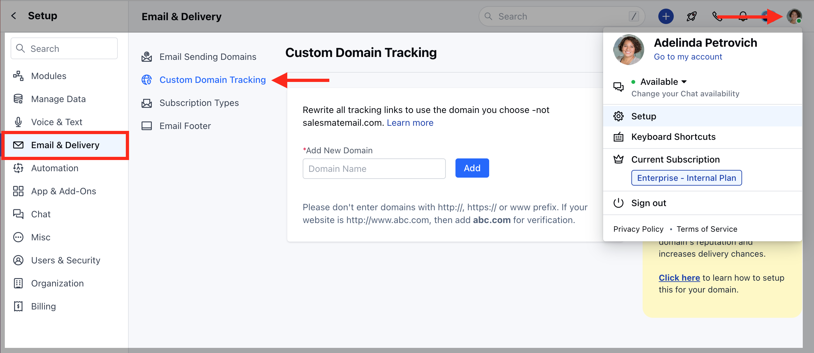
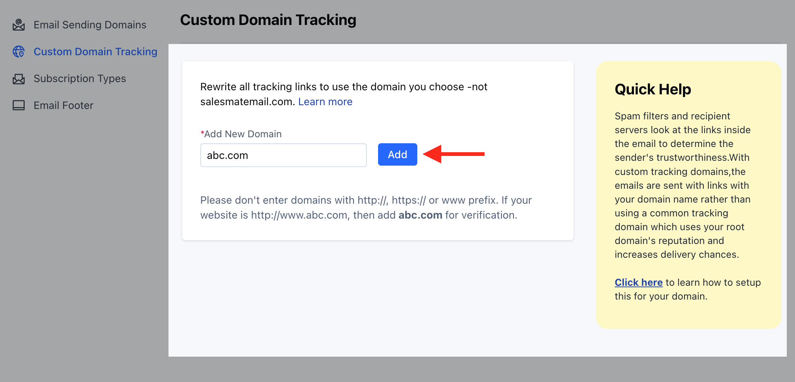
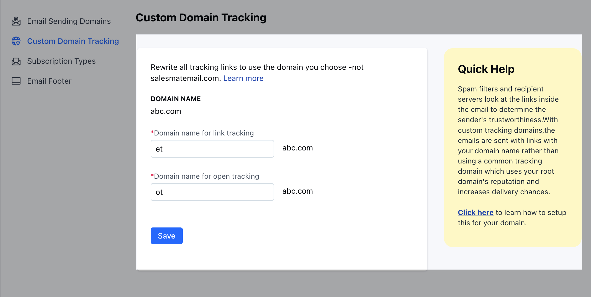
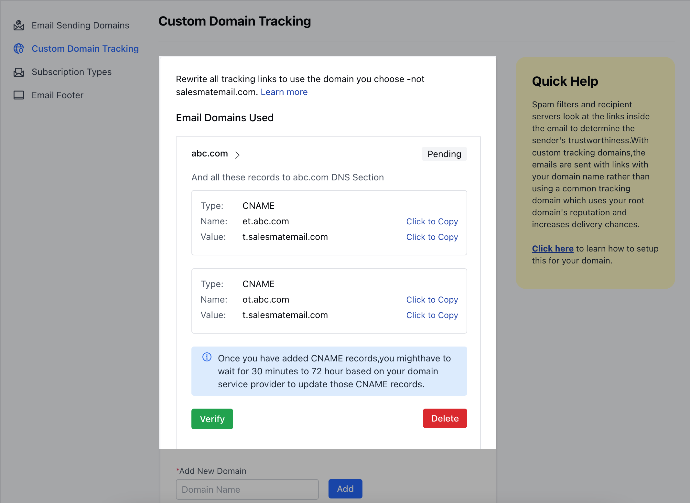
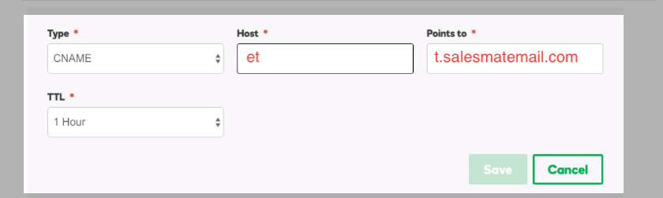
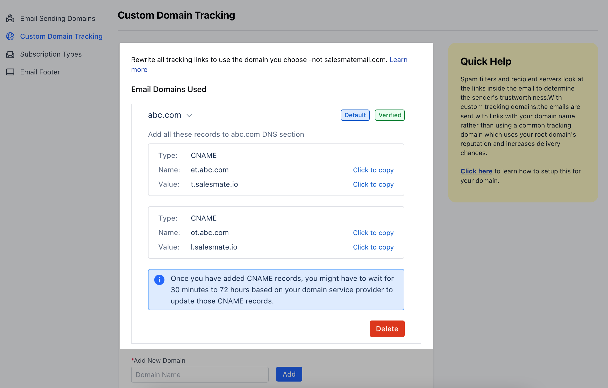

You can customize your email open and click tracking links with your domain name using the Link Branding option; that is the links and images for email tracking (click tracking and open tracking) would be from your Domains instead of the default tracking link from Salesmate.

# Importance of Custom Domain Tracking

Using your custom domain boosts your email deliverability and gives your email recipients the security and belief that the links in your messages are secure and belong to your domainIt will build your email-sending reputation, therefore helping you create/ build your brand image

###  **Topics covered:**

in this article:

- [How to setup Custom Custom Tracking Domain](#how-to-setup-custom-custom-tracking-domain)
- [How to add CNAME entries to your DNS server](#how-to-add-cname-entries-to-your-dns-server)

###  How to setup Custom Custom Tracking Domain

To set up the custom tracking domain:

Click on the **Profile Icon** at the top right cornerSelect on **Setup** Head over to the **Email & Delivery** categoryClick on the** Custom Domain **Tracking ** option

Click on **Add New Domain** where you can enter your domain name and hit **Add**

Provide a domain name for **link tracking**(default with et.yourdomain.com (http://et.yourdomain.com/))
You can use any initials to use it as the domain name, here, we have used **"et"** as the domain nameProvide a domain name for **open tracking**(default will be ot.yourdomain.com) and hit save
You can use any initials to use it as the domain name, here, we have used **"ot"** as the domain name **NOTE: Please don't enter domains with http://, https:// or www prefix**

You will get instructions to set CNAME records for your link.

Once the CNAME records are generated, you will have to add these CNAMEs to your DNS server (Domain provider for example:**GoDaddy**)

###  How to add CNAME entries to your DNS server

Log in to your [GoDaddy](#how-to-add-cname-entries-to-your-dns-server) DNS Manager. Go to the My Account menu and click Domains.Under Domains, click the Manage DNS button for the domain you want to verify.

The DNS Manager page will open with information about existing DNS records.Go down to the Records section and click the Add button to add a DNS record.Choose CNAME from the drop-down menu, Type.Enter CNAME records as mentioned on your Custom Domain Tracking page in SalesmateFinally, click Save.

| Type | Host | Points to | TTL |
| --- | --- | --- | --- |
| CNAME | et | t.salesmatemail.com | 1 Hour |
| CNAME | ot | t.salesmatemail.com | 1 Hour |
| Note: - Some domains need you to specify the complete Host thus enter:et.abc.com and ot.abc.com respectively - Repeat the same steps for "ot" CNAME as well - Set the TTL to the minimum time available |

Once you have added CNAME records, you might have to wait for 30 minutes to 72 hours based on your domain service provider to update those CNAME recordsOnce CNAME records are updated, you can come back to the page and hit the verify button

Once the domain gets verified, the outgoing emails will start sending tracking links with your domain name **Note**:

You can set and verify multiple domainsYou can also choose a default domain in case of sending the SMTP domain is not verifiedAt the time of sending emails, the system will check the domain name of the outgoing email. If it matches the domain you have verified, then tracking links will be overwritten with the provided domain namePlease note end-user must have SSL certificates installed for provided sub-domains to avoid any security warningWe always use SSL-based images to track the open trackingIf the user has added a URL inside the email with HTTPS, then the tracking URL will also be generated with SSL. If the user has provided a non-SSL URL, then the tracking URL might follow non-SSL URLs
