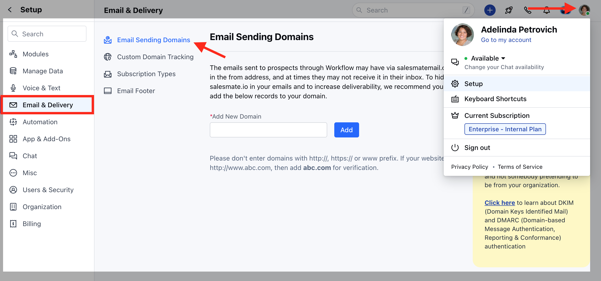
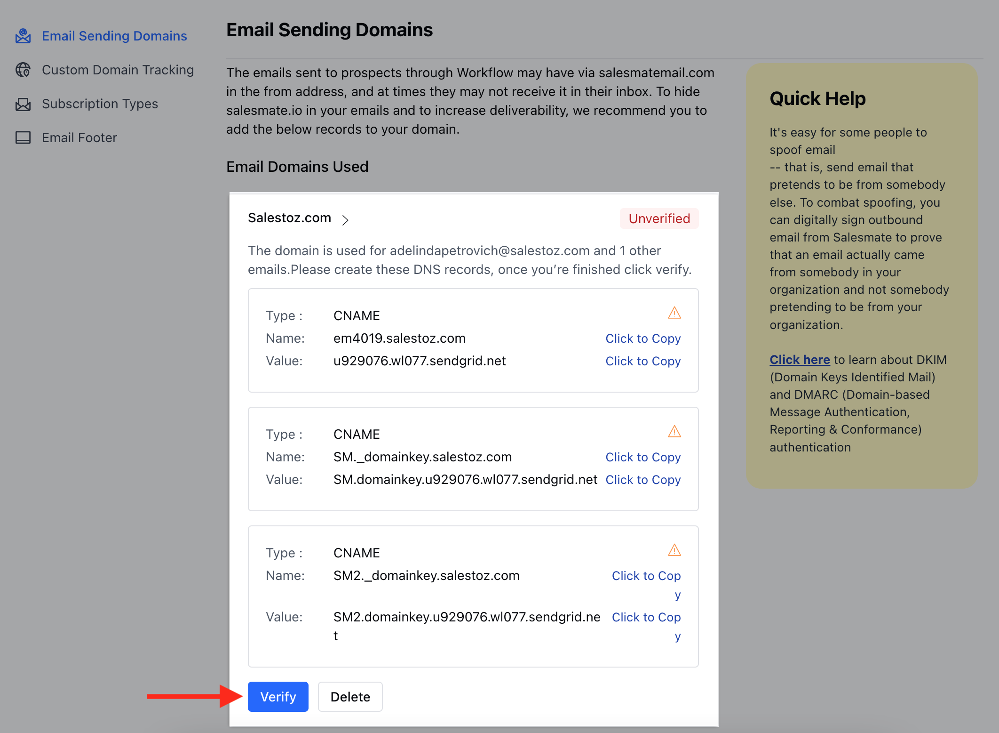
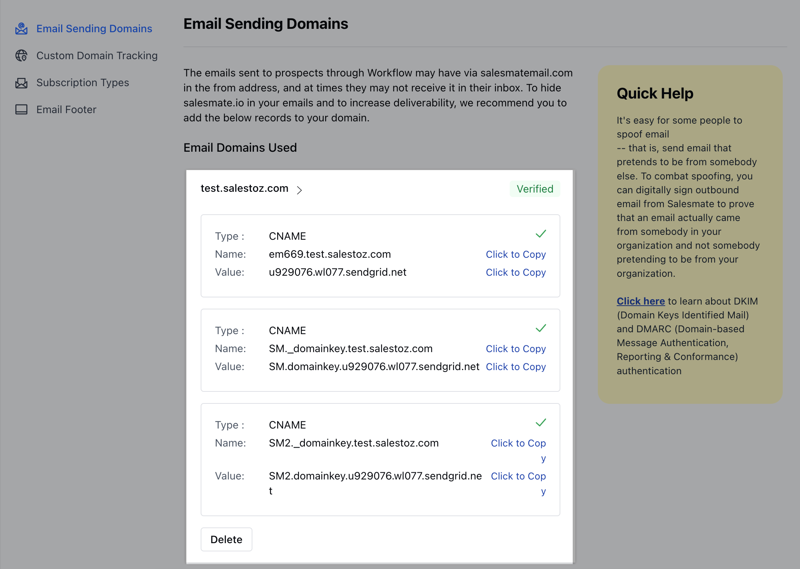

The emails that you send to your prospects might have via **salesmate.io** appear in the form address when they receive it. If you’d like to hide this in your emails, it is highly recommended that you add DKIM records to your domain.If the DNS Manager for your domain is hosted with GoDaddy, follow the steps below to add a CNAME and verify the domain.

Log in to your [GoDaddy](http://www.godaddy.com/) DNS Manager. Go to the My Account menu and click Domains.Under Domains, click the Manage DNS button for the domain you want to verify.The DNS Manager page will open with information about existing DNS records.Go down to the Records section and click the Add button to add a DNS record.Choose CNAME from the drop-down menu, Type.Enter CNAME records on your Outgoing email settings page in SalesmateFinally, click Save.

### How to verify your domain in Salesmate?

Navigate to the **Profile Icon** on the top leftClick on **Setup** Head over to **Email & Delivery** Click on the **Email Sending options**

Hit the verify button to verify your domain name

Verified domains are tagged and **verified**

- *Note**: You can expect a propagation time from 30 minutes up to 24 hours. This is because it takes time for the DNS to take effect across the internet. The actual time of propagation may vary in some locations based on your network setup.In case of any errors refer to the possible reasons for [DKIM verification failure](https://support.salesmate.io/hc/en-us/articles/360006677972-DKIM-Verification-Failure-Possible-Reasons).
