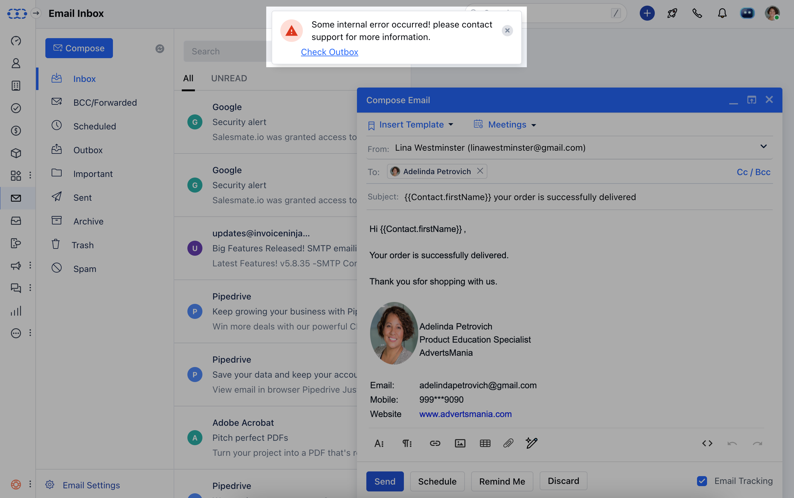
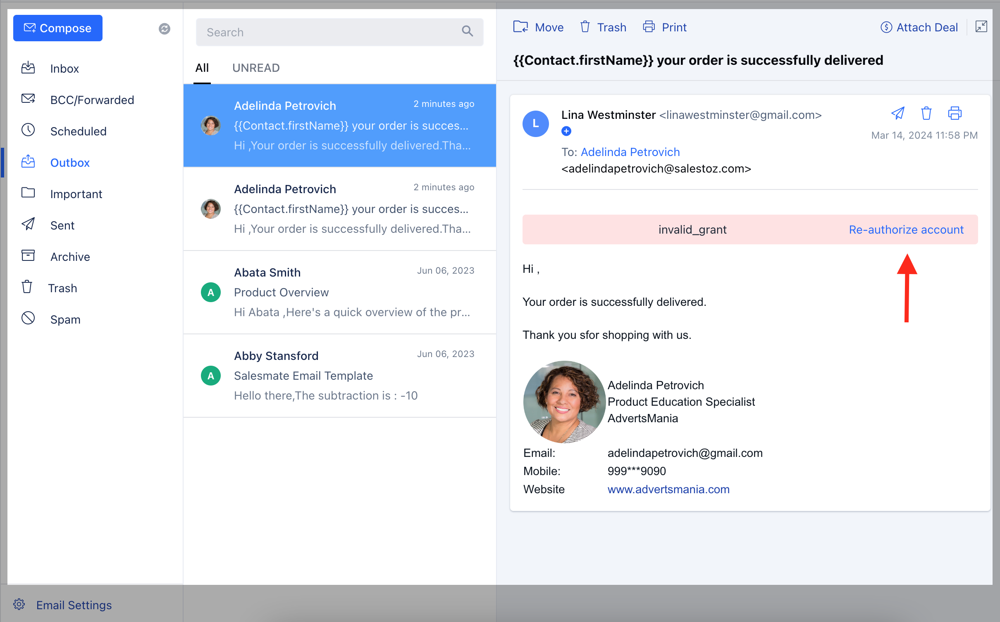
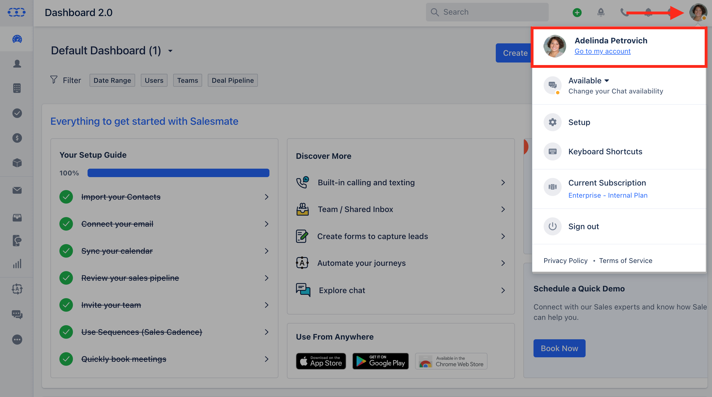
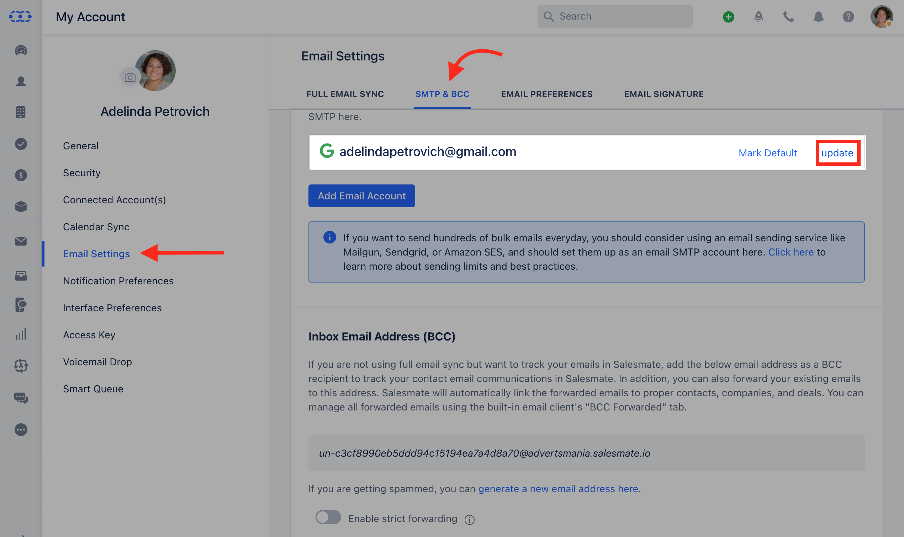
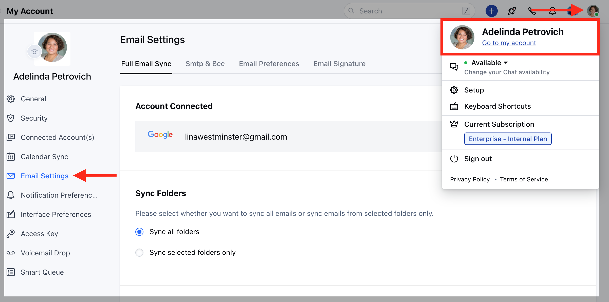
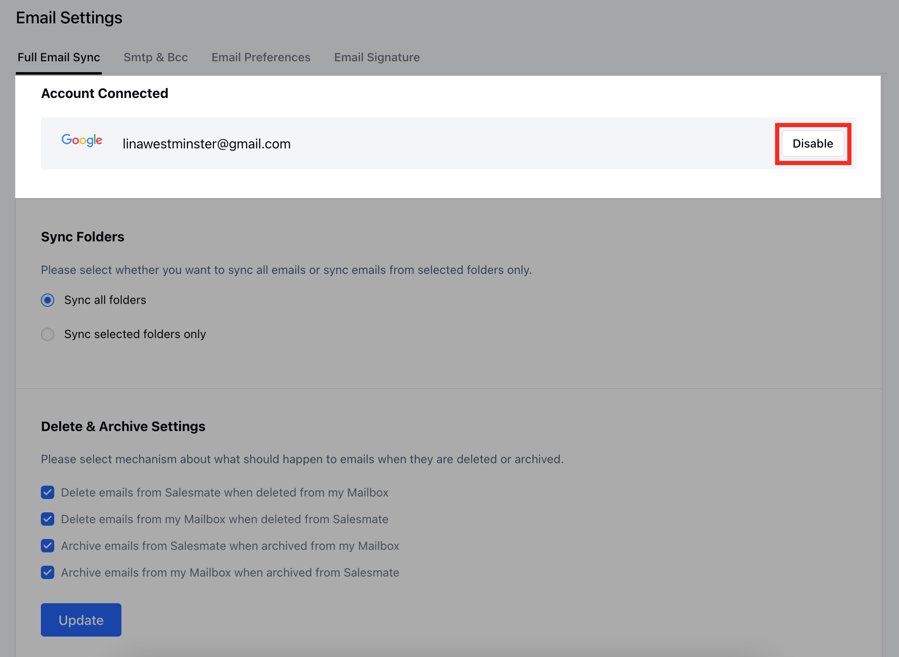
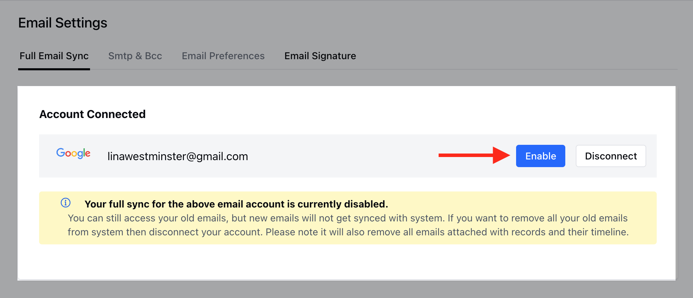
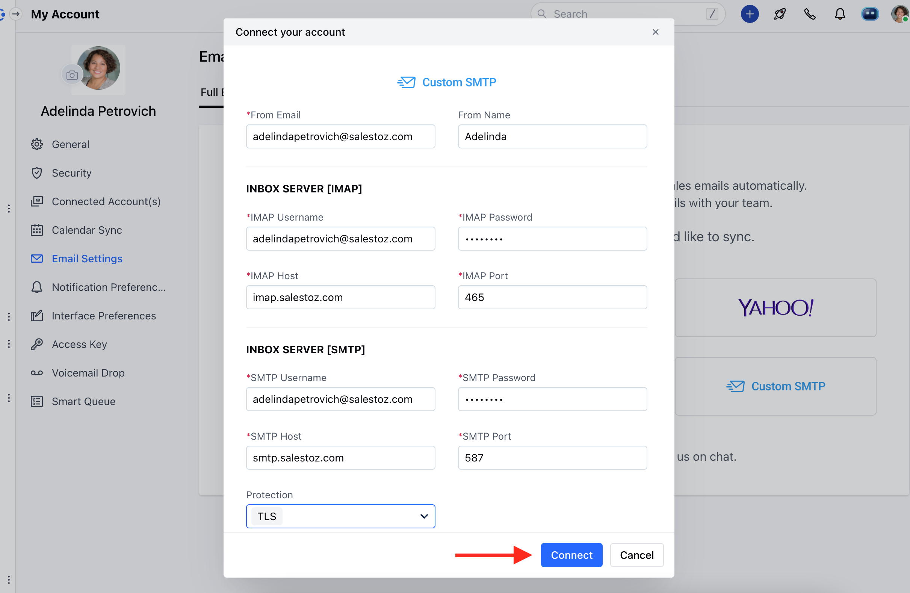

When you update any information to your connected email account with Salesmate the changes do not reflect in Salesmate automatically. In such cases, it won't allow you to send emails and would show the error.

### How to re-authorize your Email Account

- [**In case of the Full Email Sync as Gmail or Microsoft Account**](#in-case-of-the-full-email-sync-as-gmail-or-microsoft-account)
- [**In the case of the Full Email Sync as Custom SMTP**](#in-the-case-of-the-full-email-sync-as-custom-smtp)

####**To reauthorize your Email Account when it shows the error,**

### In case of the Full Email Sync as Gmail or Microsoft Account

Navigate to your **Email Outbox.

- **Click on **Re-authorize Account** on the right of the un-send email **.

Once you click on **Re-authorize account**, you'll be redirected to the **SMTP & BCC** page.Click on the Update option of the email account that is showing an error.You'll be redirected to your Gmail or Microsoft login page where you can update your details **Or** Navigate to your **Profile Icon** on the top right cornerClick on **Go to My Account**.

Head over to **Email Settings** Click on **SMTP & BCC** Select the **Email Account** and click on ** Update **

** You'll be redirected to the Gmail or Microsoft login page where you can update your details.

### In the case of the Full Email Sync as Custom SMTP

Navigate to your **Profile Icon** on the top right cornerClick on **Go to My Account** Head over to** Email Settings ***

- *Go to** Full Email Sync **Click on the** Disable option **on the right of the** Email Account.

Now select **the Enable** option.

As you click on Enable it will open the **Custom SMTP form** Add your details here and click on **Connect**.

