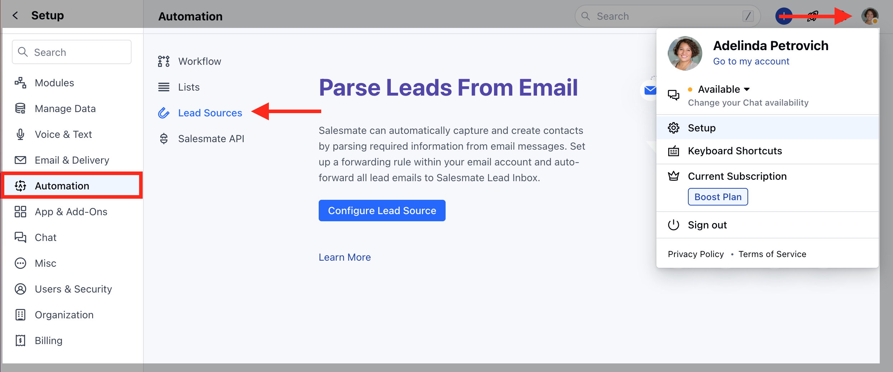
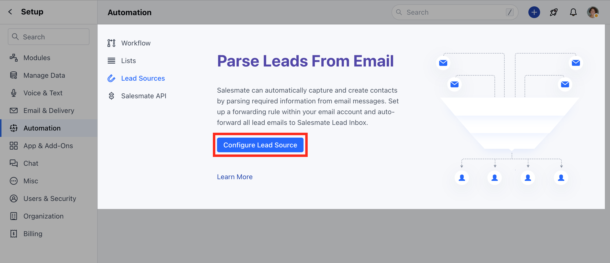
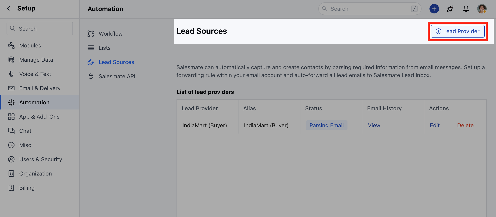
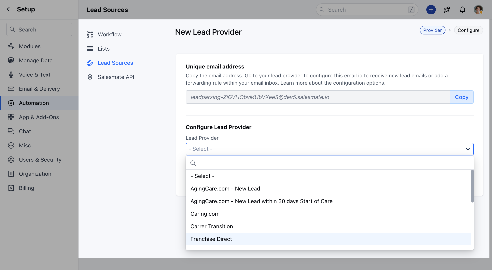
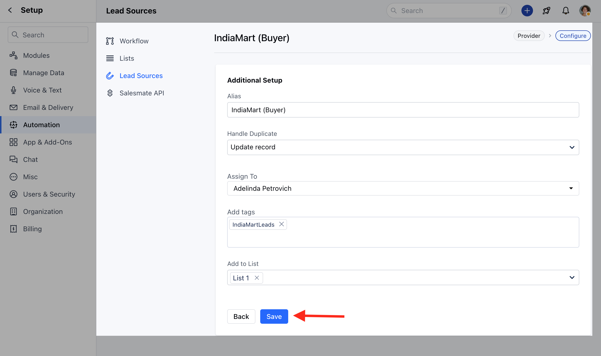
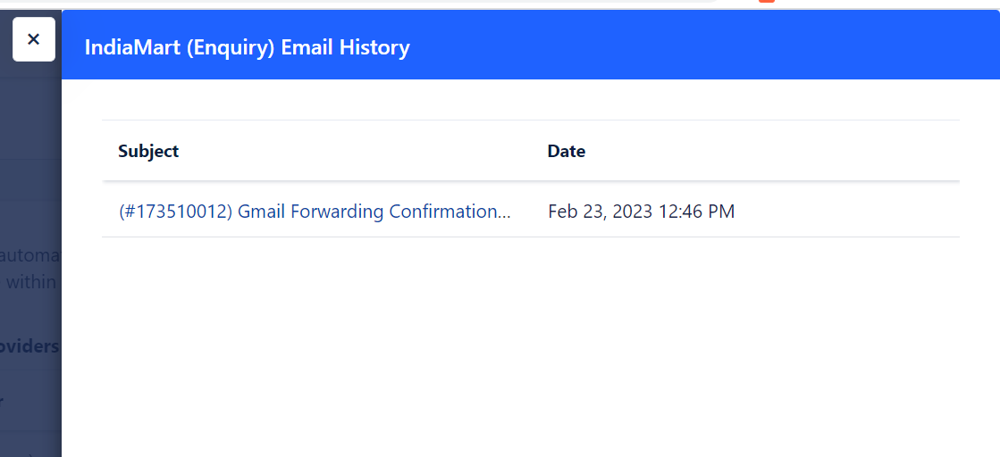

Lead providers provide us with emails with a predefined structure that includes information on the lead or prospect. It takes a lot of time to copy and paste all the details manually. We can quickly and effectively automate these procedures using lead parsing.You can use the lead parsing function to convert emails you receive from your lead providers into contacts and conduct your business flow automatically.

- **Note**: This feature is only available in Pro (Legacy Plan: Growth) and above plans.

### Topics Included:

- [How to Enable Lead Parsing?](#how-to-enable-lead-parsing)
- [How to Add A Lead Provider?](#how-to-add-a-lead-provider)

### How to enable Lead Parsing?

Navigate to the ** Profile **Icon** in the top right corner.Click on the **Setup** option.Navigate to the **Lead sources** option under** Automation **.

On the detailed screen page, you need to click the **Configure Lead Source** button to proceed with further Setup.

On the next screen, you will get the list of configured lead providers so you can choose one of them, and right above that you can see a unique forwarding email address that can be copied with a single click.You need to set up the specific email address as a forwarding email inside your native email inbox or set it up within your lead provider to send emails directly to Salesmate whenever a new lead is created on their platform.

### How to Add A Lead Provider?

You can fetch your Enquiries within Salesmate via Lead Parser.Once the lead parser is enabled, You'll need to perform the following steps:

Navigate to the **Profile** icon in the top right corner.Click on the **Setup** option.Navigate to the **Lead sources** option under **Automation**.

Click on the **+ Lead Provider** button on the top right.

Copy the **Parsing address** and paste it under the Forwarding settings of your Email provider. Select a Lead Provider from the Dropdown list.For now, Salesmate provides the list of the following Lead Providers.

- **AgingCare.com - New Lead **AgingCare.com - New Lead within 30 days Start of Care **Caring.com **Carrer Transition **Franchise Direct **HHHC.com(Home Helpers Home Care)- Employment Lead **HHHC.com(Home Helpers Home Care) - Prospect **IndiaMart (Buyer)**IndiaMart (Enquiries)**Lotvue **Nter Now **Utour **Zillow **locatorIDX **

On this page, you need to do an additional setup under which you can manage the options mentioned below:**Alias**- Add an alias for your source provider to identify it quickly when there are other similar providers.
By default, the alias value will auto-populate with the value provided by the user in the name field of the provider. In the case of a predefined provider, the alias would be the provider name by default.This is an optional field, although we have to keep the value of the provider name if the user does not provide any value.A maximum of 255 characters is allowed.

- **Handle Duplicates?**- Choose whether to update the record or skip the record.

- **Assign To**- Choose an owner or team for assigning newly created contacts to a single person or use a round-robin distribution policy to distribute newly created records among the team members.

- **Assign Tag**- You can choose a tag to be assigned to newly created records.
The tags that are already added to your account could be added too.

- **Add to List**- Optionally choose to add newly created records to be added to a particular marketing list.

After you save all the details your lead provider will be successfully saved and ready to use.

- **Note:**If you have any lead providers that you wish to integrate with, we now have an **[Email Received Trigger](https://support.salesmate.io/hc/en-us/articles/48767576180377-Email-Received-Trigger)** under Smart Flows that can be used to parse your emails and create them as a Lead (Contact) in Salesmate.
