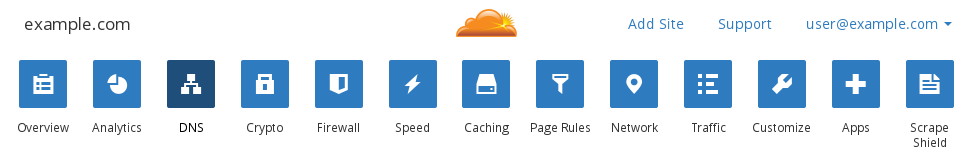
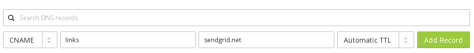
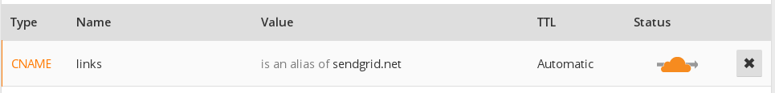
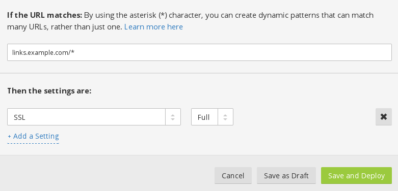
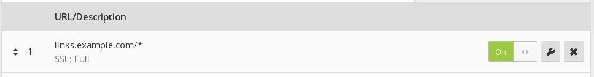
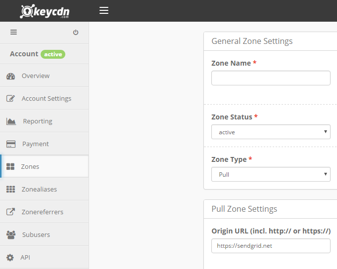
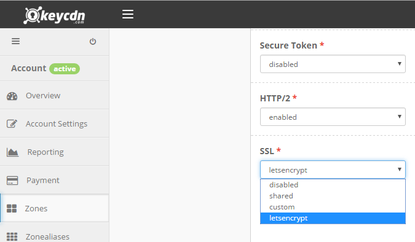
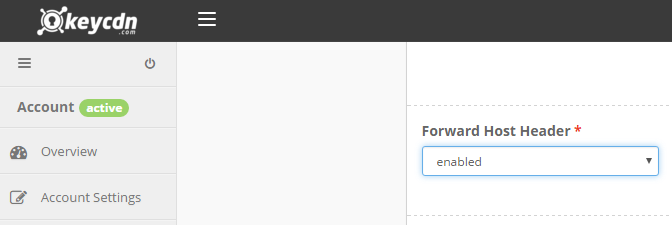
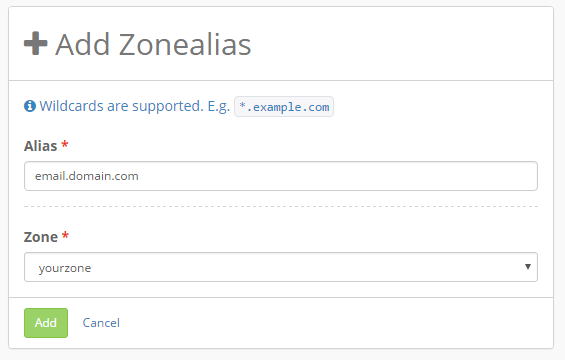

###  Overview

Salesmate supports SSL-enabled click and open tracking. This feature is enabled automatically if you are using a shared IP address or have a non-authenticated domain. To enable SSL click and open tracking for an authenticated domain, additional configuration for SSL keys is required.

###  Configuring SSL Certificates and Keys

In order for click and open tracking to work over SSL, Salesmate needs to present a valid certificate that will be trusted by the email recipient's browser. For authenticated domains, Salesmate is not able to request and/or manage certificates, as it is not the record owner for the domain.To work around this restriction, you may use a CDN service, such as
[CloudFlare](#using-cloudflare)
,
[Fastly](#using-fastly)
, or
[KeyCDN](#using-keycdn)
to manage certificates and keys for your domain.

###  Using CloudFlare

The following instructions assume you already have a CloudFlare account made, using either a
[Full DNS setup](https://support.cloudflare.com/hc/en-us/articles/205195708)
or a
[CNAME setup](https://support.cloudflare.com/hc/en-us/articles/200168706)
. You can compare the 2 different setups
[here](https://support.cloudflare.com/hc/en-us/articles/203685674)
. Note that a CNAME setup is only available to Business or Enterprise level CloudFlare plans.The instructions also assume that you have set up a valid
[custom tracking domain (branded link)](https://support.salesmate.io/hc/en-us/articles/360055782311)
on your account. This step is essential for the following instructions to work.

Begin by logging into your CloudFlare account, and navigating to the DNS settings for your domain.

Add a new CNAME entry that points your configured branded link domain to salesmatemail.com.

Once the record is created, click on the cloud icon under the Status column to turn it orange and enable HTTP proxy.

Next, navigate to the Page Rules settings for your domain. You will need to create a Page Rule for your branded link domain that sets SSL to Full. This is necessary due to how
[CloudFlare validates the certificate on the origin](https://support.cloudflare.com/hc/en-us/articles/200721975)
. You can find more information on the different SSL options
[here](https://support.cloudflare.com/hc/en-us/articles/200170416)
.

Ensure that the Page Rule is On.

If you are using a CNAME setup, you will also need to change DNS to point to the CloudFlare CNAME you created.Once all of this is done, you will need to contact support on chat or email to support@salesmate.io and request that SSL click and open tracking be enabled on your account. They will then verify the configuration and enable the setting on your account.

###  Using Fastly

- [Sign up for Fastly](https://www.fastly.com/signup/)
or
[log in](https://manage.fastly.com/)
to an existing account.Click **Configure** on the Dashboard.Click the gear icon to open the **Manage Service** menu and click **Create**.

Set the options as follows:- **Server address and port:** `salesmatemail.com` : `443` *The connection on the SSL port 443*

- **Domain:** `lt.example.com` *Enter your custom tracking domain here. Ensure it matches the domain configured in the Custom tracking domain settings. This value will be what recipients see in your SSL enabled click tracking links.*
- **Description:** `Salesmate` (or whatever you like)Finally, click the **Create**. The new service will appear in the list of available services.Contact Salesmate support to validate your CDN settings and enable SSL click and open tracking.For more information, please visit [Fastly's documentation](https://docs.fastly.com/guides/basic-setup/working-with-services#creating-a-new-service).

###  Using KeyCDN

This section is maintained by KeyCDN, if you have any questions about KeyCDN please
[contact their support](https://www.keycdn.com/support/)
team.
[Sign up for KeyCDN](https://app.keycdn.com/signup)
or login to your existing account.Create a pull zone and point the origin URL to
[https://salesmatemail.com](https://salesmatemail.com/)

Enable SSL and HTTP/2 (custom SSL or Let's Encrypt).

Enable the option "Forward Host Header."

Create a CNAME record in your DNS settings pointing the alias you want to use for your custom tracking domain (e.g. lt.domain.com) to the Zone URL provided within your KeyCDN dashboard (e.g. salesmate-1c6b.kxcdn.com). Then, add that alias as a Zonealias.

Finally, contact our support team and they'll validate the CDN settings and enable SSL click and open tracking.
