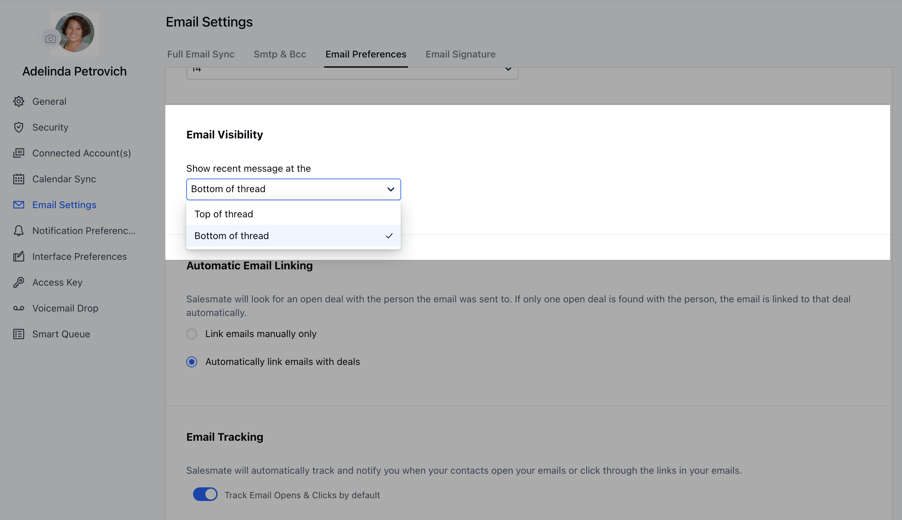

Email threads are Salesmate's way of showing you the full email conversation you've had with specific participants. If you have the Email configured in Full Sync, the emails you send and receive will be automatically put into threads within the Salesmate Mail tab.To ensure this works smoothly and as intended, we highly recommend you**send emails from within the Salesmate app**using Full Email Sync.

####**Email Threading Order**Users can choose their preference for the order of new emails coming in an email thread i.e. whether they should come on to the top or at the bottom under the Email thread

Navigate to the**Profile Icon**on the top right cornerClick on**Go To My Account**Head over to the**Email Settings**Under**Email Visibility**, Select your preference.Once selected, the preference will get auto-saved.

Once the order preference has been updated, it will then update the email thread order in both Salesmate's personal inbox and the Team InboxIt's a User level preference that means, each user will be able to set their individual preference.

We don't have email threading for forwarded emails using Smart BCC functionality.**Note:**Threads in Salesmate are displayed for your easy reference and do not mean that the emails within the thread are shared with every possible recipient. Unless an email is directly addressed to a recipient, they will not receive a copy — even if they are included in the thread.
