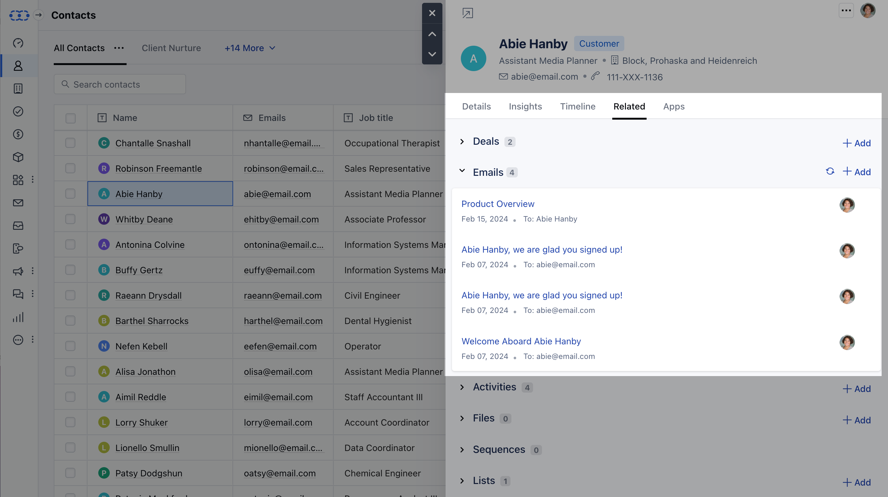
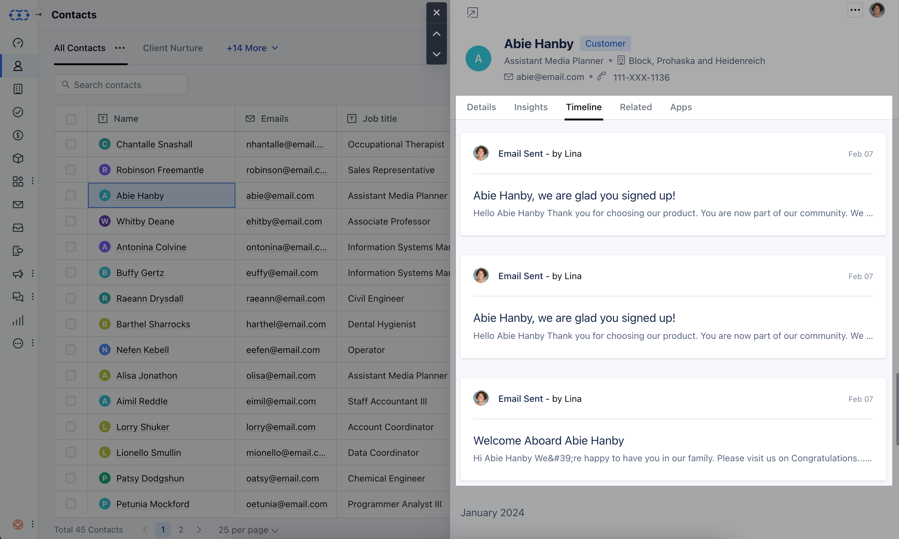

Salesmate will sync your emails and associate them with the contacts related to the email ID automatically.Additionally, Salesmate also offers Emails associations that are specific to Deals or Activities. These Emails can also be associated manually if required.Your emails start syncing with the associated contact record once you have connected your emails either by forwarding your emails using the
[Bcc Email address](https://support.salesmate.io/hc/en-us/articles/214088269-How-can-I-setup-my-emails-in-Salesmate-)
or configuring
[Full Email Sync.](https://support.salesmate.io/hc/en-us/articles/115000665965-Full-Email-Sync-Beta-)
Each email is available to you on the records timeline and under the related tab and timeline in the quick view of the record. This keeps you up to date on your communication with the contact.

A Quick Preview of Contact will show you Emails under the **Related section**

 Get the status of the Emails Sent, Clicked, Open with all associated received Emails.

Not just associating your emails with the contacts. You can choose to
[associate your emails with the deals either automatically or manually.](https://support.salesmate.io/hc/en-us/articles/115003236205-How-do-I-connect-incoming-emails-to-deals)
