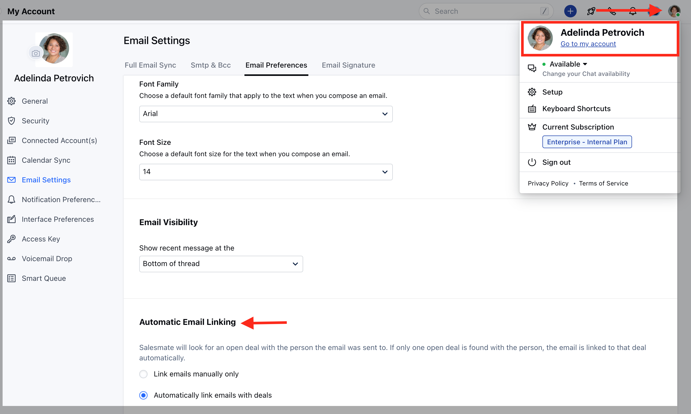
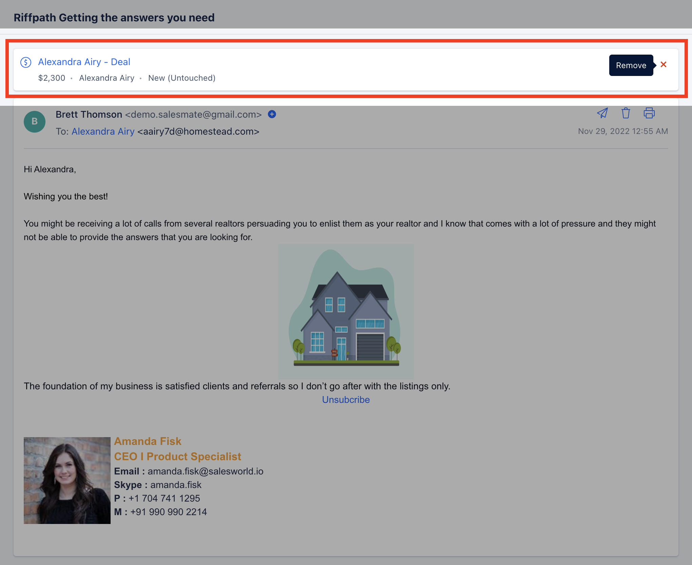
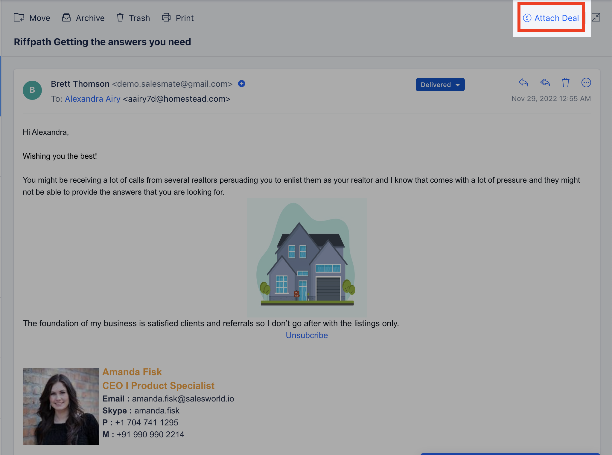

Emails will be automatically linked to the contacts matching the email address in Salesmate. If the contact has only one deal open, the email will get attached automatically to the deal.If the contact has more than one deal open, then the system won't automatically attach the email to the deal as it won't be able to figure out to which deal the email is related. You need to attach the deal to that email from Salesmate Mailbox.

[Automatic Email Linking](https://support.salesmate.io/hc/en-us/articles/115003236205-How-do-I-connect-incoming-emails-to-deals#h_01GP3F5B6VEWKJM8CR3ZDVC8VZ)[Use Cases](https://support.salesmate.io/hc/en-us/articles/115003236205-How-do-I-connect-incoming-emails-to-deals#h_01GP3F5KE3V2RTEF1CQ1P8T8A0)

### Automatic Email Linking

You can set the default behavior of the email linking to deals. Salesmate will look for an open deal with the person the email was sent to. If only one open deal is found with the person, the email is linked to that deal automatically.You can choose your preference by following the below steps:

Navigate to the**Profile Icon**in the top right corner.Click on**Go to my Account.**Click on**Email Settings.**Click on**Email Preferences.**Head over to**Automatic Email Linking.****Link emails manually only:**It will not link the deals to the emails automatically. You will need to manually attach the deals.**Automatically link emails with deals:**It will automatically link the emails with deals if the reply is on the same email thread or there is only 1 open deal associated with the contact.

### Use Cases

#### Case 1

#### You have two open Deals A &  B. Email is sent out from Deal A as well as Deal B. Now client responds about Deal B on the email of Deal A. Thus this email will be shown on Deal A.

Click on the**X**icon to remove the deal from the email.Click on the**Attach Deal**button to attach the correct deal which will show once the incorrect deal is removed.

#### Case 2

You have two open Deals A & B. Email is sent out from Deal A as well as Deal B. Now client responds back to the Deal A thread email. Thus this email will be shown on Deal A specifically and if he replies without using a thread, then you will need to manually attach the deal to the email.

Click on the**Attach Deal**button to attach the deal.

