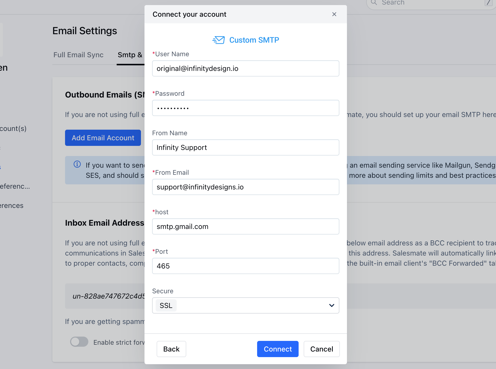

You have linked your primary email account with Salesmate and want to set up your email alias account to send emails through it. You can connect your alias email account under SMTP & BCC. For example, I have a **primary** account **demo@salesmate.io**. I am additionally responsible for handling support emails from email support@salesmate.io.

- **support@salesmate.io** is an **alias** for my primary account.

- **To configure this follow the below steps:**Navigate to the **Profile Icon** in the top right corner.Click on **Go to my account.

- **Click ** Email Settings.***

- *Click on** SMTP & BCC.

- **Head over to** Outbound Emails (SMTP)**. Click the** Add Email Account** button.

Select **Custom SMTP.

Fill in the required details.Mention the **Alias Email address under From Email.

Once added you will get an option to select the from address while sending out an email from Salesmate or the Chrome Plugin/Extension.**In case of Errors, please check the below points:**Due to security concerns, Google has removed the **Less Secure Apps (LSA) feature**. Therefore, it is no longer possible to use the LSA setting to allow access to third-party apps that do not support modern authentication.If you encounter errors while connecting, you may need to use an alternate method to allow the third-party app access to your Google account. You can use **App Passwords** to authenticate the third-party app. Here are the steps to generate an App Password:

Sign in to your **Google Account.

- **Go to the **Security tab.

- **Under "**Signing in to Google,**" select **App Passwords.

- **Select the app and device you want to generate the app password for.Follow the instructions to enter the **App Password.**
