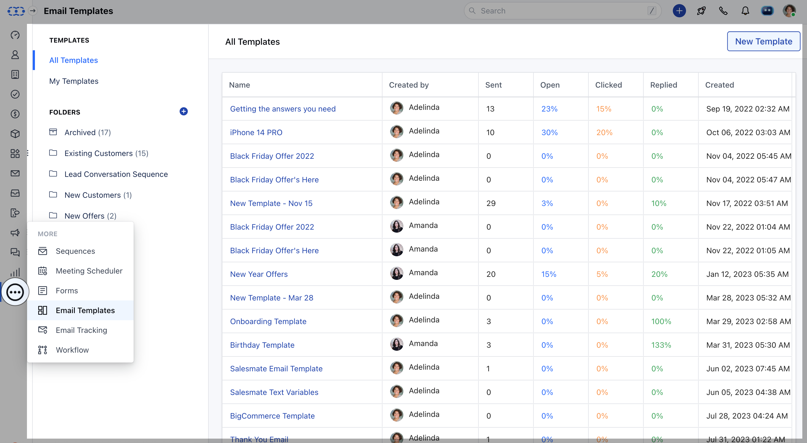
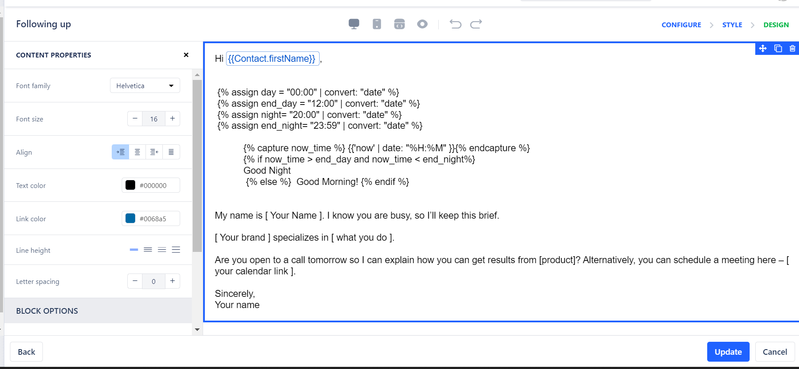
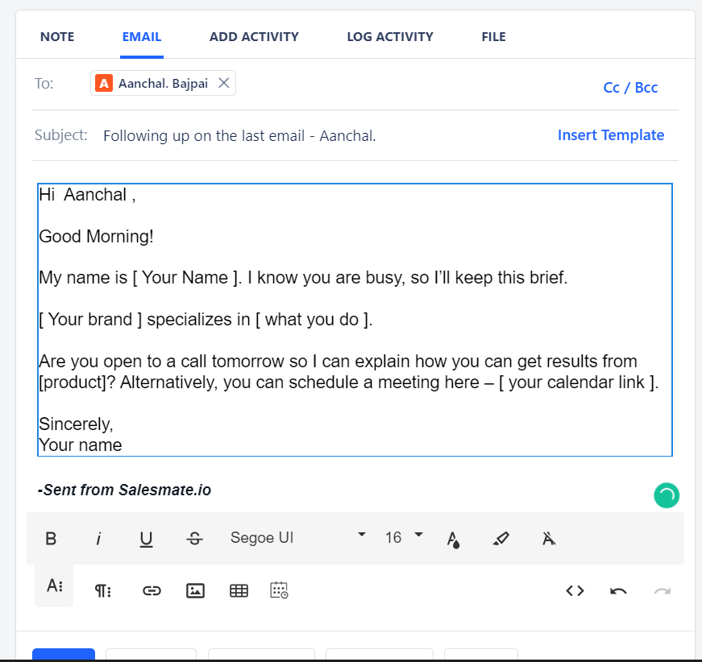

You can add custom greetings like Good Morning or Good Night in your Emails automatically via Email Template. To create an email template:

Navigate to **More Icons** on left menu barClick on **Email Templates** Click on **\+ New Email Template** to create a template.



Select **Simple Text** type of Email Template. Paste the following Code in the starting of the template.

```
| &#123;% assign day = "00:00" | convert: "date" %&#125; |
| &#123;% assign end\_day = "12:00" | convert: "date" %&#125; |
| &#123;% assign night= "20:00" | convert: "date" %&#125; |
| &#123;% assign end\_night= "23:59" | convert: "date" %&#125; |
| &#123;% capture now\_time %&#125; &#123;&#123;'now' | date: "%H:%M" &#125;&#125;&#123;% endcapture %&#125; |
&#123;% if now\_time & gt; end\_day and now\_time & lt; end\_night%&#125;
 Good Night
&#123;% else %&#125; Good Morning! &#123;% endif %&#125;
```



Add the Template** Name.

- **Create/Select** the folder where you would like to store this email template.Mention the **Subject** Line of the Email. You can also insert dynamic attributes to send personalized emails and Hit** Next.** Hit on Update and update the email template.


