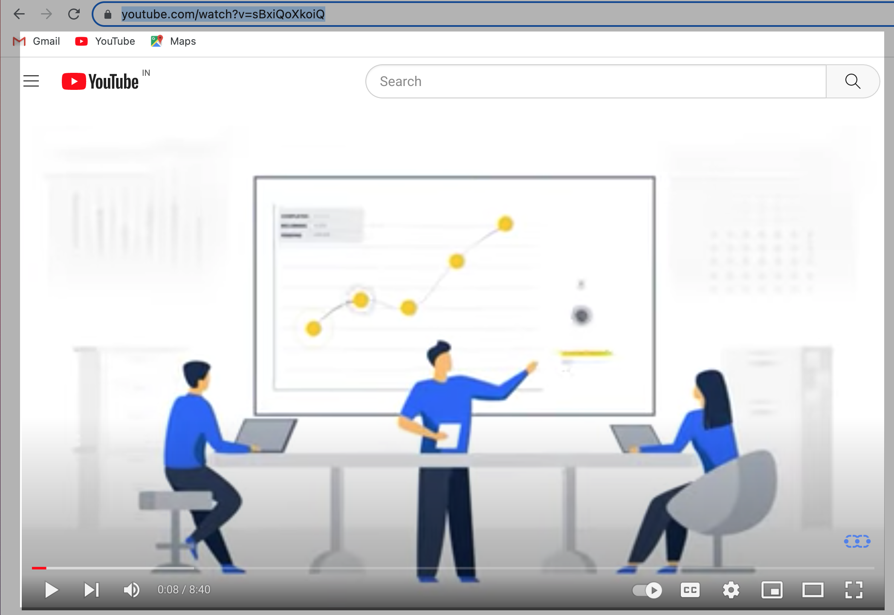
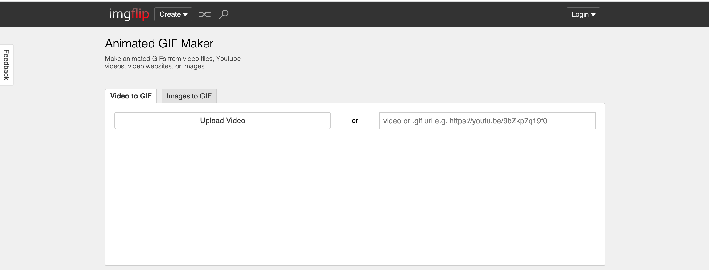
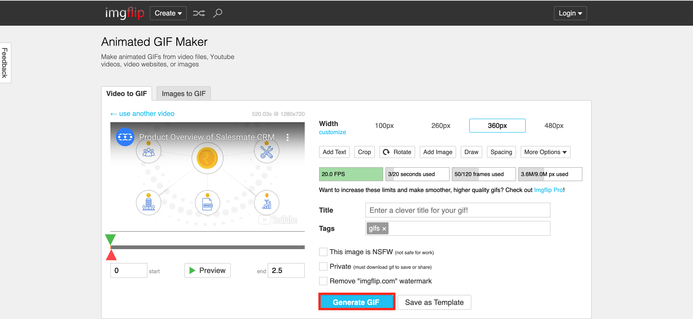
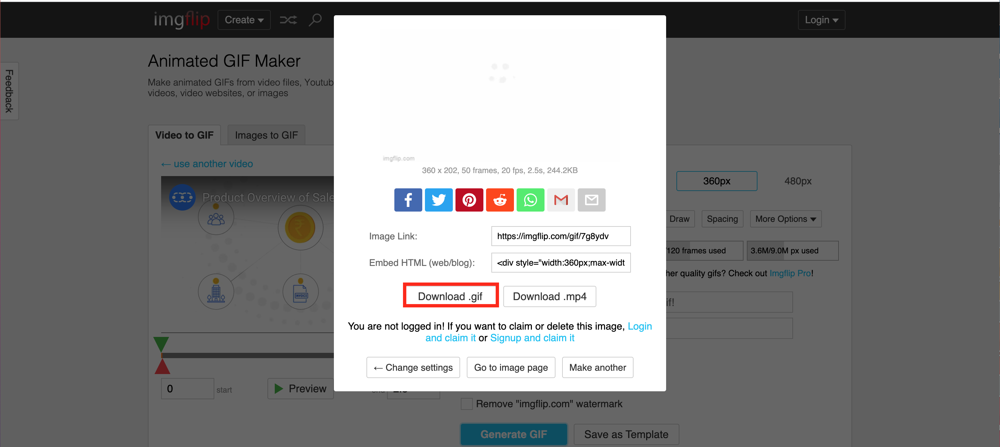
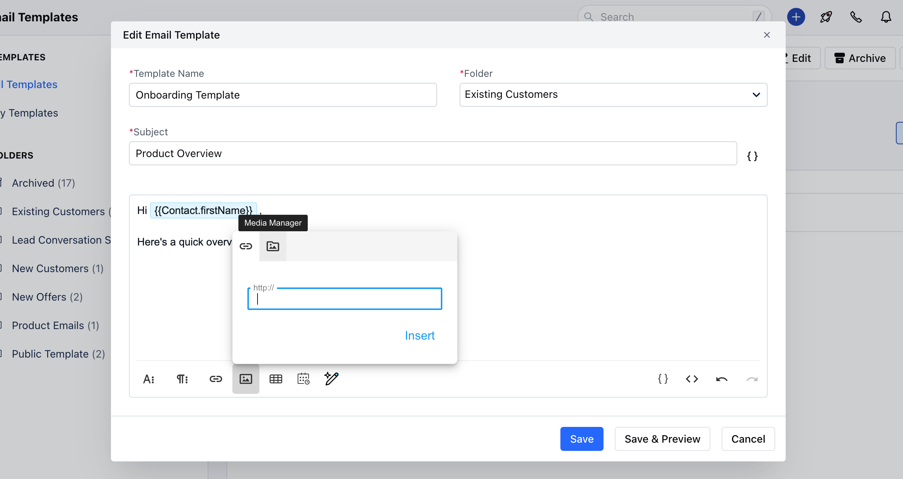
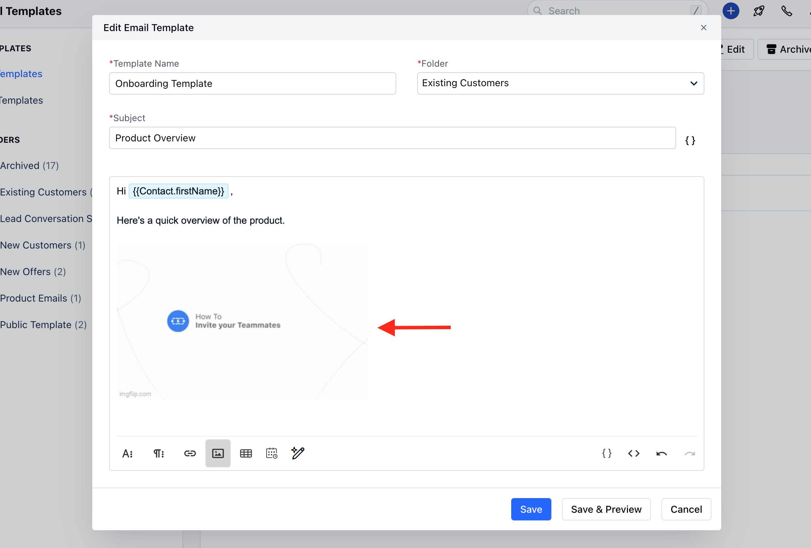

There are two options you might want to consider when embedding a video in your email.

You can either add a GIF of your video with the label "Click here to watch full video".You can add a still photo of your video, and when subscribers click the "Play" button, they'll be re-routed to your video's URL.

### How to Create a GIF Image of Your Video

Find the URL of the video you want to include, or download and save it to your computer.

Go to [Imgflip.com](https://imgflip.com/gif-maker) - a tool that enables you to create GIFs of videos.

Choose a starting point and endpoint for your GIF.

Download your GIF.

Add the GIF to the email by uploading it to the Email Media Manager

Add a video CTA linking to the full video.

### How to Create a Still Image of Your Video With a Play Button

Take a screenshot of the paused section of the video.When the video, it automatically includes a "Play" button. To add one to a still image, go to the website [Add Play Button to Image](#how-to-create-a-gif-image-of-your-video), upload your image, choose a play button design, and click "Create Play Button Image". Then, click "Download Image".Next, simply click "Insert Image" in your email to include the image with the Play button. Then, highlight the image and select "Insert Link". Copy-and-paste the link to the full video.When a user clicks on your image, they'll be redirected to the full video. Make sure the video is set to auto-play so the user doesn't have to click "Play" again.
