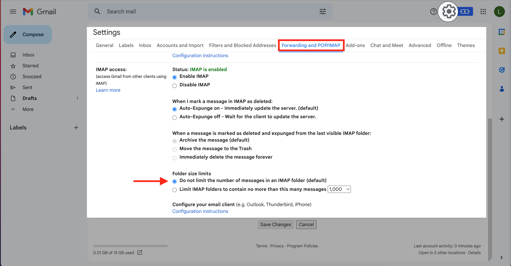
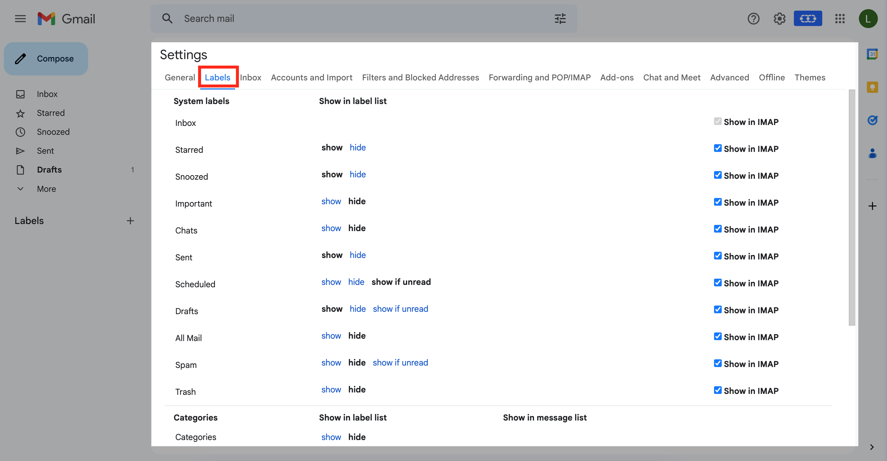

A probable cause of the issue could be that your Gmail account has IMAP disabled for the “All Mail” label or that IMAP is disabled.To troubleshoot this error follow the below steps:

Log into your Gmail account at [https://mail.google.com](https://mail.google.com/).

Go to your Gmail settings and select “Forwarding and POP/IMAP” (the direct link should be [https://mail.google.com/mail/u/0/#settings/fwdandpop](https://mail.google.com/mail/u/0/#settings/fwdandpop)).
Verify:
“Enable**IMAP”**should be selected.“Do not limit the number of messages in an IMAP folder” should be selected.Save the above settings.

Go to the “Labels” tab (the direct link should be: [https://mail.google.com/mail/u/0/#settings/labels](https://mail.google.com/mail/u/0/#settings/labels)).Verify that “All Mail” has “**Show in IMAP**” enabled along with others as well. Now you can go ahead and add your Gmail /  GSuite account in [full sync.](https://support.salesmate.io/hc/en-us/articles/115000665965)
