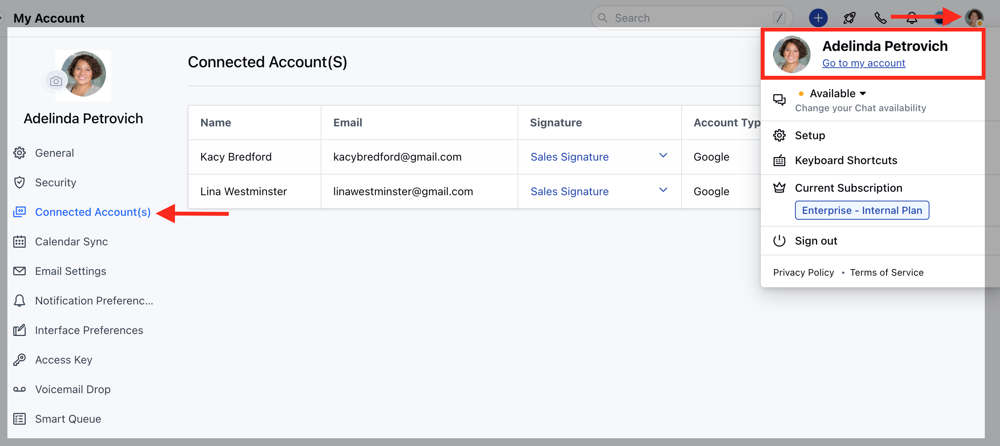

Salesmate allows you to create Multiple Email Signatures with a flexibility to change the Default Signature for the Connected Email Accounts.

### Change the Signature for Connected Emails

To change the Signature for Connected Emails,

Navigate to the **Profile Icon** on the top right cornerClick on the **Go to My Account** Head over to** Connected Accounts **

** Here, you have the choice to either select a signature from the list of created ones or choose not to use any signature at all.

