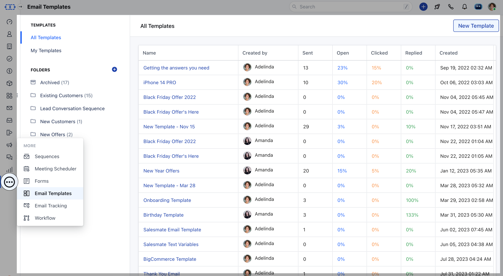
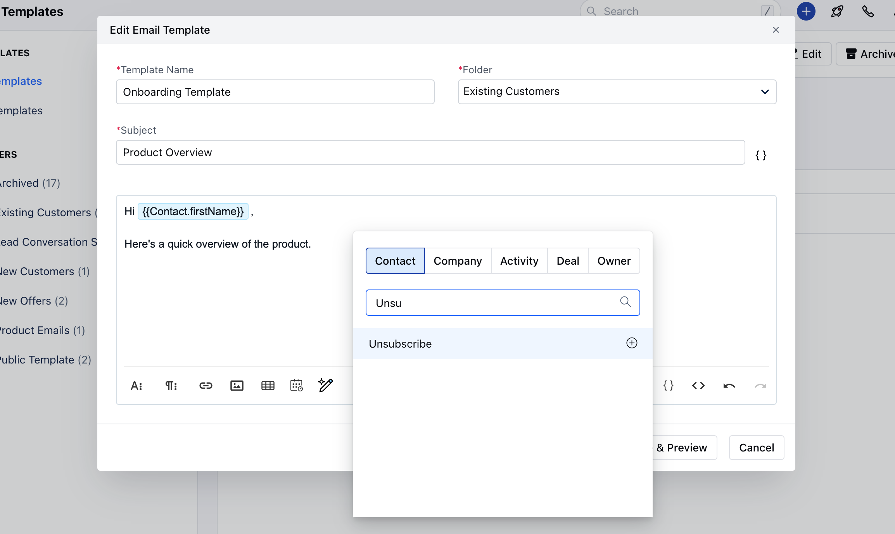
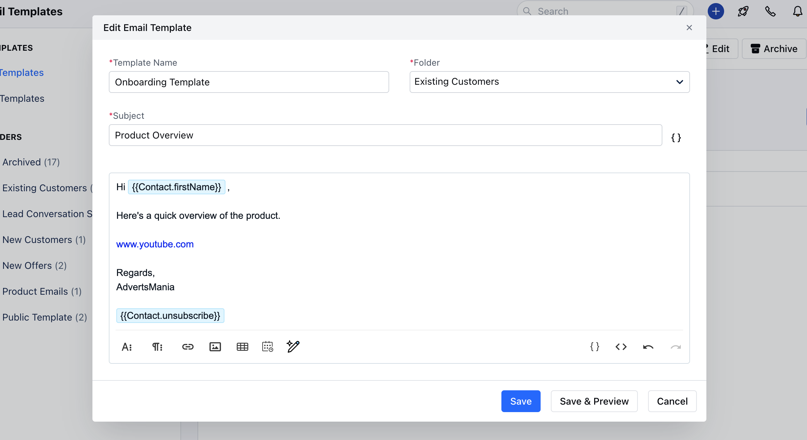
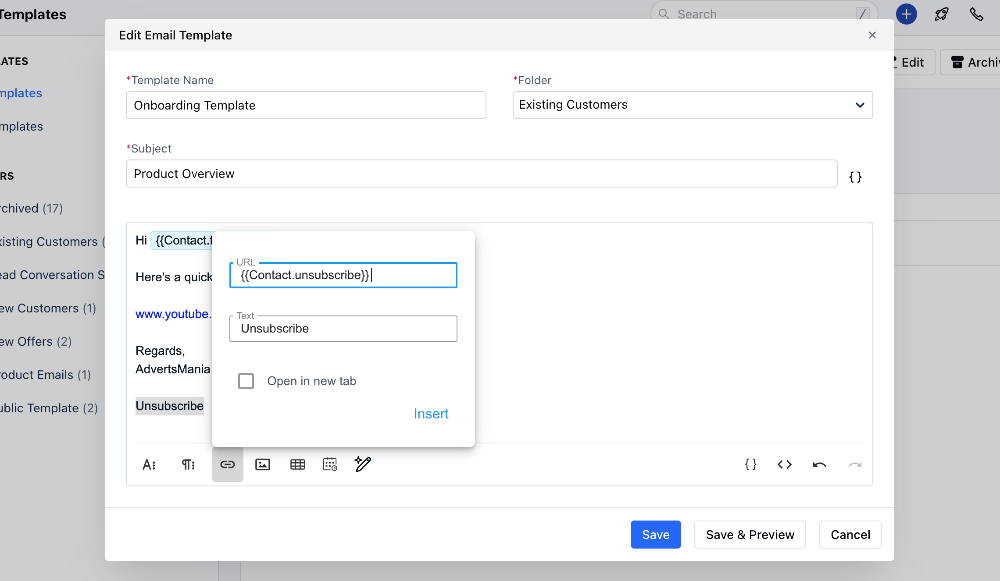
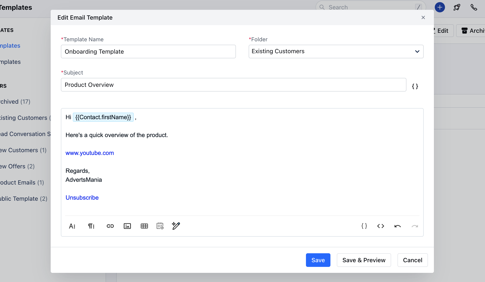
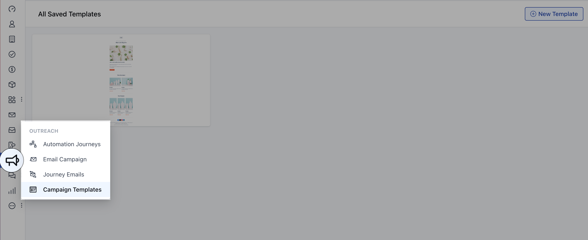
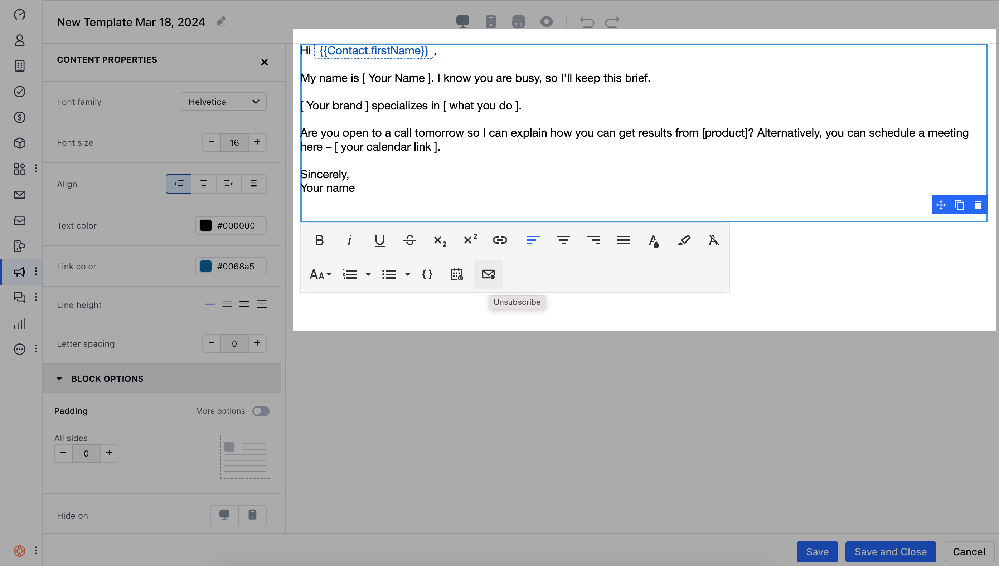

You can add an **unsubscribe** link to your emails using templates that are sent from the Contact / Activity / Deal page or using the compose email option in Inbox, Gmail Chrome extensions, or mobile applications.

This link allows recipients to opt out of receiving such emails from your account.
Adding unsubscribe links to your email communications can help you stay compliant with spam laws (e.g., CAN-SPAM, GDPR, CASL) and improve email deliverability by allowing unengaged recipients to opt out.

You can add the unsubscribe link to the following:

- [Email Templates](#email-templates)

- [Campaign Templates](#campaign-templates)

---
###  Email Templates

To add the Unsubscribe link to Email Templates:

1. Navigate to the **More Icon** on the left menu bar.
2. Click on **Email Templates**.
3. You can add the Unsubscribe link to existing templates or create a new one by clicking **New Template**.

To add the Unsubscribe link here, click on **Attributes** and select the **Unsubscribe** option under Contacts.

It will be inserted as a variable in the Email body.

Copy the attribute `{{Contact.unsubscribe}}`, type **Unsubscribe**, then go to **Insert Link**.
Now paste the copied attribute into the URL field and click **Insert**.

Once you click on Insert, **Unsubscribe** will now appear in your email body.

---
###  Campaign Templates

To add the Unsubscribe link to Campaign Templates:

You can create a new template or select one of the predefined templates.

To add the Unsubscribe link here:

- Drag and drop the **Text block** into the editor.
- Select the **Unsubscribe** option from the toolbar.

When the contact receives the email and clicks **Unsubscribe**, they will be redirected to an unsubscribe page where they can choose the reason for unsubscribing:

- I no longer want to receive these emails
- I never signed up for this mailing list
- The emails are inappropriate
- The emails are spam and should be reported
- Other (fill in the reason below)

The contact will receive a success message after submitting the option.

In Salesmate, two fields will be updated:

- - **Email Opt-Out:** `True`

- **Email Opt-Out Reason:** (the chosen reason)

The email field will also be highlighted in **red** as an indication that the contact has opted out of future emails.
