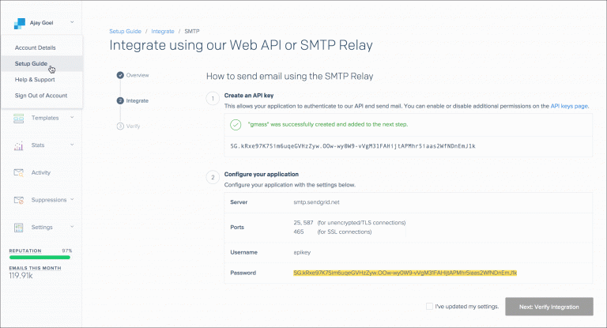

Would you like to use SendGrid as an option to send bulk emails or as an SMTP under Sequences. If so, here is how we recommend that you configure your Sendgrid account.

####**In your SendGrid account,**Go to your**Sendgrid account >> Setup Guide >> Integrate >> SMTP Relay**Create an**API key**and copy your User name and Password.

####**In your Salesmate account,**Navigate to**Profile Icon**on top right cornerClick on**"Go to my account"**Head over t**o Email Settings**. Click on the**SMTP & Bcc**tabClick**"Add Email Account"**Choose option**"Custom SMTP"**Enter the details as below:**Username:**Copy user name from your Sendgrid API**Password:**Copy Password from your Sendgrid API**From Name:**The name you would like the recipient to see when they receive your email**From Email:**The email you would like the recipient to see when they receive your email**Host:**smtp.sengrid.net**Port (Secure):**25 (None), 587(TLS), 465(SSL)Click**Connect**Once the SMTP is connected successfully, it will appear in your drop down list to select when you:

Compose an email (single or bulk)Enrol contact to sequence
