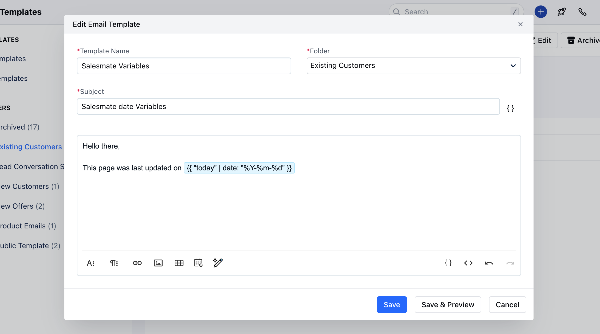
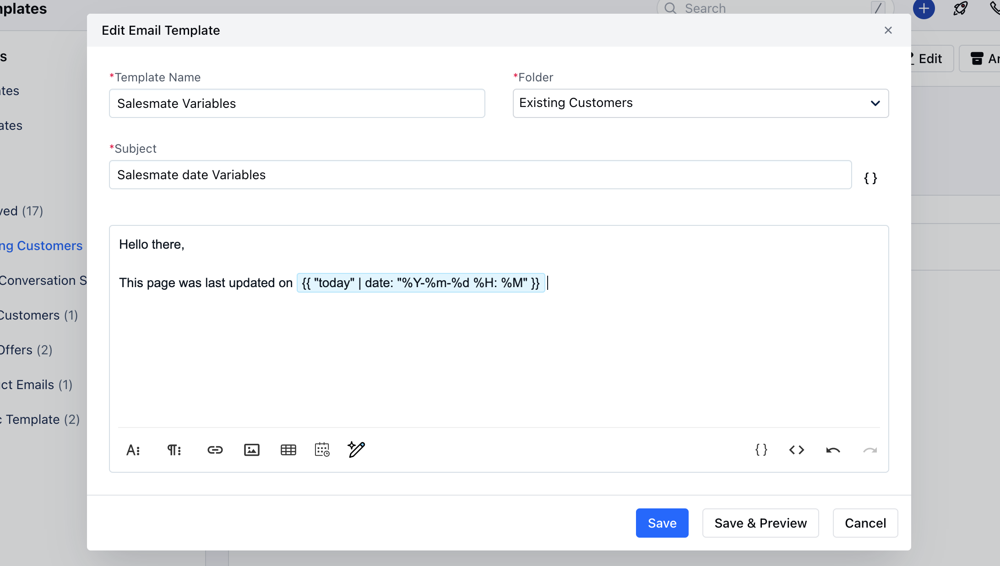

To add today's date in an email template, You can use special word "today" with date function. Add the following attribute in the email template:

**Input**

```highlight
This page was last updated at &#123;&#123; "today" | date: "%Y-%m-%d" &#125;&#125;
```

**Output**
```highlight
This page was last updated at 2024-03-12
```




You can also add the current time with the date.

- **Input:** 
```highlight
This page was last updated at &#123;&#123; "today" | date: "%Y-%m-%d %H: %M" &#125;&#125;
```

- **Output:** 
```highlight
 This page was last updated at 2024-03-12 19:06
```
