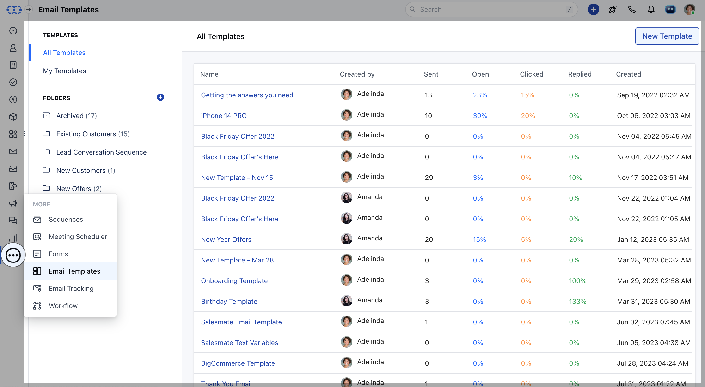

An email template is a pre-defined email layout, that may already include content like images or text. Rather than create a new email from scratch each time, you can use a template as a base. Templates are also handy for making sure email designs follow brand guidelines.Topics Covered,

- [**How to Create an Email Template**](#how-to-create-an-email-template)
- [**Text Editor Options**](#text-editor-options)

To create Campaign Templates please check this article **\-**
[**Article Link**](https://support.salesmate.io/hc/en-us/articles/19847146942361 "/hc/en-us/articles/19847146942361")

###  How to Create an Email Template

To create email templates:

Navigate to the **More Icon** from the left Menu barClick on **Email Templates** Head over to **New Template** to create a template.

Here add the following details to start creating a New Template,- **Template Name:** Add a name to the template for using it while you send the emails

- **Folder:** Manage your email templates based on your requirement

- **Subject:** Add the purpose of the email

- **Body:** Add email content and use attributes to personalize the emails

###  Text Editor Options

Use a different text editor option to customize the email content

- **More Text:** With this option, you can customize the content by changing **Font Style, Font Size, Font Family, Text color, and Background color**. You can also **Underline the Content**,**Use Strikethrough**, and also **Clear Formatting** from here.

- **More Paragraph:** With this option, you can align the content to the Left, Right, or Center. Furthermore, you can also use the Order or Unorder List for alignment.

- **Insert Link:** This option allows you to add any links to your content.

- **Insert Image:** This option allows you to add any image or gif to personalize your content by simply adding the links or using the Media Manager

- **Insert table:** You can use this option to add content in table format.

- **Meeting Scheduler:** With this option, you can add Meeting links to your content.

- **Insert Attributes:** Insert attributes to personalize your content

- **Code View:** View email in the HTML editor

Click on **Save** to save the template
