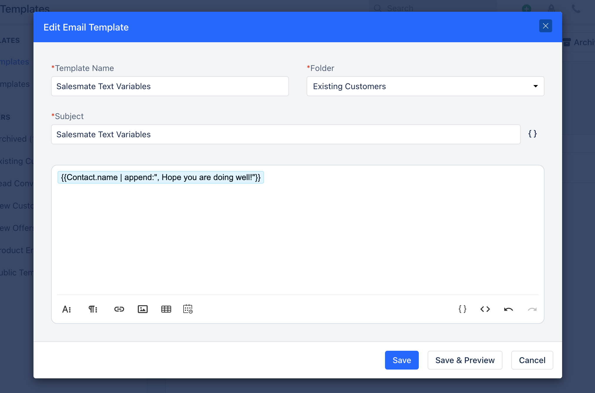
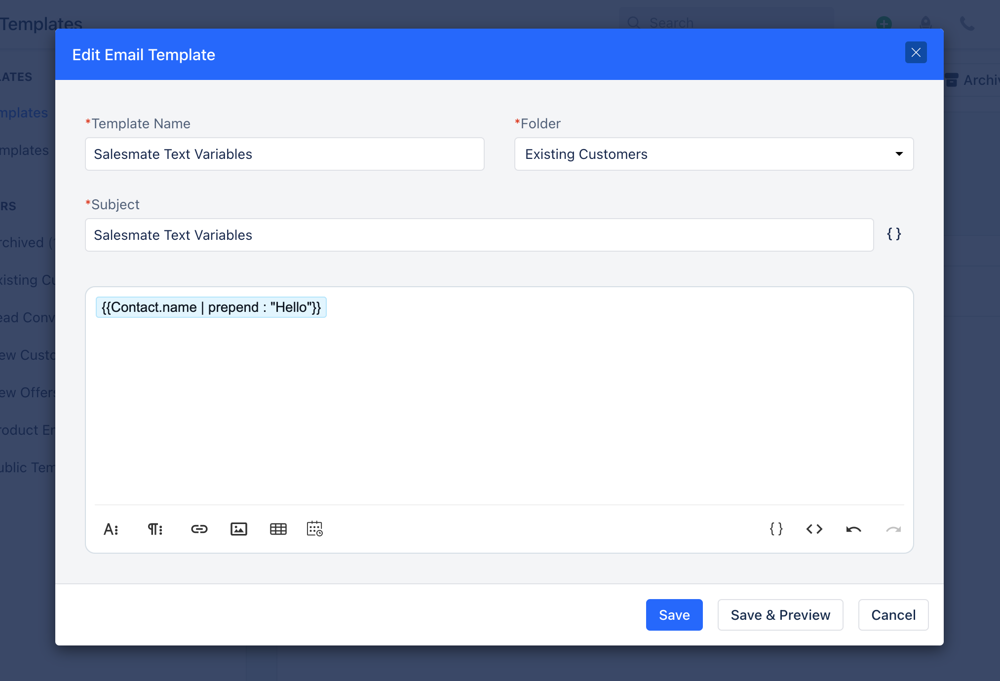
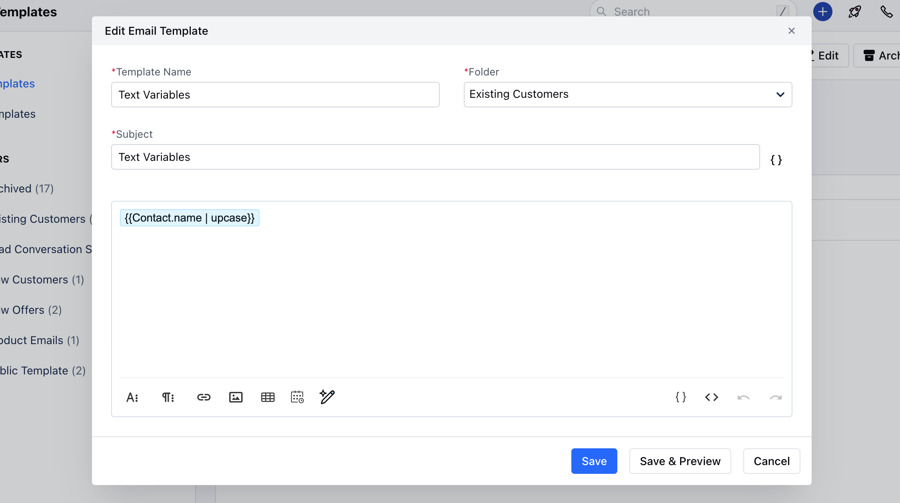
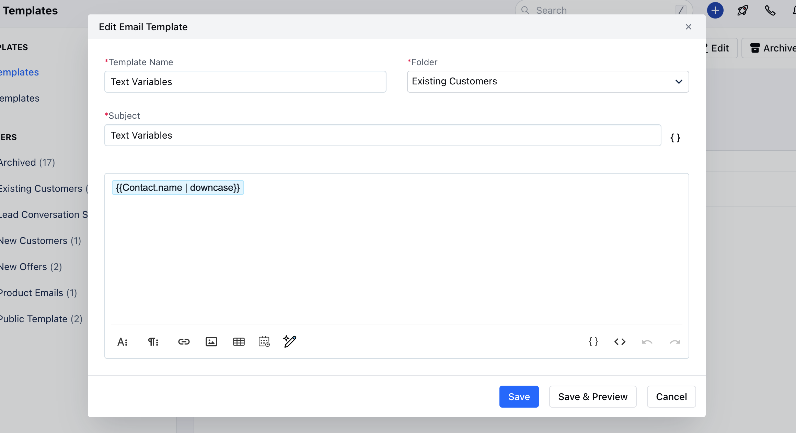

You can insert text functions in the Email Template to append, prepend, uppercase, downcase, concat, and remove texts from a particular field. Topics covered:

- [Append](#append)
- [Prepend](#prepend)
- [Uppercase](#uppercase)
- [Downcase](#downcase)

### Append

This function appends the text mentioned by you along with the value of the field.

- **Input:** ```highlight
| Append Example :&#123;&#123;Contact.name | append:", Hope you are doing well"!&#125;&#125; |

````


- **Output:** ```text highlighter-rouge
Append Example: &#123;Lina Westminster, Hope you are doing well!&#125;
````


### Prepend

This function prepends the text mentioned by you along with the value of the field.

- **Input:** ```highlight
| Prepend Example : &#123;&#123;Contact.name | prepend : "Hello"&#125;&#125; |

````


- **Output:** ```highlight
Prepend Example: Hello Lina Westminster
````


### Uppercase

This function converts each character of the word in uppercase. Note: It has no effect on strings that are already all uppercase.

- **Input:** ```highlight
| Uppercase : &#123;&#123;"Contact.name" | upcase&#125;&#125; |

````


- **Output:** ```highlight
Uppercase: ABIE HANBY
````


### Downcase

This function converts each character of the word in lowercase.Note: It has no effect on words that are already all lowercase.

- **Input:** ```highlight
| LowerCase: &#123;&#123;"Contact.name" | downcase&#125;&#125; |

````


- **Output:** ```text highlighter-rouge
LowerCase: abie hanby
````


