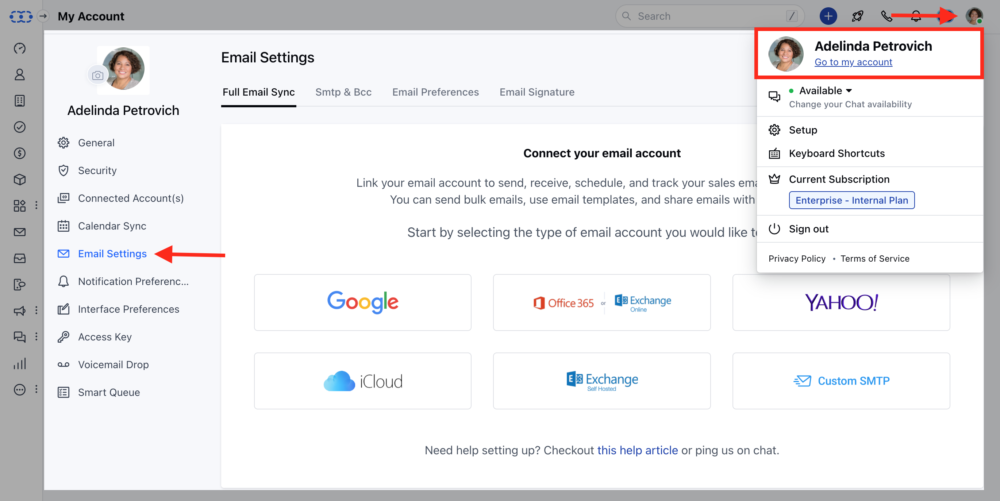
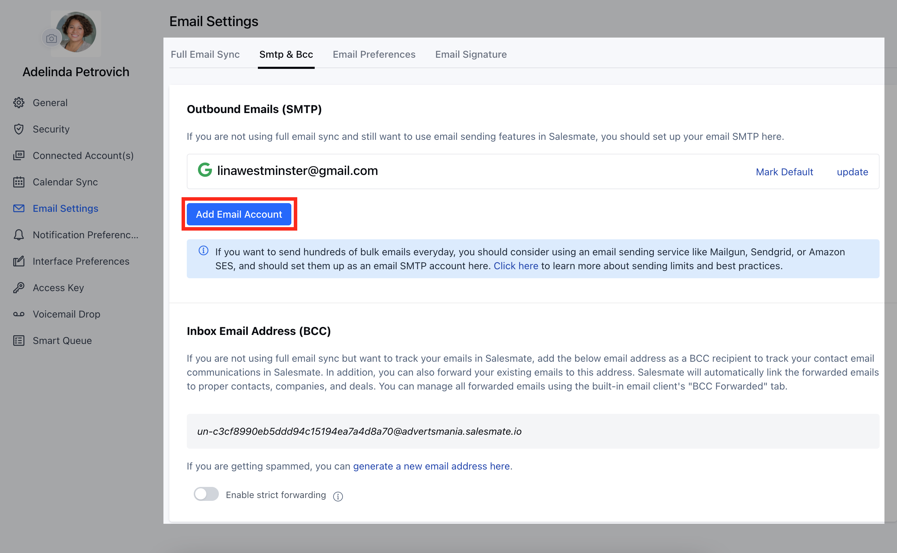

Salesmate allows you to configure a Group Account for EmailsTo add this account to Salesmate

Navigate to the **Profile Icon** on the top right corner.Click on **Go To My Account** Head over to** Email Settings ***

- *Select** SMTP & Bcc **Click on** Add Email Account **

Enter the details (refer to screenshot)
User Name: Mention your actual email IDPassword: use the app-specific password that you generated earlierFrom Name: Name by which you want the user to see they received emailFrom Email: Mention the group emailHost: smtp.gmail.comPort over Secure: 465 over SSL / 587 over TLS

Add the Group account as an ALIAS in Gmail (GSuite) from **Settings > Accounts > Send mail as:**Once added, generate an APP SPECIFIC PASSWORD from [https://myaccount.google.com/](https://myaccount.google.com/) >**Security > App Password**
