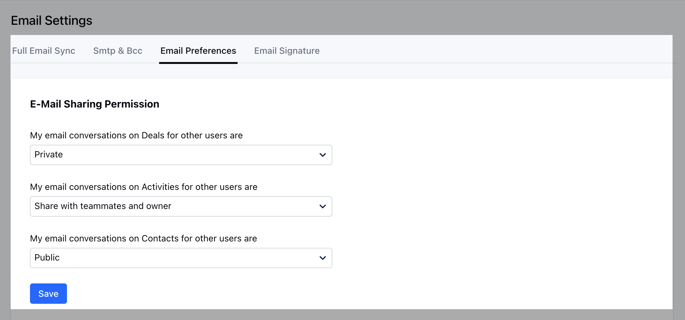

Email Module has a special security mechanism, different from the other modules.Email Sharing can be done either to individual emails, or the user can define a policy for sharing the emails by default.

- **Email Sharing has the following 3 policies:** My email conversations on Deals for other usersMy email conversations on Activities for other usersMy email conversations on Contacts for other users** The Sharing permissions are:**Private **(default: when a new user is created)

All emails associated with the record will be visible to that user onlyEmail will be visible to users with whom the user has explicitly shared the email or manually shared the particular email with a user.

- **Share with teammates and owner** All **teammates** and **owners** of the record will be able to see the email associated with that particular record.Email will not be visible to all the users who see the particular record if they are not followers or ownerEmail will be visible to users with whom the user has explicitly shared the email or manually shared the particular email with a user marking him in CC or To **Public** All followers and owners of the record will be able to see the email associated with that particular record.Email will be visible to all the users who see the particular deal even if they are not followers or owners.Email will be visible to users with whom the user has explicitly shared the email or manually shared the particular email with a user.

