Salesmate offers **full (two-way) email sync**, which allows you to **send emails** from Salesmate and **automatically log replies**.  

If Salesmate system folders already exist in your email folders list as custom folders, duplicate folders (with the same name) may be created in Salesmate.

---

### **Topics covered**

- [Configure the Google Account](#configure-the-google-account)
- [Configure the Microsoft Account](#configure-the-microsoft-account)
- [Sync Folders](#sync-folders)
- [Delete and Archive Options](#delete-and-archive-options)
- [Disable Sync](#disable-sync)
- [Stop Sync](#stop-sync)

### **To Set Up Your Full Email Sync or Change Your Email Settings**

1. Navigate to the **Profile icon** on the top-right corner.  
2. Click on **Go to My Account**.  
3. Head to **Email Settings** → **Full Email Sync**.

**OR**

- Navigate to your **Email icon** on the left menu bar.  
- Click on **Email Settings** at the bottom left.

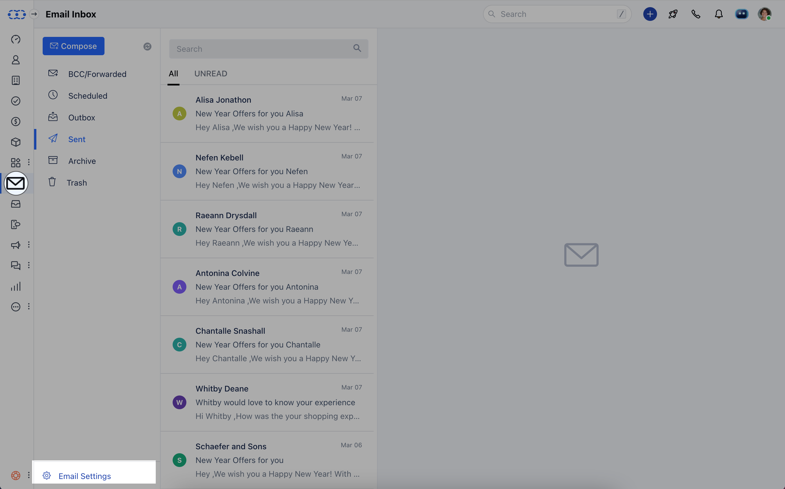

From here, select the type of email account you’d like to sync.  
The folder listing will initiate, and syncing will start automatically.

---

### **Configure the Google Account**

To configure a **Google Email account** for full email sync:

1. Select **Google** as your email provider.  

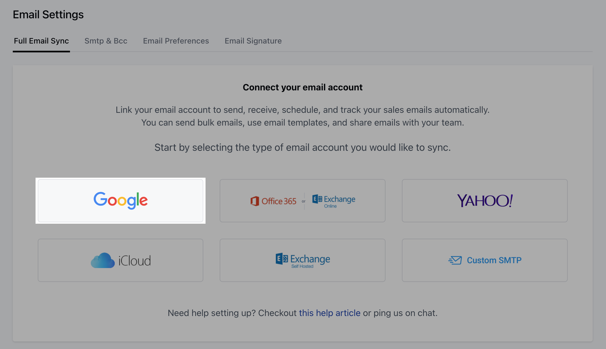

2. **Choose** an account to continue to **Salesmate.io**.  

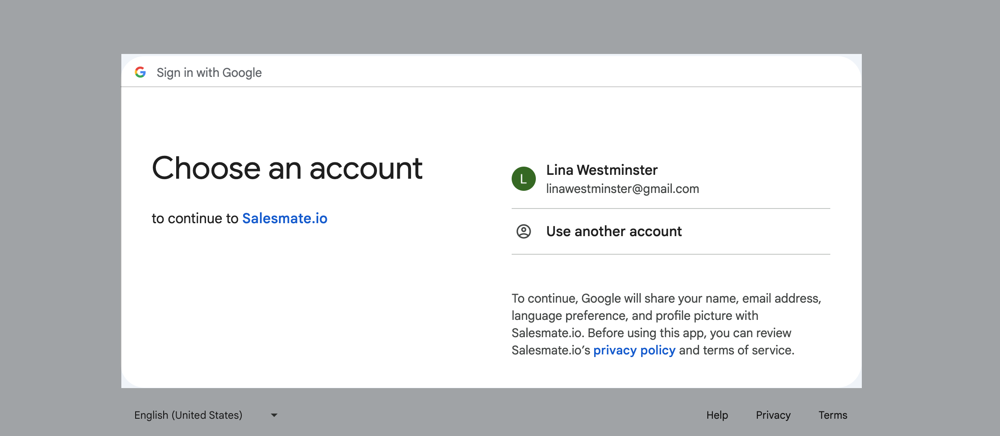

3. Provide necessary **permissions** for access.  

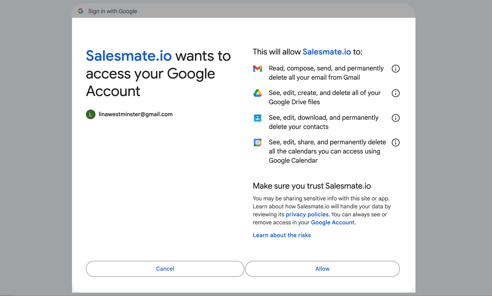

After selecting your Google account, choose the one you wish to configure for full email sync.

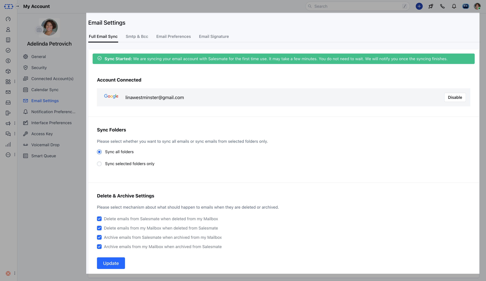

---

### **Configure the Microsoft Account**

To configure a **Microsoft/Office 365** account for full email sync:

1. Select **Office 365** or **Exchange Office** as your email provider.  
2. You can configure both **Online Microsoft Email** and **Online Business** accounts for synchronization.  

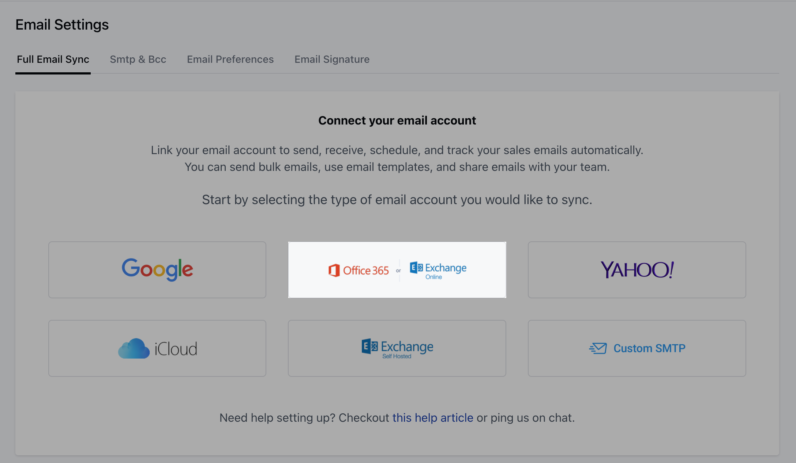

3. After selecting the provider, choose your account for sync.

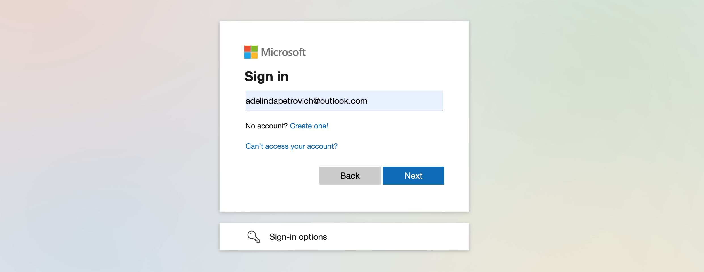

4. Enter your password.  

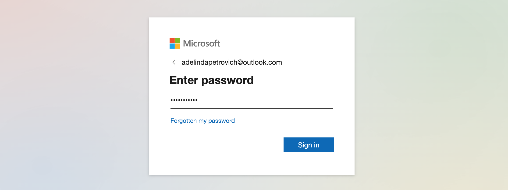

You can also configure **self-hosted Microsoft Email** accounts for full email synchronization.

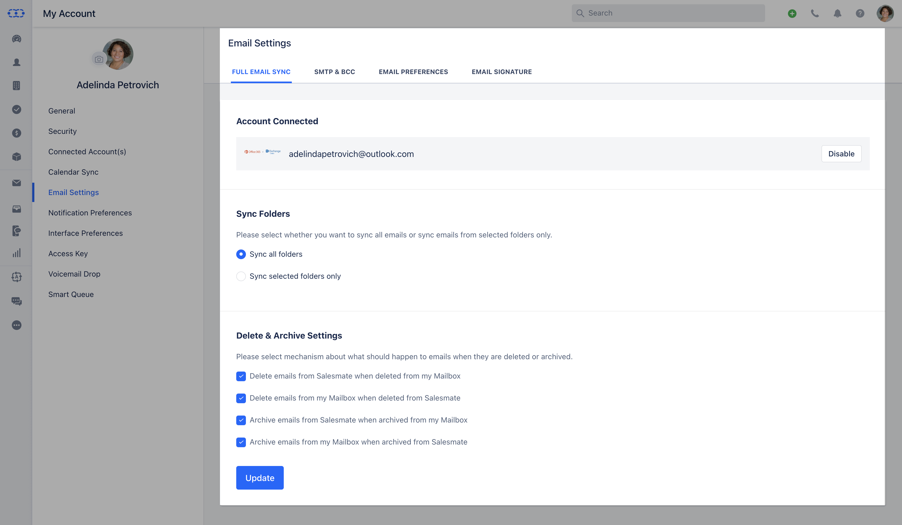

If you select **Exchange self-hosted**, Salesmate will auto-log any email that appears in your **Sent Items**, even if it was sent from Gmail or your phone.  
Emails sent from Salesmate will automatically appear in your Sent folder.

By connecting your account:

- You can send and receive emails within Salesmate or your preferred email client.  
- Salesmate automatically tracks conversations with contacts, activities, and deals.  
- You can choose to sync **all folders** or **specific folders** during setup.  
- There’s no need to BCC Salesmate — syncing handles it automatically.  
- Salesmate initially fetches the last **60 days of emails**; older emails won’t be fetched, but new ones will sync automatically going forward.

---

### **Sync Folders**

Once sync begins, folder listing will start automatically. You can choose:

- **Sync All Folders:** Syncs all folders in your connected account.  
  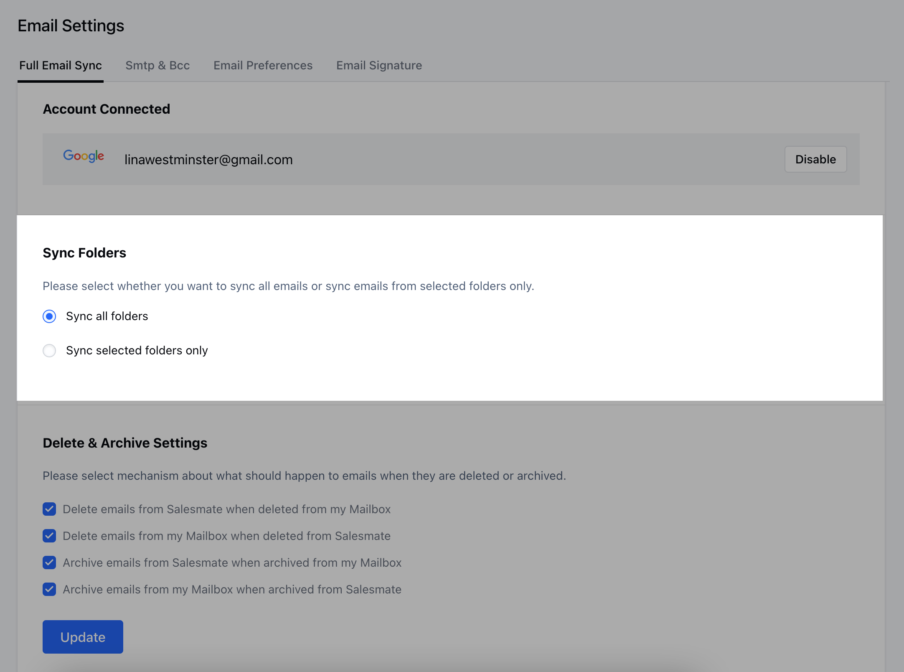

- **Sync Selected Folders Only:** Choose specific folders to sync.  
  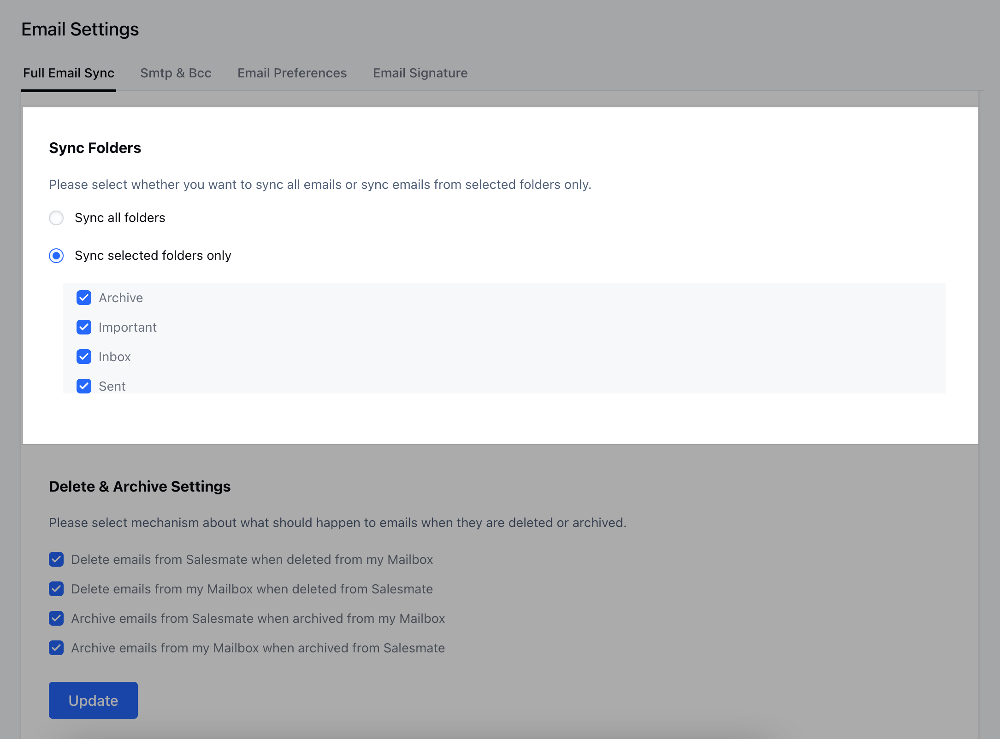

---

### **Delete and Archive Options**

You can configure how deletes and archives are handled:

- Delete emails from Salesmate when deleted from your mailbox.  
- Delete emails from your mailbox when deleted from Salesmate.  
- Archive emails from Salesmate when archived from your mailbox.  
- Archive emails from your mailbox when archived from Salesmate.  

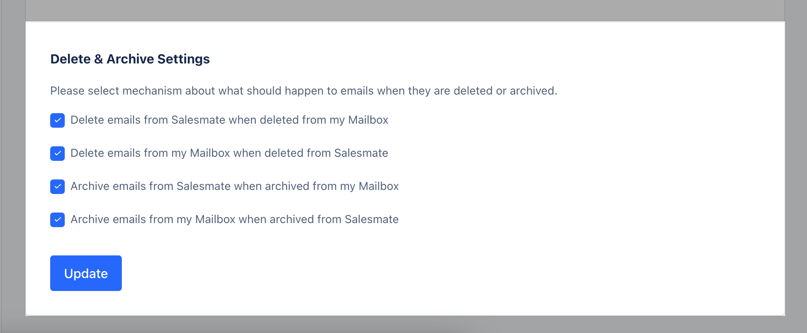

---

### **Disable Sync**

You can temporarily stop syncing your full email account by clicking **Disable**.

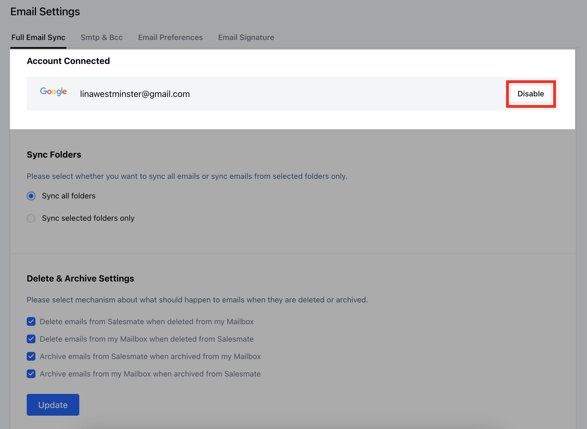

<Note>
Your emails will remain as they are until you reconnect your account.  
When reconnected, synchronization resumes, fetching the last 60 days of emails from before reconnection.
</Note>

---

### **Stop Sync**

To permanently remove your account and stop synchronization, click **Disconnect**.

---

### **Summary of Full Email Sync**

- Real-time sync of your **live inbox**, allowing you to view sent and received emails.  
- **Selective sync** — choose only the folders you want.  
- Notifications for all received emails.  
- Send, reply, forward, CC, and BCC directly from within Salesmate.  
- Use **Email Templates** and **Attachments**.  
- Works with your preferred **SMTP** settings.  

<Note>
If your SMTP configuration returns an error, you can reconnect using the **Custom SMTP option**.  
Commonly used settings:  
- **IMAP:** Port `143`  
- **SMTP:** Port `587`  
- **TLS:** Enabled  
</Note>
