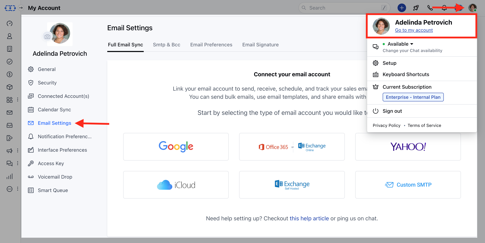
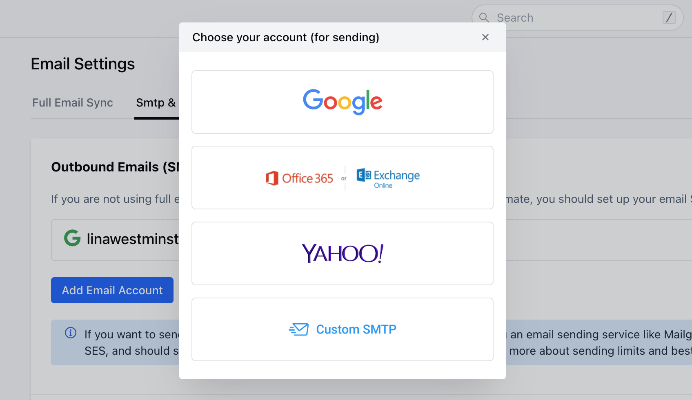
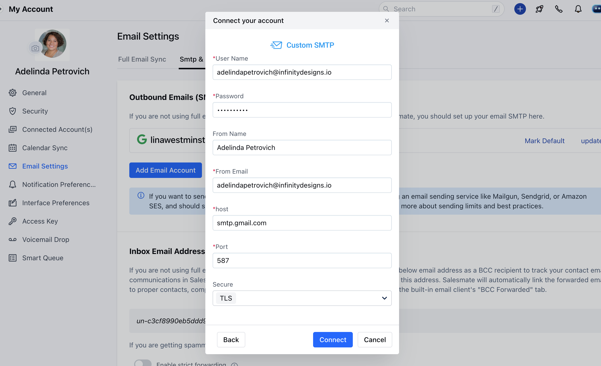
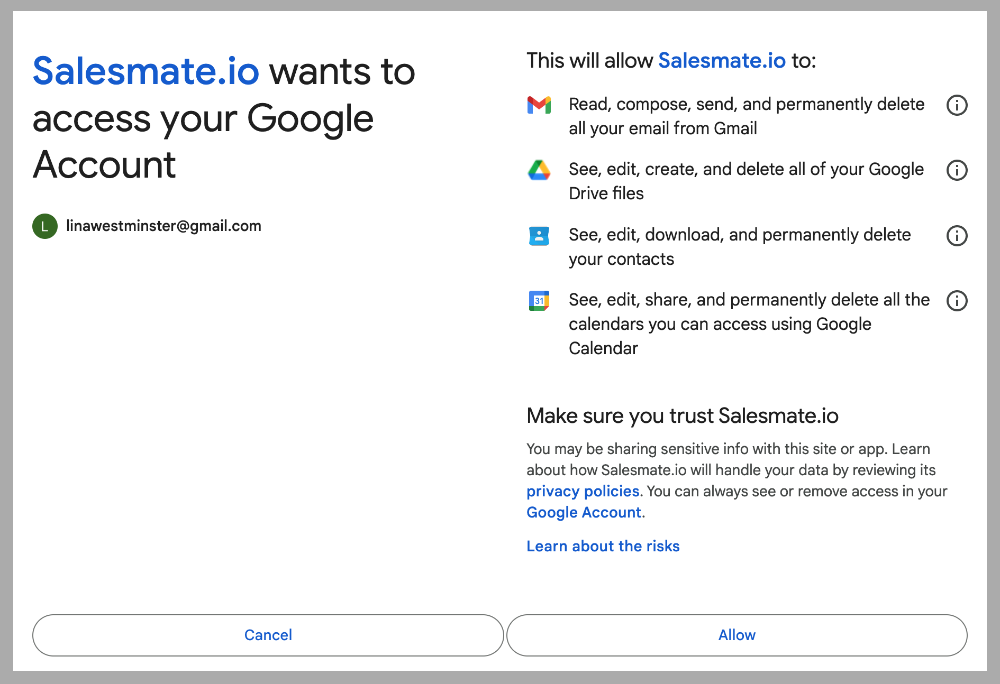
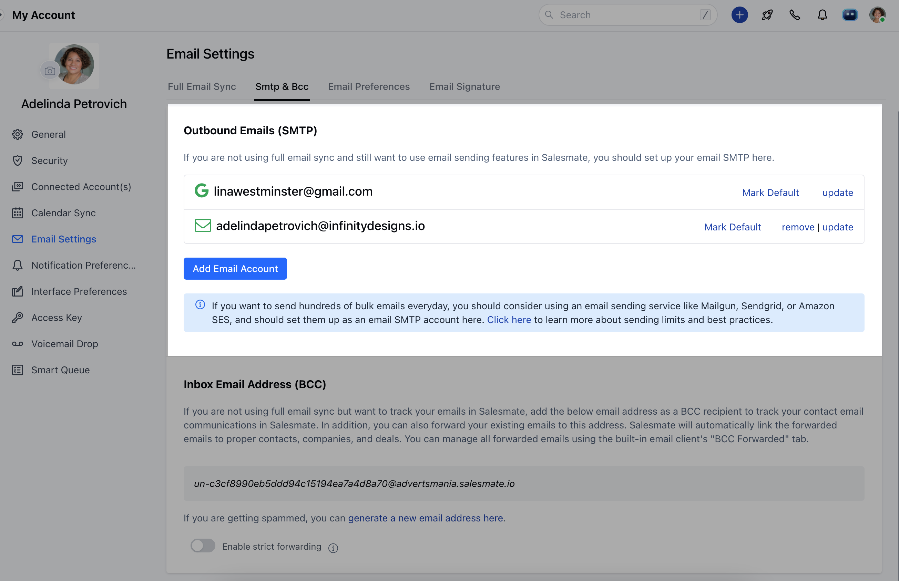
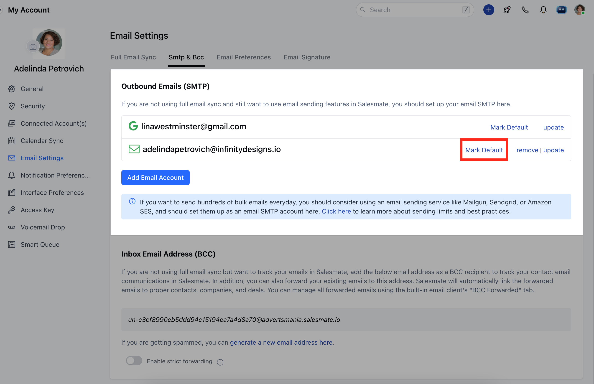
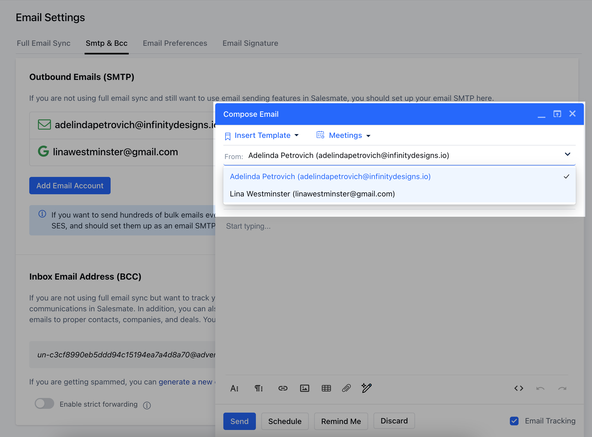
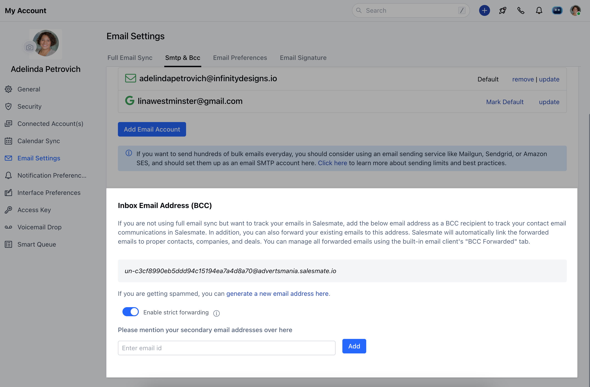

Managing email from your CRM is a remarkable way for sales geeks to save time and effort. As this feature has come to a point where it has become essential, we’ve taken a step ahead to make the management of your business email more effective.

### **Topics covered:**

- [How to configure SMTP?](#how-to-configure-smtp)

- [How can I set up the default outbound email?](#how-can-i-set-up-the-default-outbound-email)

- [How do I configure incoming emails/ BCC?](#how-to-configure-my-email-account-in-salesmate)

### How to configure my email account in Salesmate?

We’ve greatly simplified the process of connecting your email accounts to Salesmate.Email accounts can be configured in two ways inside Salesmate by using the **SMTP**&**BCC** Option or **[Full Email Sync](https://support.salesmate.io/hc/en-us/articles/115000665965-Full-Email-Sync)** In this article, we will cover setting up your email Outgoing and Incoming using **SMTP & BCC** options.

### To configure **SMTP**(outgoing Email)

### How to configure SMTP?

Navigate to the **Profile Icon** on the top right cornerClick on **Go to my account** Head over to ** Email Settings ***

- *Select the** SMTP & BCC **sectionGo to the** Outbound Emails **(SMTP) sectionClick on** Add Email Account **

Select your Email Service provider from the below optionsYou can configure **Custom SMTP** if you do not find your default email service provider

- **To Send Emails - Outbound Emails (SMTP):**To configure your Custom SMTP details you need the following details handy
 *User Name*PasswordFrom Name*From Email*Host*PortSecure - SSL/TLS/None Click on the Add Email Account buttonChoose your SMTP account ( Google, Outlook.com, Yahoo, or Custom SMTP )For **Custom SMTP**

- *Note**: In case your SMTP details return an error, here is another recommended way through which you try connecting again with the below settings in your full email sync with the Custom SMTP option, we have seen a similar case before wherein the user was able to connect successfully with below-mentioned details **143** for ** IMAP **587** for **SMTP **Both **with** TLS **If the host is Google then you will be redirected to the Google Authentication pageOn the Permissions page, click** Allow ** to continue.

Once confirmed, your account will successfully get connected.

Similarly, you can also add more SMTP accounts **Note**:

Host/Port/Secure - will be auto-filled for Yahoo and Outlook.comWith this option, you can configure multiple SMTPs to send your emails

### How can I set up the default outbound email?

Users can select the default email address if they have connected to more than one email address in Salesmate using Full Email sync or Outbound Emails (SMTP) while composing an email.

Navigate to the **Profile Icon** on the top right cornerClick on **Go to my account** Head over to ** Email Settings ***

- *Go to** SMTP & BCC **TabUnder the Connect Email Address List hit the "**Mark Default **" button to select the default email address for outbound emails.

While Composing the Email, users will now get the default selection with the ability to switch the required email too

### How to configure incoming emails (BCC) in Salesmate?

You get your own email address, which you can add to the BCC field whenever you email a customer, or you can forward existing emails directly to this address. These conversations will all appear in your Salesmate email page, linked to the relevant contacts and deals, when possible. Set the forwarding rule to forward emails to your Salesmate Mailbox address by following the below steps:**To receive emails:**Go to DashboardClick on the Email iconGo to **Email settings** Click on the **SMTP & BCC** tabCopy the Inbox email address (BCC) - Example: "un-2ab15c4cccec8b894804c7be76cb9cc9@demo.salesmate.io"To set forwarding in Gmail,
[click here](https://support.google.com/mail/answer/10957?hl=en)
To set forwarding in Yahoo,
[click here](https://help.yahoo.com/kb/SLN22028.html)
You can also enable **strict email forwarding**. This means you will receive emails from only the account that you have configured. You can add other addresses from which you want to receive emails by adding them to the secondary email address list.

- **Note:**If you think you are getting spammed, you can regenerate a new BCC forwarding address and set up the forwarding again.
