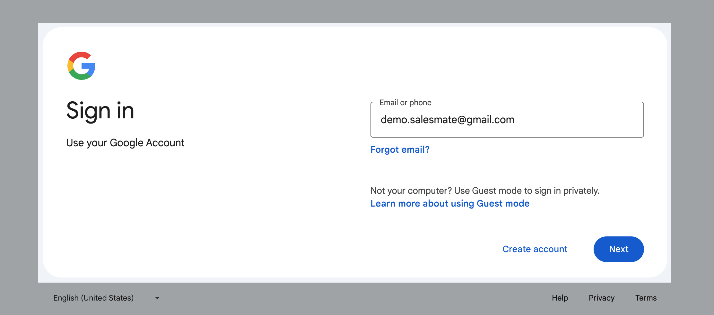
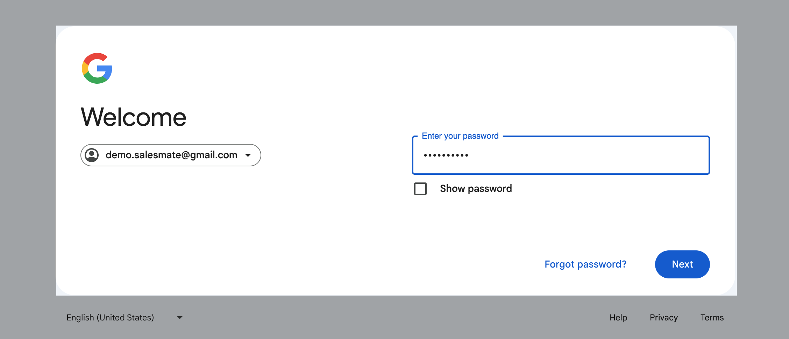
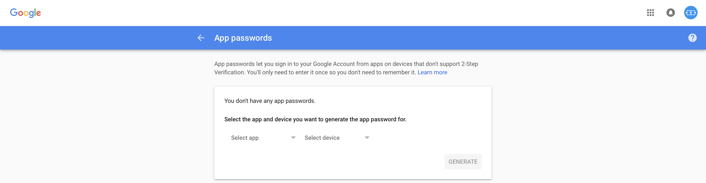
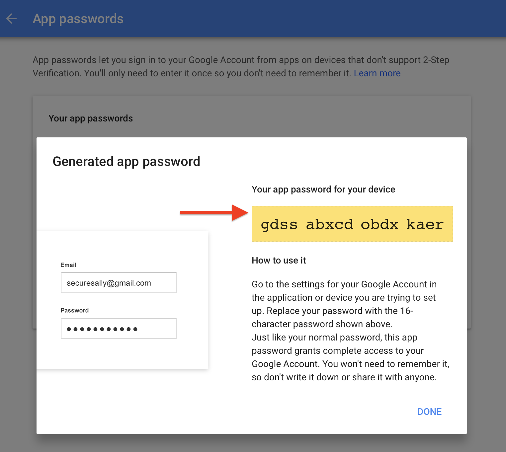
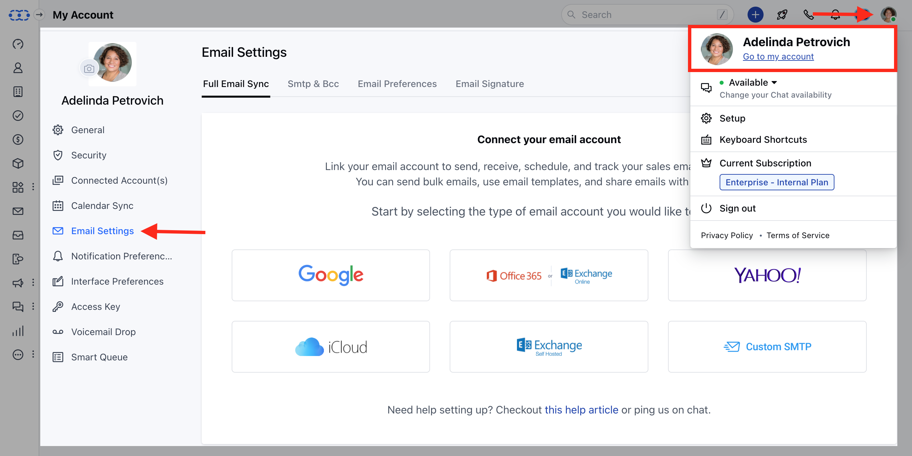
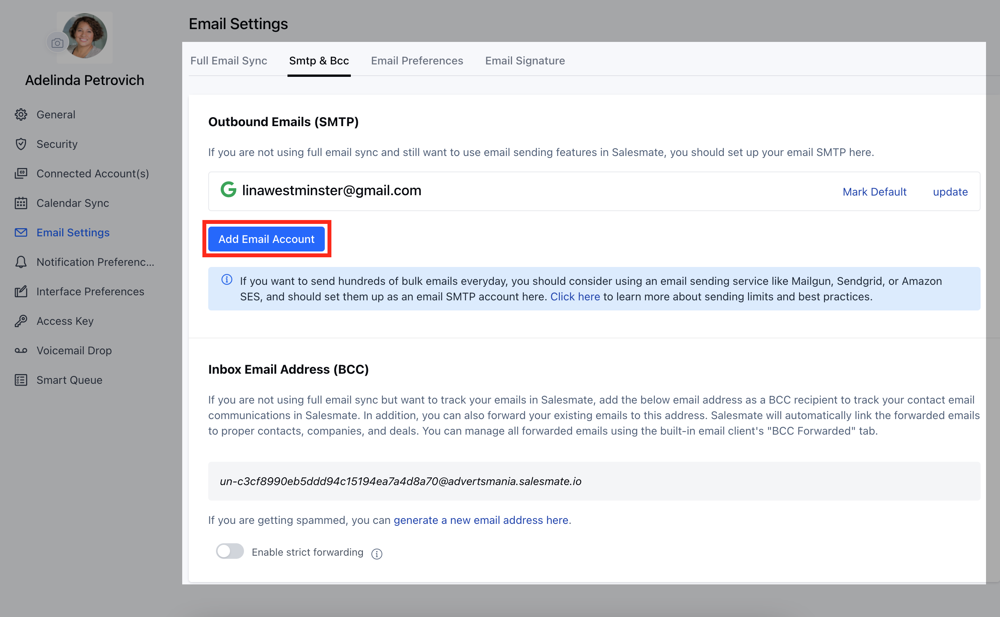
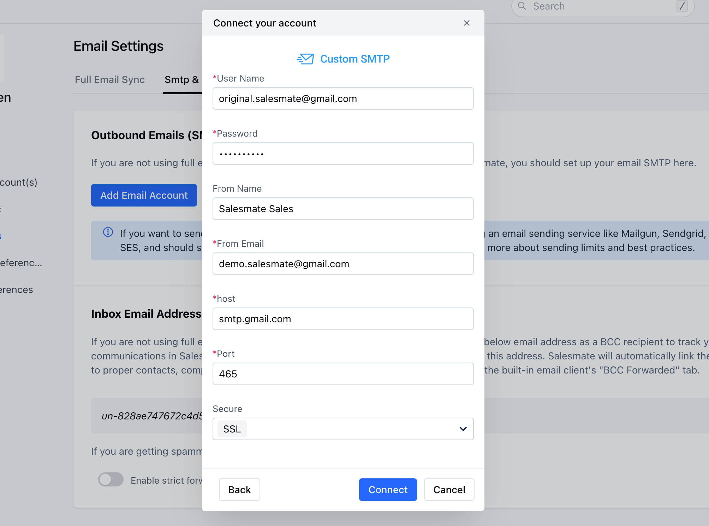
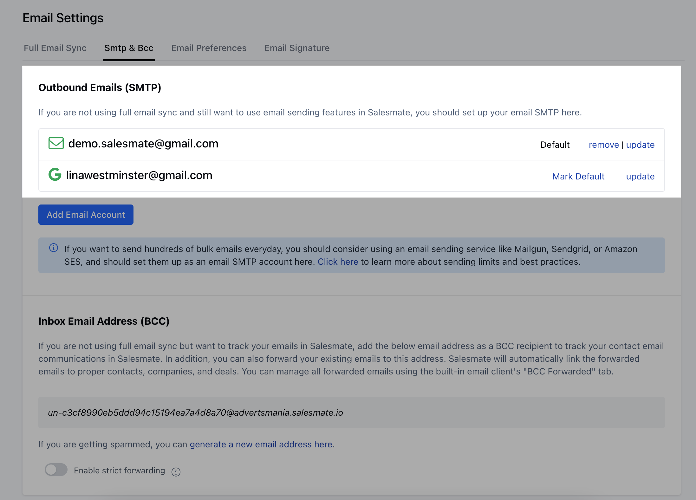

### Do you have these questions?

Having trouble lately connecting your Gmail Alias accounts?Why your Gmail alias account is not working anymore?

We have answers to all your queries, recently**Gmail**has updated its policies and has stopped support for all personal free Gmail accounts. This would mean that you need to have a**Corporate**/**Enterprise**Gmail account to access this feature.

What if you have an enterprise Gmail account and are still not able to connect your alias account with Salesmate, don't worry there is now a secured way to do it. Gmail has brought in a new way of doing so with the help of - [**Sign In using App Passwords**](https://support.google.com/accounts/answer/185833?hl=en)An**App**password is a**16-digit passcode**that gives an app or device**permission**to access your**Google Account.**If you use 2-Step Verification and are seeing a “**password incorrect”**or "**Cannot connect to SMTP Server**" error when trying to access your Google Account, an App password may solve the problem.Most of the time, you’ll only have to enter an App password once per app or device, so don’t worry about memorizing it.

### How to generate an App password?

Visit your [**App password**](https://accounts.google.com/ServiceLogin/identifier?service=accountsettings&passive=1209600&osid=1&continue=https%3A%2F%2Fmyaccount.google.com%2Fapppasswords&followup=https%3A%2F%2Fmyaccount.google.com%2Fapppasswords&rart=ANgoxcfR985arg8jsUGUGpxtekH-41Pd6krJ3-j-TQ_FenVpztHDJcD0lORa1rk8tjn2f5NFtjjo8XMu8IyCq6azPG0CtmSVSw&authuser=0&csig=AF-SEnbUwOaQl4HNSUSd%3A1527854153&flowName=GlifWebSignIn&flowEntry=AddSession) page. You may be asked to sign in to your Google Account.

Select your**Gmail**account**Sign****in**to your account

(App passwords let you sign in to your Google Account from apps on devices that don't support 2-Step Verification. You'll only need to enter it once so you don't need to remember it.)

Select the**app**and**device**you want to generate the app password forApp Should be**Other**(_Custom name_)

Mention the**Name**of the App for reference

Click on**Generate****Copy**the password generated

Now that your password is**generated,**you can use it to sign in inside the Salesmate SMTP Email account settingsOnce the password is generated you should receive a**confirmation****email**

Copy the**password**Go to**Salesmate**(your Salesmate domain xxxxxxx.salesmate.io)Navigate to the**Profile Icon**on the top right corner.Click on**Go To My Account**Head over to**Email Settings****

**Select**SMTP & Bcc**Click on**Add Email Account**

Select**Custom****SMTP**

Fill in the required information
\*User Name - your**email****address**\*Password - the new**password**generated from the**app**From Name - Your Name to be displayed\*From Email - The**Alias**Email Address you want to set\*host -**smtp.gmail.com**\*port -**587**Secure -**TLS**

Once connected it should reflect as shown below and you are good to go

**Visit:**Google support if needed - [https://support.google.com/accounts/answer/185833?hl=en](https://support.google.com/accounts/answer/185833?hl=en)Send an email with an alias account from your Salesmate mailbox -
