Download the **Chrome Plugin** from [here](https://chrome.google.com/webstore/detail/salesmate-crm-for-gmail/ekeefjfdbaakgbfbagacmckiedkmakem?hl=en)Once installed the **Chrome Plugin** for Salesmate will let you use Salesmate from within **Gmail**. It lets users share all records be it Contacts, Companies, Deals, Activities, or Products **Topics covered:**

- [How to install the Salesmate Chrome Plugin?](https://support.salesmate.io/hc/en-us/articles/115003230249-Chrome-Extension-for-Salesmate#h_01GKGGMJ45C4EYR2CV1MMDTD48)

- [Log in to the Chrome plugin](https://support.salesmate.io/hc/en-us/articles/115003230249-Chrome-Extension-for-Salesmate#h_01GKGGMW9E80VD7XZGT56AA0X3)

- [Adding Records (Contact/Company/Deal/Activity)](https://support.salesmate.io/hc/en-us/articles/115003230249-Chrome-Extension-for-Salesmate#h_01GKGGNKG3K4VDE16FHJDFKEY3)

- [Viewing Records](https://support.salesmate.io/hc/en-us/articles/115003230249-Chrome-Extension-for-Salesmate#h_01GKGGP2ZHVN64TZYGNQ3TAM06)

- [Composing and using email templates](https://support.salesmate.io/hc/en-us/articles/115003230249-Chrome-Extension-for-Salesmate#h_01GKGGPBEB9BGCTC82GMTP8R4K)

- [Email tracking & Logging](https://support.salesmate.io/hc/en-us/articles/115003230249-Chrome-Extension-for-Salesmate#h_01GKGGPSKKF44MN0NQ87T1FJB5)
- [Uninstalling Plugin](https://support.salesmate.io/hc/en-us/articles/115003230249-Chrome-Extension-for-Salesmate#h_01GKGGQRVGMHB2968PM1V2TV4F)By default, the activities lined for you will be listed i.e.

- **My Activities** view will be loaded as you sign in to the plugin using your Salesmate web app login credentials.

The Salesmate Chrome Extension for Gmail gives you **full management of records**- view all records and add them from the extension as well (contacts, companies, deals, activities, or Products);**email tracking** and **email templates**- just like you have in the Salesmate web app.

- **Click an email**, and it will fetch the **associated contact** based on the email ID. It will show all the details about the contact, the timeline, and related items like deals, activities, files, and emails. It also allows you to update the record, add a note, create an activity or a deal, send an email, or delete the contact from right there.

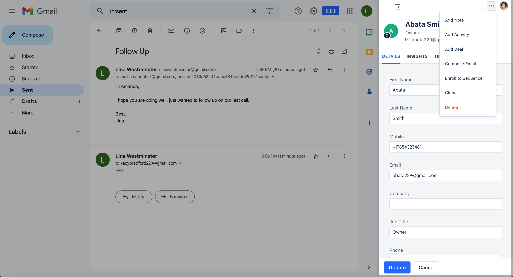

In case it does not find that record you can **quickly create a contact** for it which cuts down on the manual entry you would have to do otherwise.

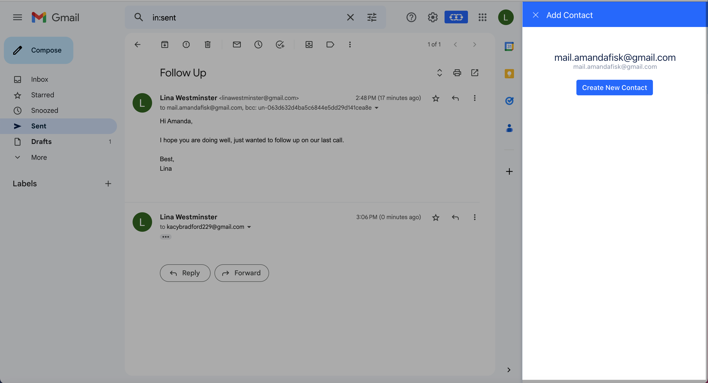

####**How to Install Salesmate Chrome Plugin** On the Google **Chrome Web Store** search for Salesmate Chrome Extension for Gmail to install the Chrome Plugin.Click on '**Add to Chrome**' in the top right corner of the window.

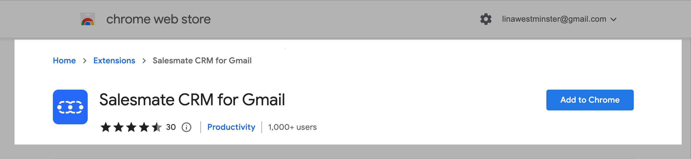

Accept the PermissionsOnce installed you will see a Salesmate icon on the top of your browser.Inside Gmail, you will see a Salesmate icon which you can click to expand and view the information about the contact of the opened email.

Not using Chrome Browser, [download](https://www.google.com/chrome/browser/desktop/index.html) it here for free.

####**Login to the Chrome Plugin** Click the **Salesmate Chrome Extension** icon from your Chrome toolbar.You’ll see the login screen with a **"Sign In"** button

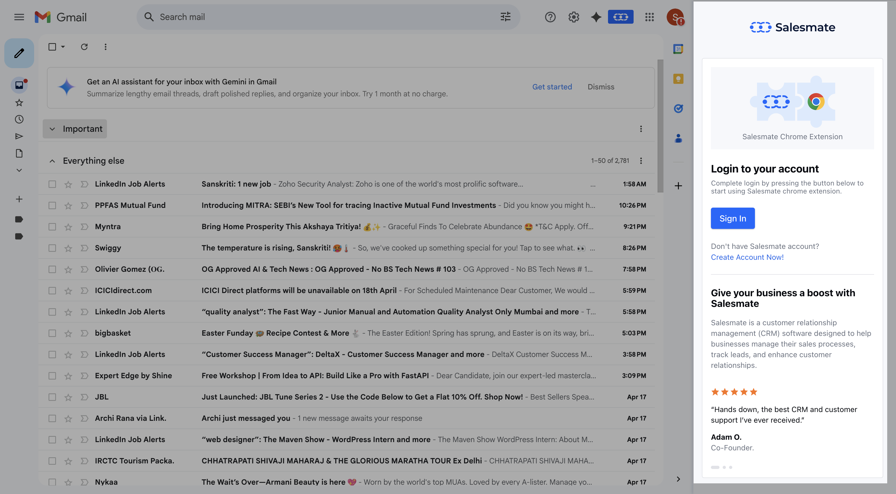

Click the blue **Sign In** button.You’ll be redirected to authenticate your Salesmate account.

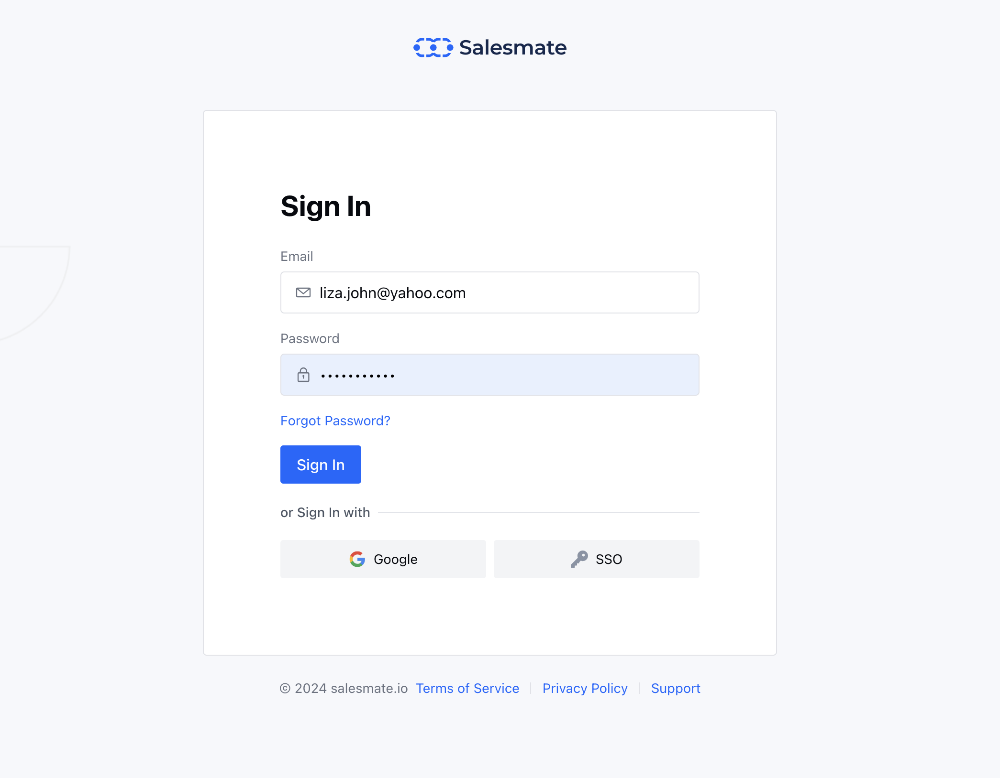

####**Adding Records ( Contact, Company, Deals, Activities, Products)** You can quickly add records by hitting the **\+** icon

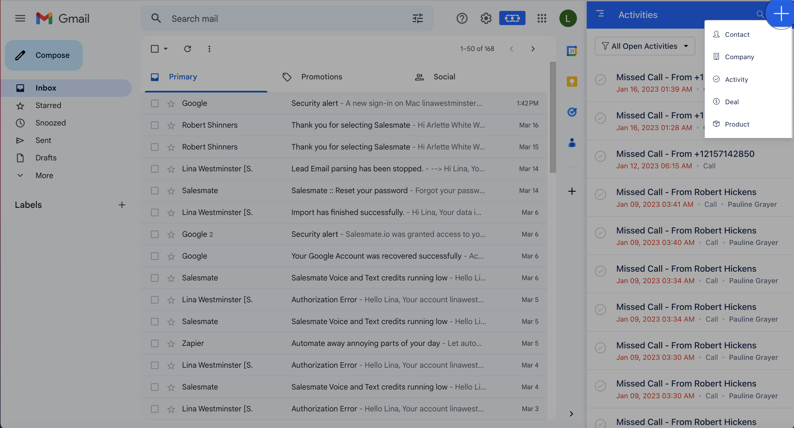

####**Viewing Records ( Contact, Company, Deals, Activities, Products )** Quickly view your records by hitting the left drop-down and selecting the module you want to view the records for.

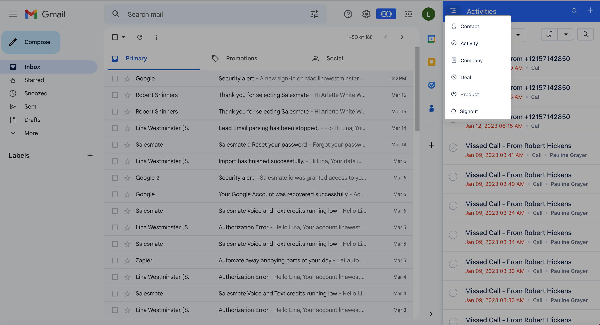

You can choose the pre-defined OR custom view as on the Salesmate web app when viewing records for that module.Also, you can **sort** based on the standard sort fields as that of the Salesmate web app.

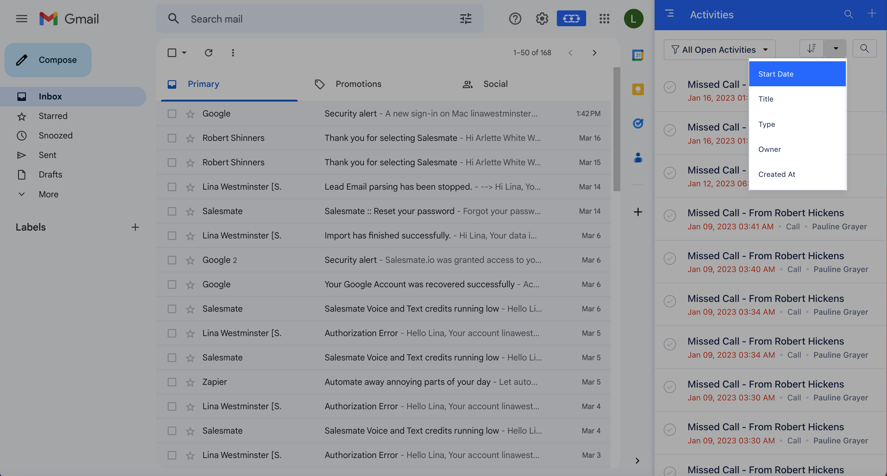

You can view the complete details of a record as you do on the web app's side / quick view on the Chrome plugin.

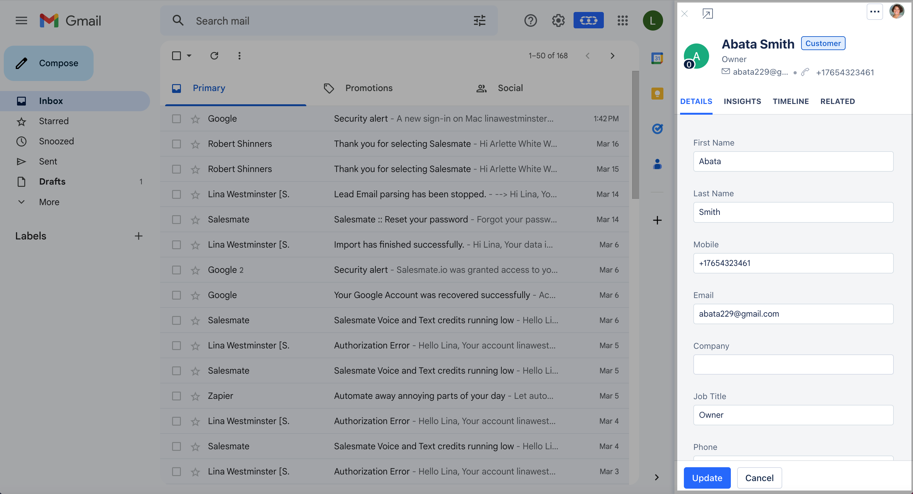

####**Composing an Email and use of Salesmate Email templates** While composing an Email from within Gmail, the Chrome plugin allows you to use the already created Email Templates on the Salesmate Web App and personalize your emails.You can preview the email template before you use it.

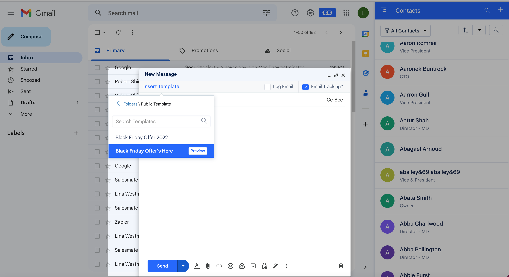

####**Email Open & Click Tracking, Email Logging** While sending an Email tick the checkbox for **Log Email** and **Email Tracking**

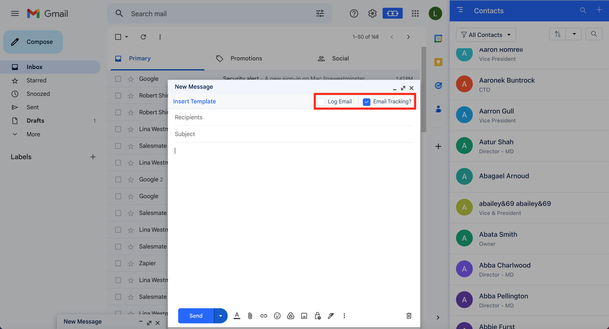

Once you have sent the email, you can refresh your page and view the tracking logs on the sent email within your Gmail account.

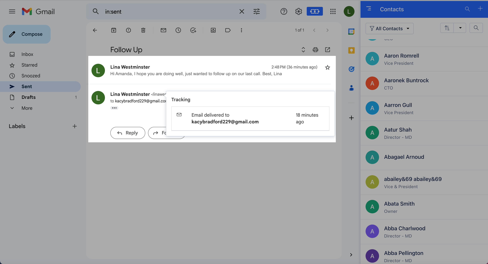

You can choose to track emails that you send out of your GmailIt allows you to know if the email was Delivered and Opened by the contact and even if they have clicked on any link you have included in that email.By default, the option to track emails is checked. You can choose to unselect it if you do not want to track an email.The emails that you send out of Gmail are automatically synced in case the email account is configured in two-way sync in SalesmateOptionally, you can choose to log the email in Salesmate by using the "Log Email" checkbox. This will add a Bcc address to log the email inside Salesmate and associate it with the record.

####**Uninstalling Salesmate Chrome Plugin** Uninstalling the Plugin will remove it entirely from the browser.To uninstall:

Click the Chrome menu on the browser toolbarClick **More tools** Select ** Extensions ***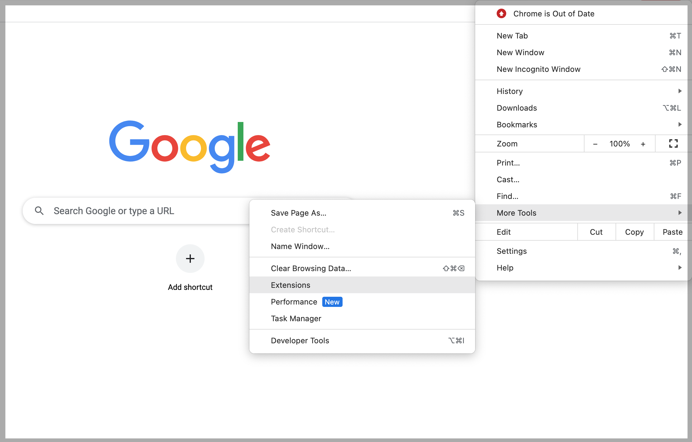

- *Click the** trash **can icon Remove an extension from Chrome next to the Salesmate AppA confirmation dialog appears, click** Remove**

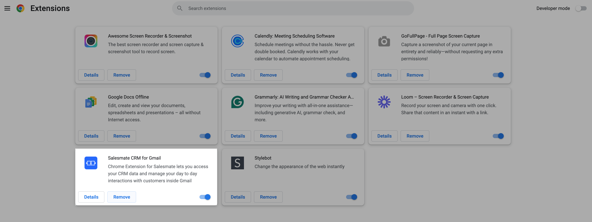

Visit our [Integrations page](https://www.salesmate.io/integration/) to learn more about various apps and integrations offered by us.
