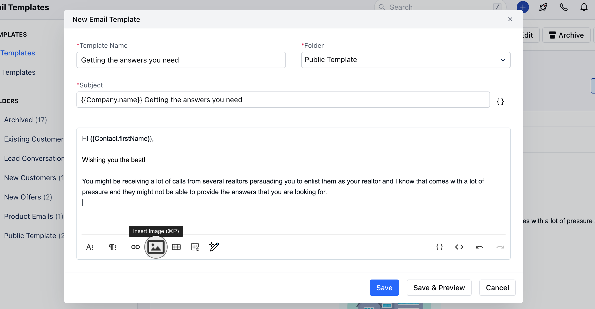
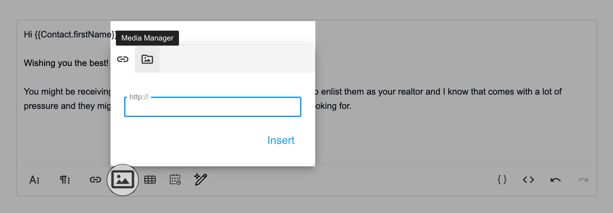
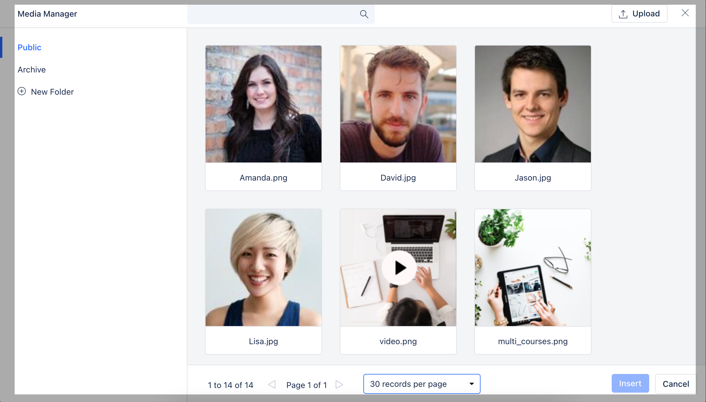
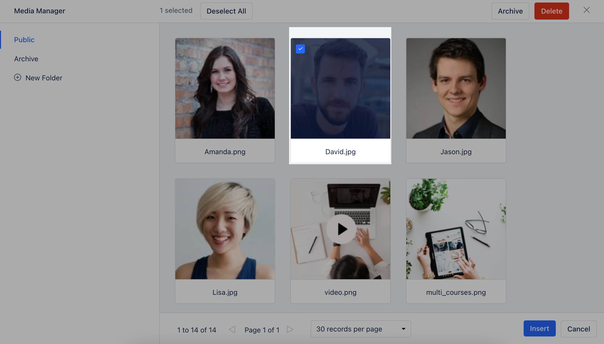
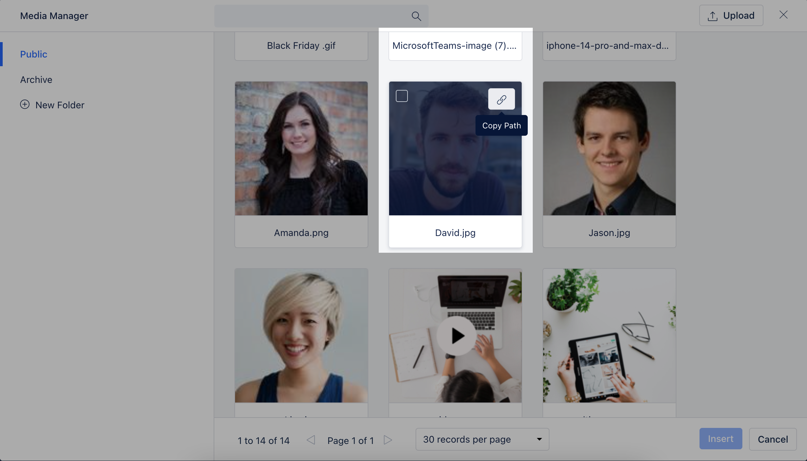

Email Media Manager provides a simple interface so users can easily use images/files inside CRM:

To place logo inside their email template.To place social media icons in the email footer.OR any kind of image to be used in the email template.To place images inside the email signature.

###**How to upload media files**While creating an email template OR defining the email signature you can upload media filesHit the "**Insert Image**" button

Then hit the**Media Manager**button

It opens up the**Media Manager**window

Hit the**Upload**button, browse and select the file/s you would like to uploadYou can also simply**drag and drop**to upload the file/s

###**How to insert /use media files**Once uploaded the file/s will appear in the respective folder you have uploaded themSelect the image and hit**Insert**to use the image

**OR**Hover over the image and hit the Copy path button to copy the URL path of the image to be used

**Note:**Any user can upload media files to the media managerFiles supported:  JPG, JPE, JPEG, GIF, PNG, and BMP image files.No single file can be more than 1MB.

###**Other Options in the Media Manager:****Move files**between folders**Archive / Unarchive Files.****Archived files:**It will not have any impact on your templates or already sent emails. You will not be able to use them in the future.**Delete files**: If these files are used anywhere in a template or sent emails then it will appear as broken.
