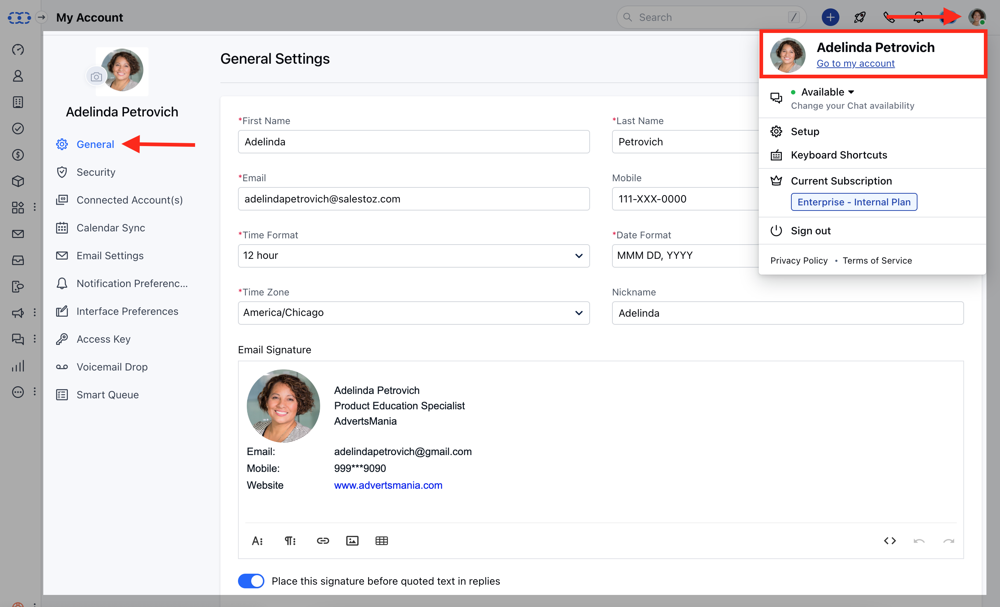
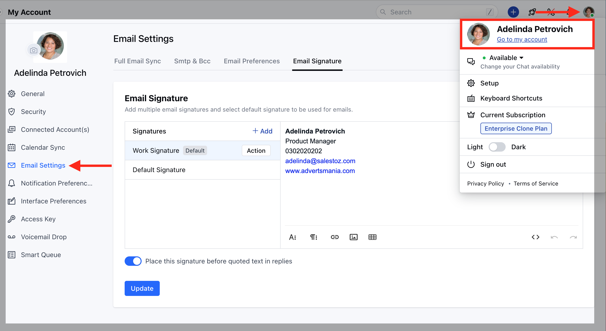
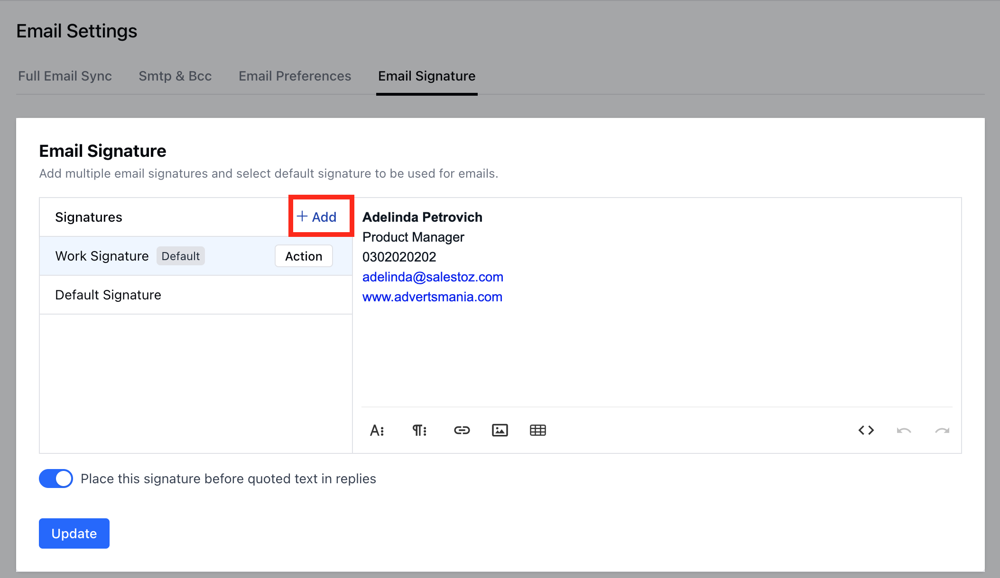
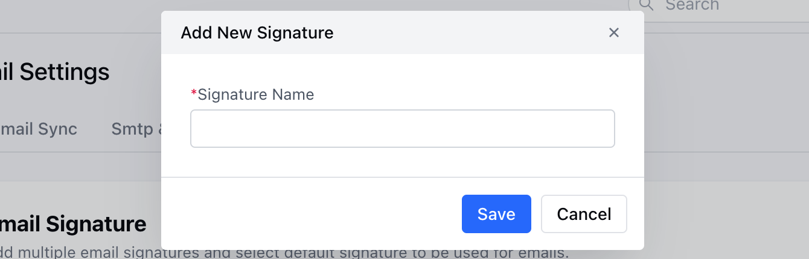
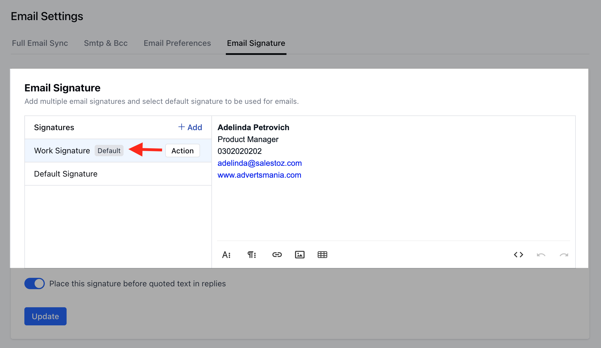

When you are reaching out to the contacts, it is valuable to provide them with the most information about you, your company, and how to contact you for more information.To handle this efficiently, Salesmate suggests creating a specific email signature for your email account, so that every customer receives the information necessary to help you close the sale.

###  **Topics covered:**

- [Adding your Signature](#adding-your-signature)

- [Adding Multiple Signatures](#adding-multiple-signatures)

###  Adding your Signature

To add your email signature in Salesmate,

Navigate to **the Profile icon** on the top right cornerClick on **Go to my Account.

- **Under the **General Settings** towards the end of the page add your Email Signature

###  Adding Multiple Signatures

Navigate to **the Profile icon** on the top right cornerClick on **Go to my Account.

- **Head over to the **Email Settings** Click on the **Email Signature**

Click on **\+ Add** option to add new signature

Enter the **Signature Name** and hit on **Save**

Once done you can create a Signature of your choice and mark one as ** Default **

**Note:**Select the position of the email signature - "**Place this signature before quoted text in replies **"HTML is supported by the email signature too. You can do so by adding the HTML source via   button.The selected Default Signature would be used in Emails
