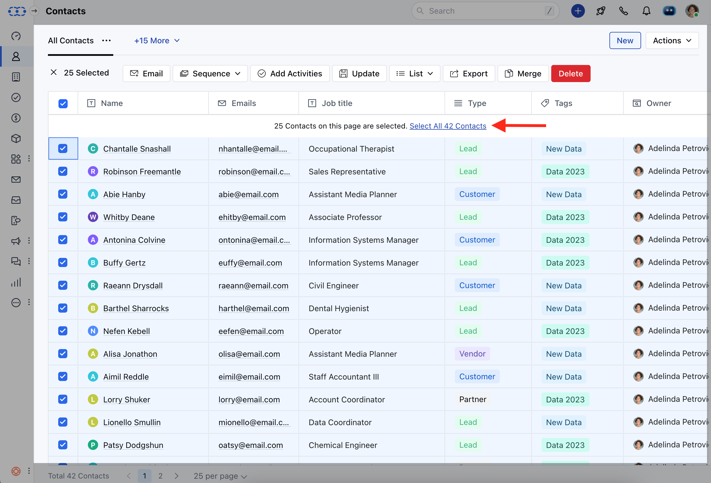
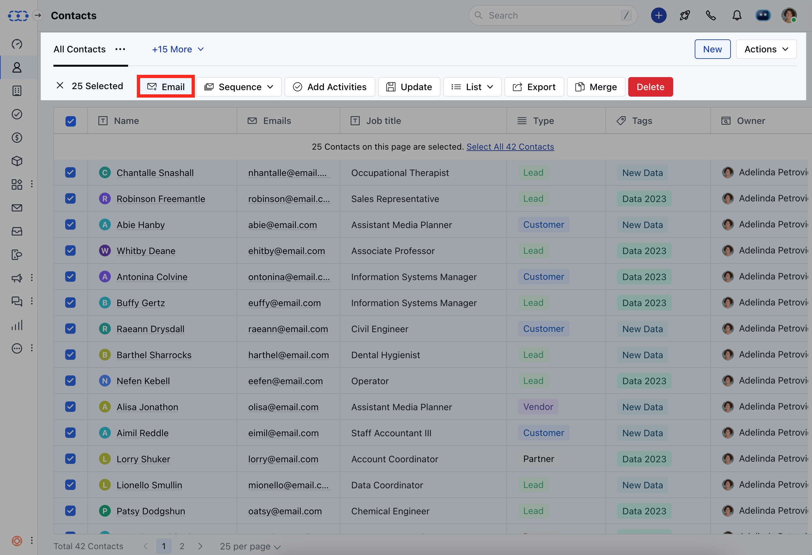
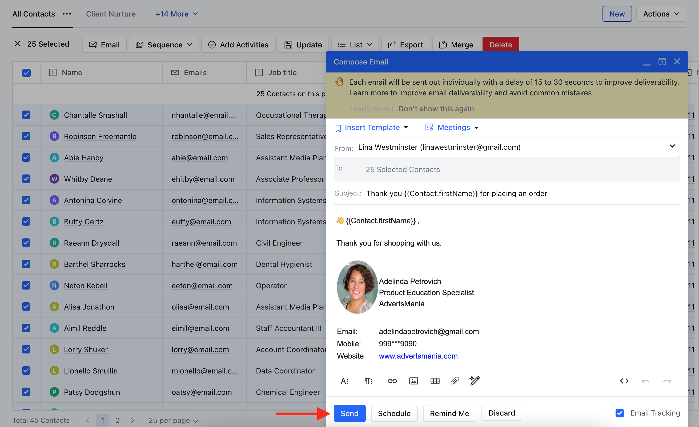
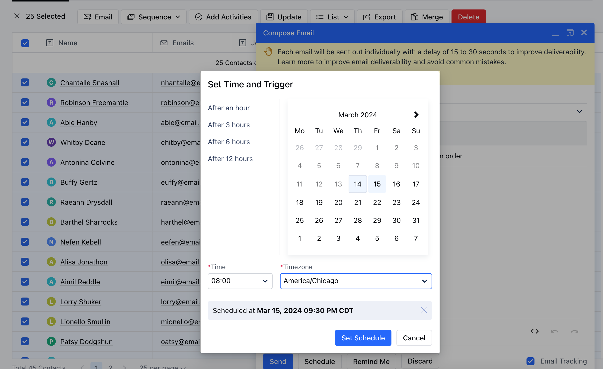

To use our email integration and send bulk emails to your leads, you'll need to configure your email account in Salesmate. You can learn how to do that here if you haven't done this already.

From the Contacts page, select the individual contacts you want to send an email to **OR** select all Contacts at once click the bulk select icon in the top left-hand corner of the screen.After you have selected your contacts. Click on the Email button.After you have finished writing your email **OR** used an existing template to compose an email, click Send Email.

- **Note:** Bulk Emails are available in All Plans. However, Schedule Emails are available in the Pro and above Plans only.

- **Bulk emailing includes emails sent using the following features:** Bulk EmailScheduling Bulk Emails **To send a Bulk email, follow the below steps:** Navigate to the **Contacts Module** from the left sidebarFilter Data through Custom ViewSelect contact or select all by clicking on the **checkbox** at the top

Click on the **Email icon**, appearing after the selection

Fill in the compose form Click on **Send**

- *To Schedule Bulk emails, follow the below steps:**Navigate to the **Contacts Module** from the left sidebarFilter Data through Custom ViewSelect contact or select all by clicking on the **checkbox** at the top

Click on the **Email icon**, appearing after the selection

Fill in the compose form or apply Email Templates from your Template LibraryClick on **Schedule** icon

Select default incremental hours for **1,3,6,12** Hours later or **Custom** Date and Time DesiredClick on **Set Schedule.

- **Verify the Schedule in the Compose Window and hit **Send.

Find All scheduled emails in your Email Client section in Salesmate under **Scheduled** Folder **How can I send Mass Emails to 250+ Contacts?

- **In Salesmate you can send 250 emails in one batch. However, you can send bulk email more than 250 in batches of 250 in go by filtering data in listing page or scrolling to another page.In Salesmate maximum 250 records are shown on one page hence a batch of 250 emails can be created at a time.It is recommended to shoot maximum 250 emails per day to your leads to avoid spamming and slowing of the process.However Salesmate does not restrict the number of emails per day, but your email provider might have restrictions on your per day email, considering the service and packs you have been offered.**Reference Links :**
- [**https://support.google.com/a/answer/166852?hl=en**](https://support.google.com/a/answer/166852?hl=en)
- [**https://support.google.com/a/answer/2956491#sendinglimitsforrelay**](https://support.google.com/a/answer/2956491#sendinglimitsforrelay)
- [**https://support.google.com/mail/answer/22839?hl=en**](https://support.google.com/mail/answer/22839?hl=en)
**
[https://support.google.com/mail/answer/81126](https://support.google.com/mail/answer/81126)
**Note:** The emails are sent from the email account that you connected to in Salesmate.Each email is delivered separately. It appears as it is a direct email.You can format the text as you want to and use email templates too.Email sending is limited to the SMTP sending limits You can also schedule to send your bulk emails later.

Let's start turning your leads into new business using our bulk email feature in Salesmate.
