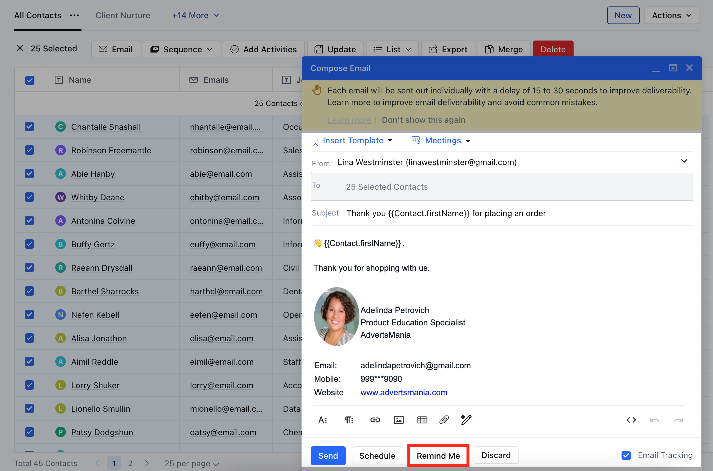
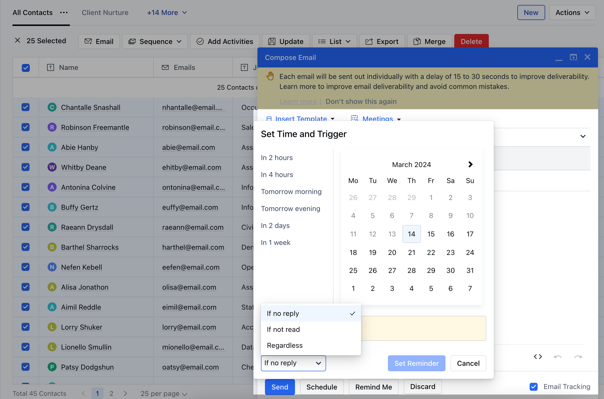

**Note:**Available in the Pro Plan and above.Salesmate activity reminders help you to remain on top of communication by reminding yourself to follow up on some important emails, so nothing falls through the cracks.

## To set an activity base reminder:

You can set a reminder while composing a new message or writing down a reply. Just click on the**"Remind Me"**button and you can select a date on which you should get a reminder.You can also set a condition about when you should get a reminder. You can select any of these conditions:

**If not read**- You will get a reminder if your sent email is not read by the customer (this feature requires email tracking to be on.)**If not replied**\- You will get a reminder if the contact hasn't replied to your email.**Regardless -**You will get a reminder on the specified date to follow up on that particular email.

So based on your condition Salesmate will create an activity for you of the type Task so you can proceed with the next course of action.
