You can filter the emails in Team Inbox which can help you organize the emails and perform specific actions on the emails which match the condition. You can set up multiple filters Under Team Inbox, based on several parameters.

####**Steps to add filters:**Navigate to**Team Inbox**under the**Left Menu Bar.**Scroll to the footer of the Team Inbox MenuYou will find Label:**Filters**

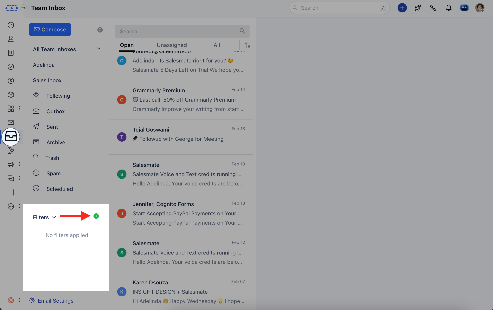

Click on the**\+ Icon**to create a new filter.You get the option to select Matching logic like**Match all filters (AND)**or**Match any filters (OR)**.**Match all filters (AND)**– filter emails that match “all” defined filter conditions.**Match any filters (OR)**– filter emails that match ”anyone” of the defined filter conditions.Click on "**Add Filter**"

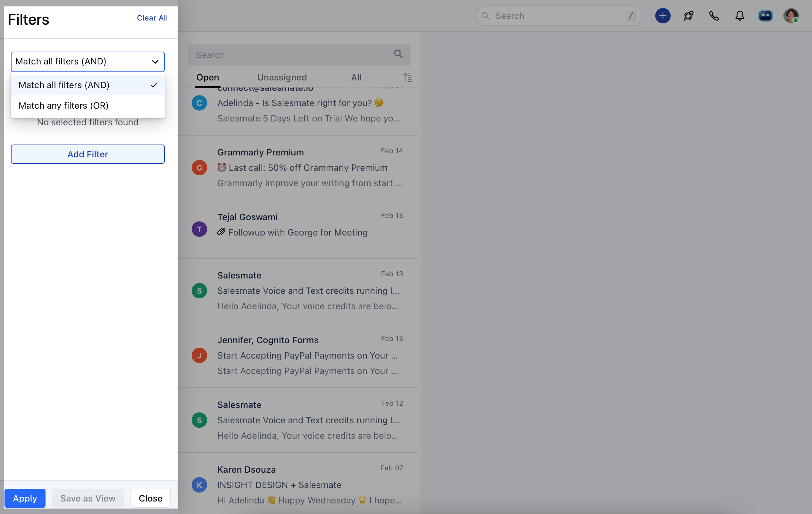

You can select from the following list of filter choices:
[INBOX](https://support.salesmate.io/hc/en-us/articles/360044121932-Filter-Emails-in-Team-Inbox#h_01GJFQR2B8QVZE1HZYD7PSEV6K)[MESSAGES](https://support.salesmate.io/hc/en-us/articles/360044121932-Filter-Emails-in-Team-Inbox#h_01GJFQRBGMT9KAN43Z85F7YC5C)[PROPERTIES](https://support.salesmate.io/hc/en-us/articles/360044121932-Filter-Emails-in-Team-Inbox#h_01GJFQRJ5DVWCDS7JVYVTP0TN2)[TEAMMATES](https://support.salesmate.io/hc/en-us/articles/360044121932-Filter-Emails-in-Team-Inbox#h_01GJFQRRCDD5ER3S8S09G0ZWDK)

You can apply the filter based on the fields shown below:

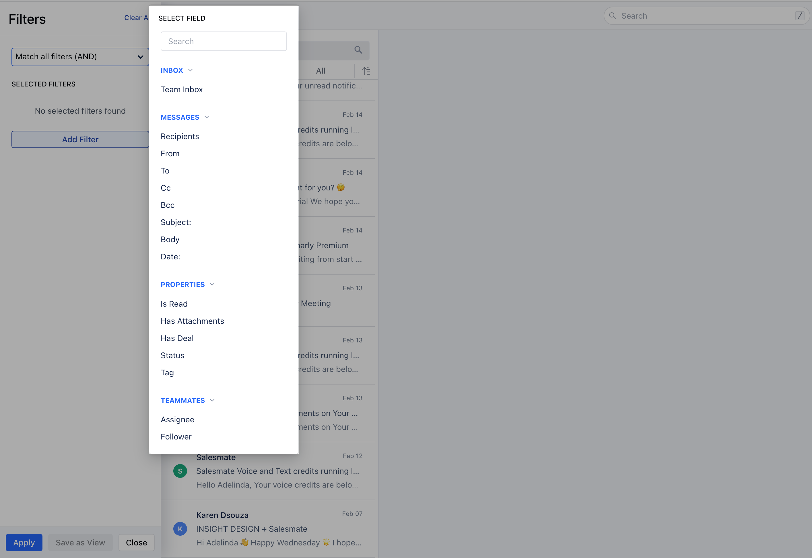

Using filters in search operations will help you to narrow down the search to specific team members, inboxes, recipients, and so on.

####**Fields on which filter can be applied:**####**INBOX****Team Inbox (Sales, Support, etc.):**It will show the list of Inboxes you have. For example, you can have two separate inboxes Sales and Support, and it will show both in the list.

The conditions available for this filter are as below:**Equals to****Not Equals to**

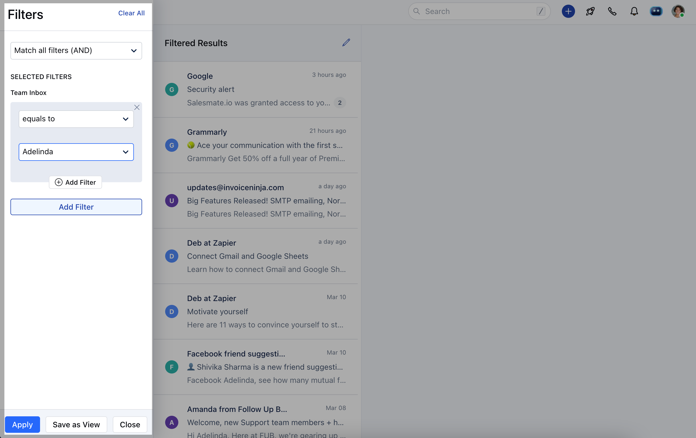

####**MESSAGES****Recipients:**It will filter the conversation in which any of the emails gets matched in the fields From, To, CC, or Bcc.**From:**It will filter 'the conversation in which any of the email’s “from” fields matches with the user-provided filter.**To:**It will filter the conversation in which any of the email’s “to“fields match with the user-provided filter.**Cc**: It will filter the conversation in which any of the email’s “cc” fields matches with the user-provided filter.**Bcc:**It will filter the conversation in which any of the email’s “bcc” fields matches with the user-provided filter.**Subject**: It will filter the conversation in which any of the email’s “subject” fields matches with the user-provided filter. The conditions available for the above filter are as below:
containsequals tostarts withends withis emptyis not empty**Body**: It will filter the conversation in which any of the email’s “body” fields matches with the user-provided filter. The conditions available for the Body filter are as below:
contains**Date**: It will filter the conversations in which email is sent or received on the date filtered by the user. The conditions available for the**Date**filter are as below:
isis beforeis aftertodaytomorrowyesterdaycurrent monthlast monthcurrent weeklast weekmore thanexactlyless than

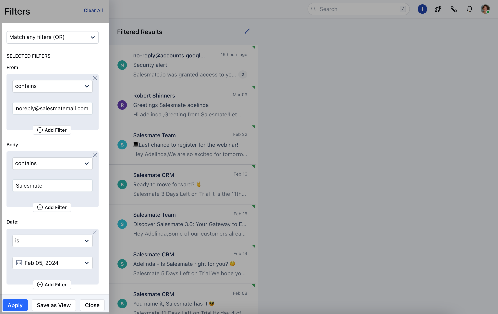

####**PROPERTIES****Is Read**: It will fetch the conversations that are read/unread for the user.**Has Attachments**: It will fetch the conversation in which any single email is having Attachment or none of the emails has an attachment based on the filter applied.**Has Deal**: It will fetch the conversation which has the deal attached or not based on the filter applied by the user. The conditions available for the above filters are as below:
is trueis false**Status:**You can filter the emails based on their status Open or Closed. The conditions available for this filter are as below:
equals tonot equals to**Tag**: It will filter the conversation with a tag matching the user-provided filter. The conditions available for this filter are as below:
equals tonot equals tois unknownhas any value

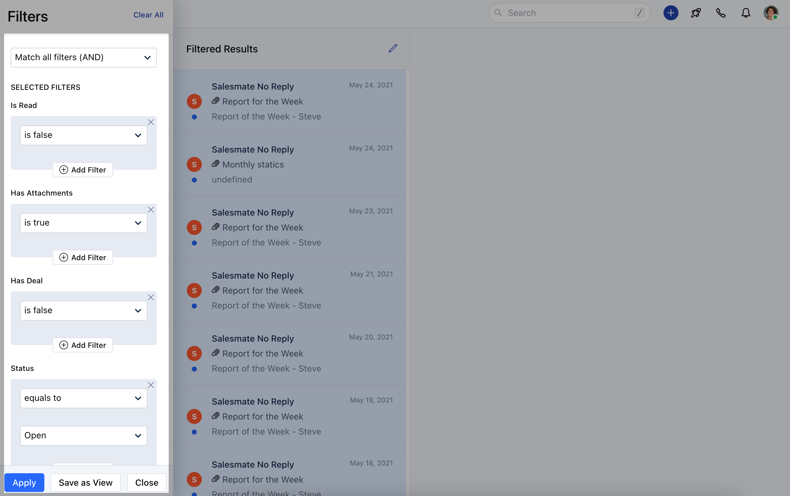

####**TEAMMATES****Assignee**: It will filter the conversation which is assigned to the user-provided filter.**Follower**: It will filter the conversation which is followed by a user-provided filter. The conditions available for this filter are as below:
equals tonot equals tois unknownhas any value

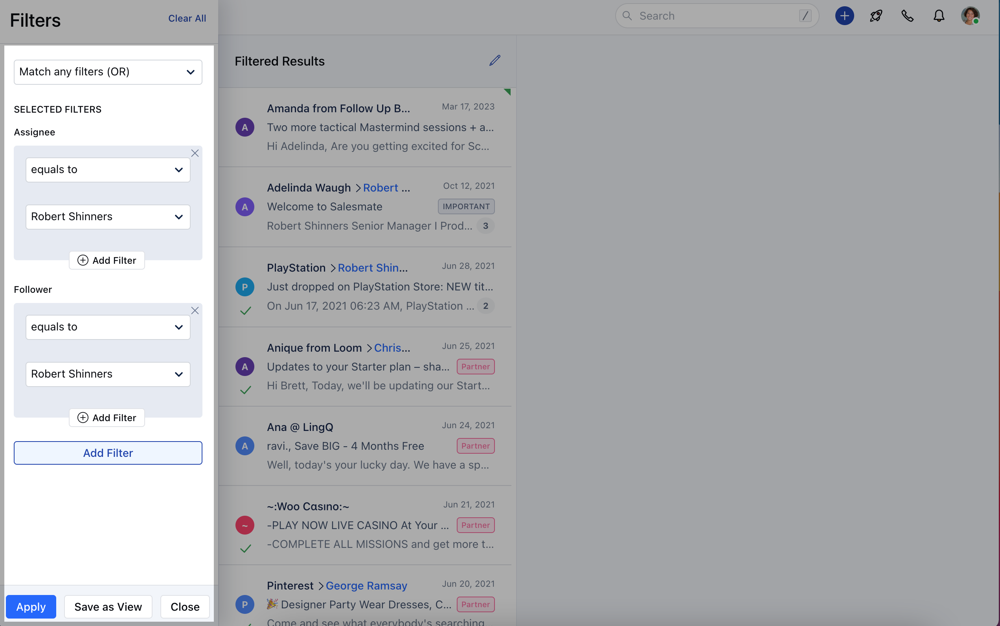

You can further click on**Apply**to view the search combination results :

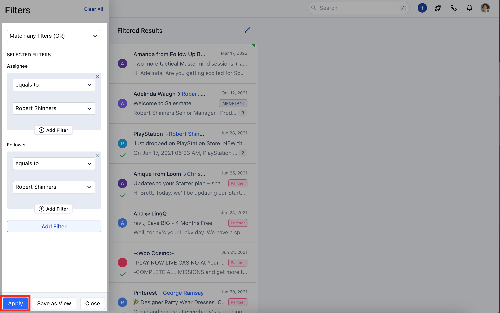

####**Create Views**If you need to use this applied filter regularly, Salesmate recommends and gives you the option to**Save**the filters as**View**for future referenceClick on -**Save as View**

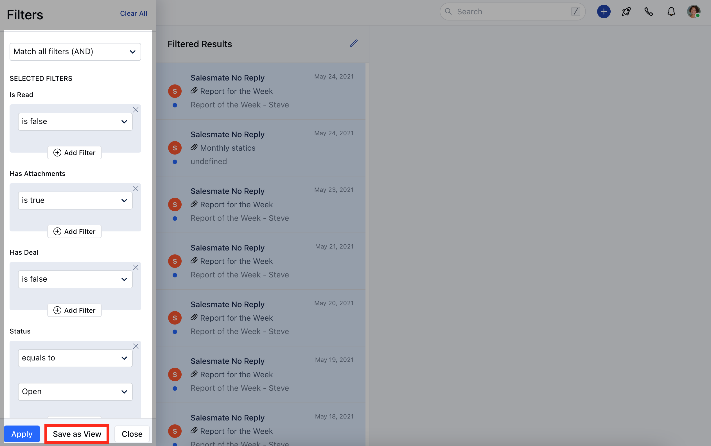

Provide the**Filter Name**and hit**Save**

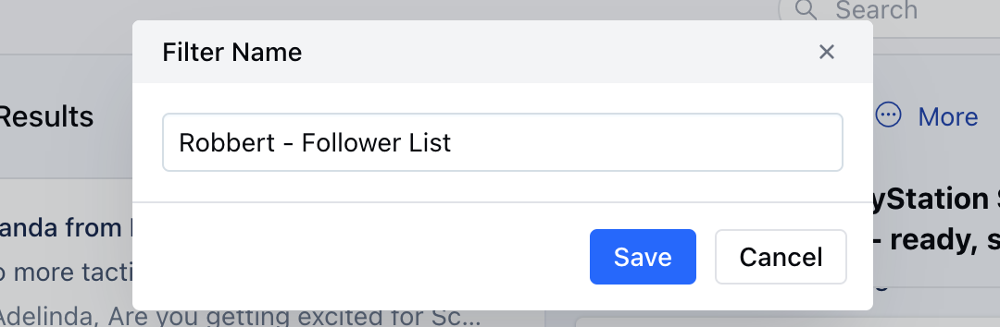

The saved views are available under the**Filters**section.

####**Manage Views**You can**Edit**,**Rename,**or**Delete**the saved filtered view.Hover over the**Three Dots**icon to**Edit**,**Rename,**or**Delete**Click on the below options to perform operations as required:**Edit**: Update the Filter Properties**Rename**: Update the Filter Name**Delete**: Remove the saved filter permanently

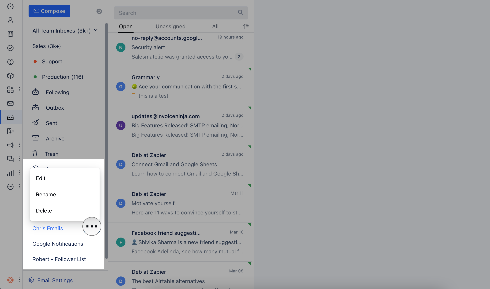

**Note:**The Delete action is irreversible and cannot be undone.
