When you have a **sales** or a **support** email address that receives a high volume of emails, your sales/service reps would not always be able to respond to all the emails assigned to them.If the emails are made visible to everybody on the team, then the teammates can simply choose emails that haven't been responded to and send replies. So the next time someone in your team is away from work, his emails don't have to wait until he arrives. People in your team can take turns and reply to them.Your **Team Inbox** becomes the common room for all **Teammates** to read and reply to emails that your company receives.

- [Team Inbox](#team-inbox-note-available-in-the-pro-plan-and-above)
- [Custom SMTP - Forwarding Address](#custom-smtp-forwarding-address)
- [Configuring Team Inbox](#configuring-team-inbox)

### Team Inbox **Note:** Available in the Pro Plan and above.

Navigate to **Team Inbox** under the **Left Menu Bar.

- ** Click on the **Add Team Inbox** button.

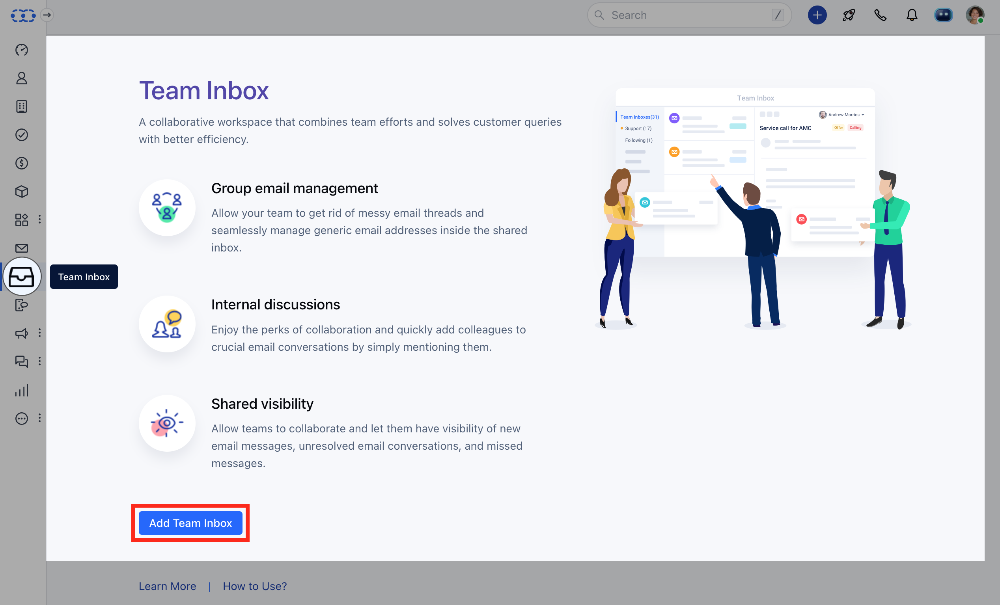

Enter the **Email Address** and the **Name** you want for your team inbox.The email addresses that can be entered are:
GoogleOffice 365Others (Example: Yahoo, custom SMTP)Click on the **Next** button.

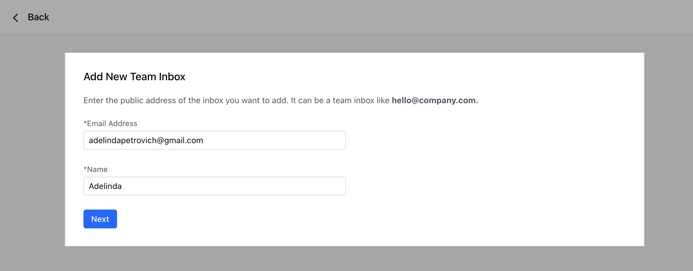

Select your account type.If records are found from **G-Suit**, then the user is required to select the account type from the following:**G-suit (Google Apps) or Gmail Account**: Sync your G-suit or Gmail account emails with Salesmate. You will need to authorize the account to start email syncing.

- **Google Group**: Forward your Google Group to your Team Inbox.

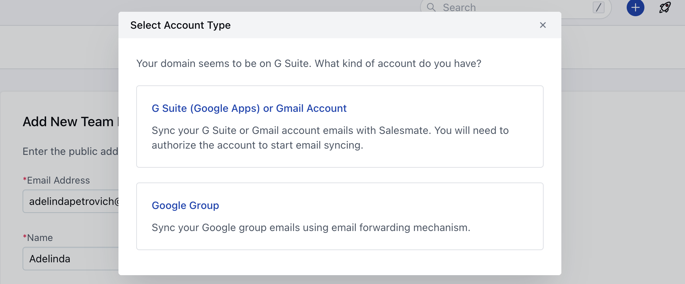

If records are found from **Office 365**, then the user is required to select the account type from the following:**Microsoft's Office 365(Online Hosted)**: Sync your Office 365 account emails with Salesmate. You will need to authorize the account to start email syncing.

- **Microsoft Distribution Group**: Forward your Microsoft Distribution Group to your Team Inbox.

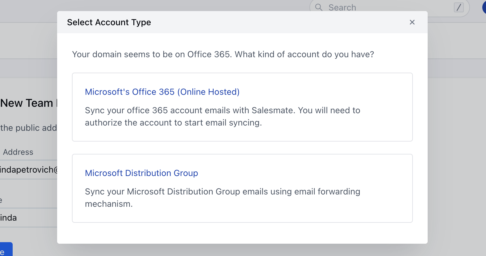

In case the records are not from **Google or Office 365** then you will be redirected to **Email Forwarding Setup.

- **You will need to enter the **forwarding address** showing here in your custom SMTP.
- [How to set up email forwarding.](https://support.salesmate.io/hc/en-us/articles/360023120811--Setting-up-your-Team-Inbox#Forwarding%20Address)

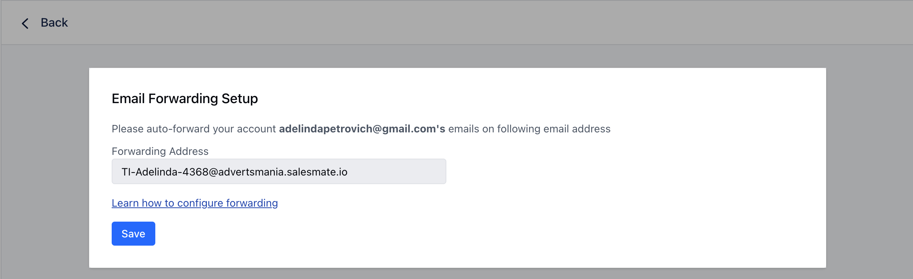

Click on **Save**.

### Custom SMTP-Forwarding Address

In the case of Forwarding, how to set up forwarding will depend on the email provider you are using. As an example, we have taken **Yahoo** to show the steps.

Go to the **Settings.

- **Click on **More Settings**. Click the primary **Yahoo** account.Go down and select **Forward**. Enter the **forwarding address**. Select Store and **forward** or Store and **forward** and mark as read.Click **Verify:**A verification email will be sent to the **email address** that you are using for forwarding.Click **Save**.

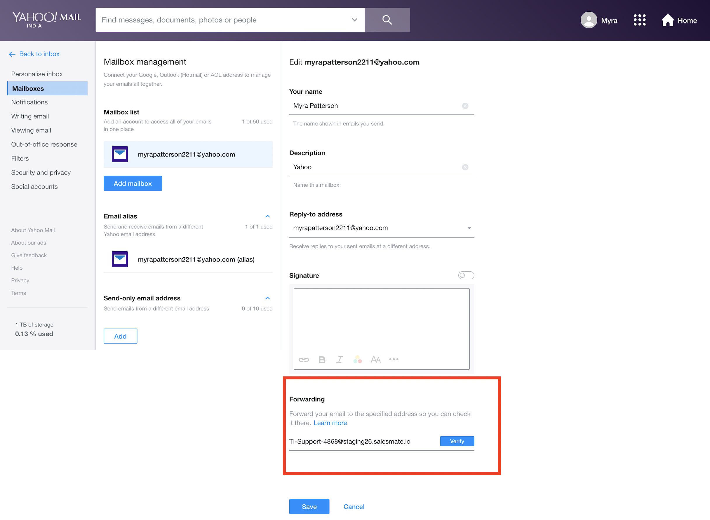

Learn how to set up email forwarding in
[Google Group](https://support.google.com/mail/answer/10957#zippy=%2Cturn-automatic-forwarding-on-or-off)
[Microsoft Distribution Group](https://learn.microsoft.com/en-us/microsoft-365/admin/email/configure-email-forwarding?view=o365-worldwide)
.
[Zoho Mail](https://www.zoho.com/mail/help/email-forwarding.html#alink1)

### Configuring Team Inbox

Once you have selected the email address as **G Suite or Gmail Account/Microsoft Office**, you will be required to enter the email you want to sync to your team Inbox.Once the email address is entered, you will be asked:- How many old emails do you want to fetch inside to start with your team inbox?Choose an option from **30,60,90 or All days**. Click on the **Start** button.

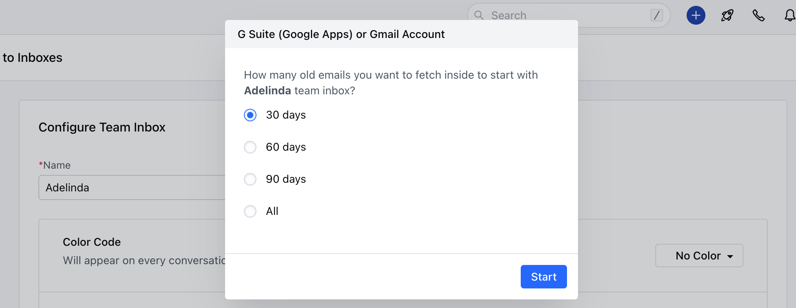

The sync will take time depending on how many days you have selected and how many emails are getting synced.

You can **Configure the team inbox setting** over to the page you are redirected.

- **Name:** You can change the name of your team inbox from here.

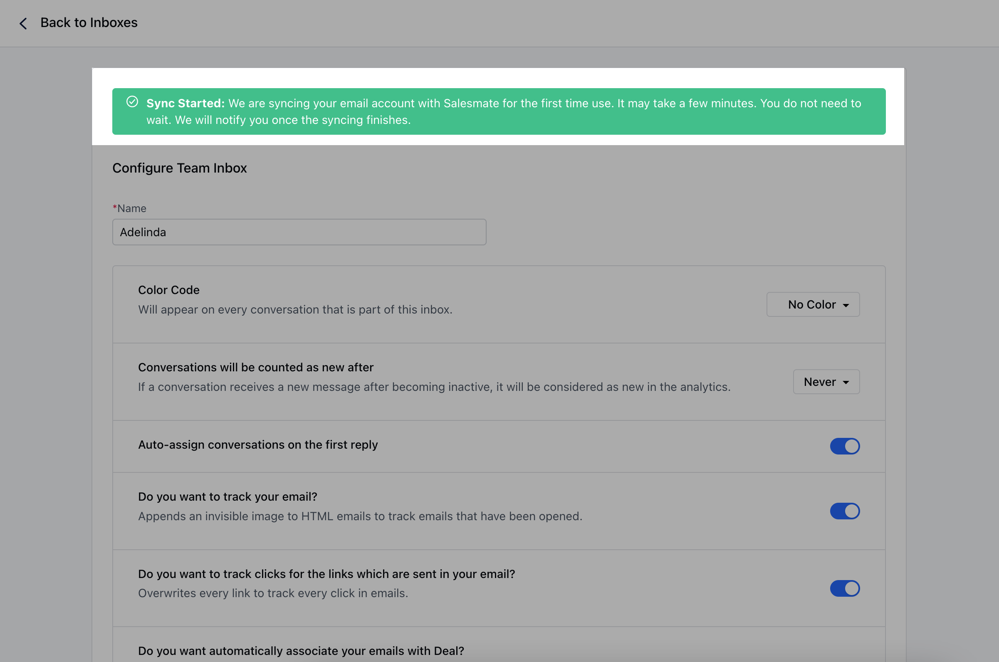

- **Forwarding Email:** This will be the current forwarding address (Appears only if you have selected **Google Group or Microsoft Distribution Group or Others (Like Yahoo!)**).

- **Color Code:** Colors will appear on every conversation that is part of the inbox. This is used for identifying emails with a glance.

- **Conversations will be counted as new after:** Whenever a conversation receives a mail after it has become inactive or if a reply is not sent within the selected period, then it will be considered as new in the analytics.

- **Auto-assign conversations on the first reply:** If this option is enabled, then anyone in the team who replies to that conversation first will auto-assign that conversation.

- **Do you want to track your email? :**It tracks the outgoing emails for open tracking and link tracking.

- **Do you want to track clicks for the links which are sent in your email? :**It overwrites every link to track every click in an email.

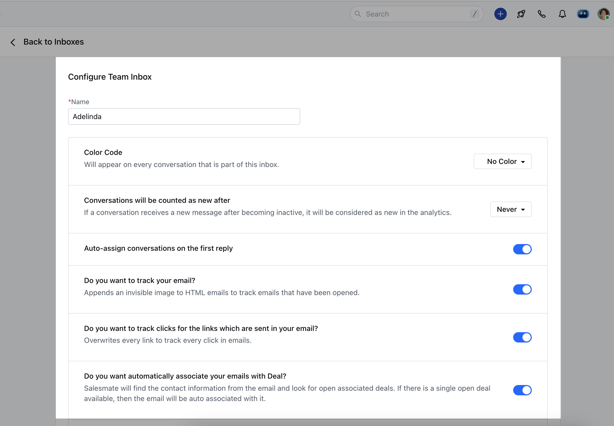

- **Use custom SMTP for outgoing emails:** Here you can connect your custom SMTP for outbound emails from Team Inbox.

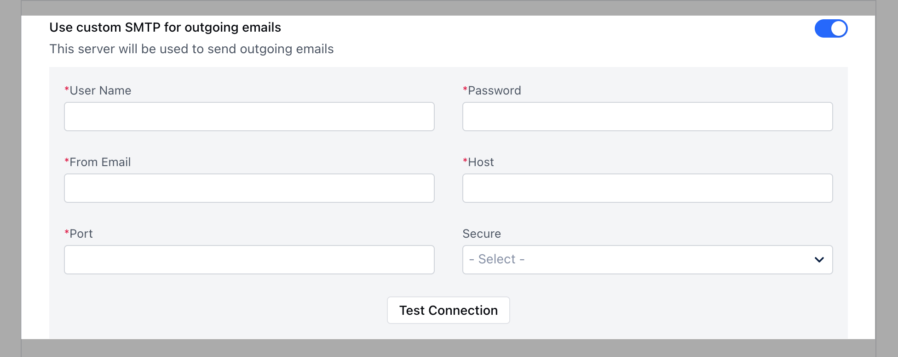

- **Auto BCC:** If this option is enabled then the user will be asked to provide multiple email addresses separated by semicolons, and each outgoing email will BCC that email to the email addresses mentioned.

- **Auto Follow:** The user will automatically be added to the auto-follow list of an email whenever he/she replies or adds a note to a conversation that is not assigned to them.

- **Access Settings:** You can share the team inbox with specific users or with everyone by changing the access settings.

- **Everyone**: Everyone in the company will be able to access the team inbox. They can also reply using the email address.

- **Selected Users:**You can enter the users who can access the team inbox. You can define multiple teammates separated by semicolons.

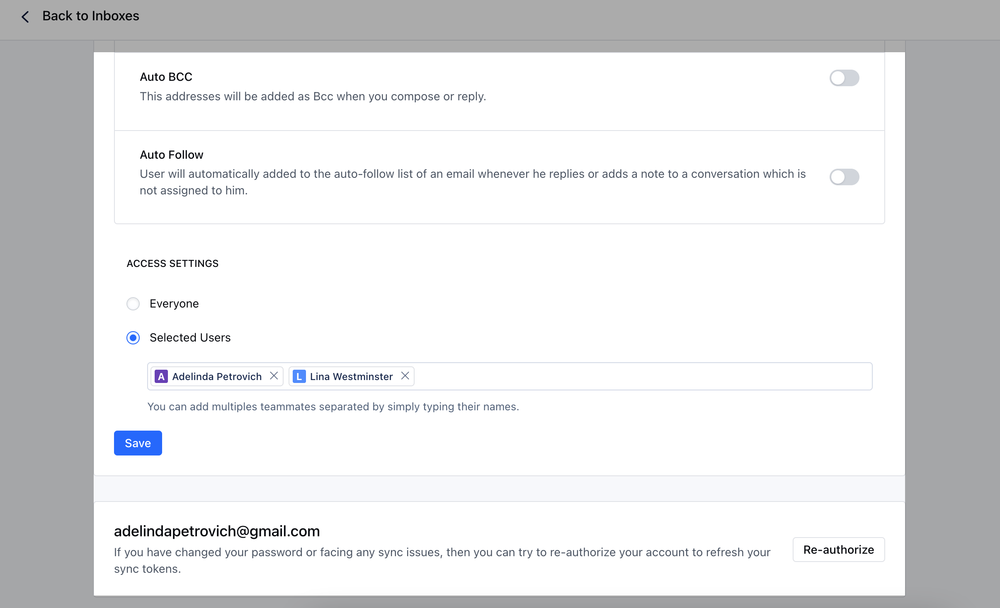

The email that has been synced will appear at the end of the configuration page where the mail can be reauthorized.Click on the **Save** button once the configuration is complete.You can view your team inbox under **All Inboxes**.

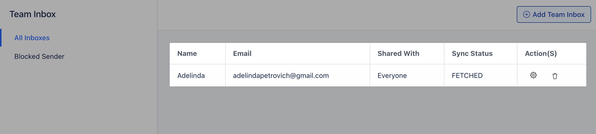

You can set the email threading preference for the email communication under the team inbox, please refer to [How Emails are Threaded](https://support.salesmate.io/hc/en-us/articles/360015611612) to get more information
