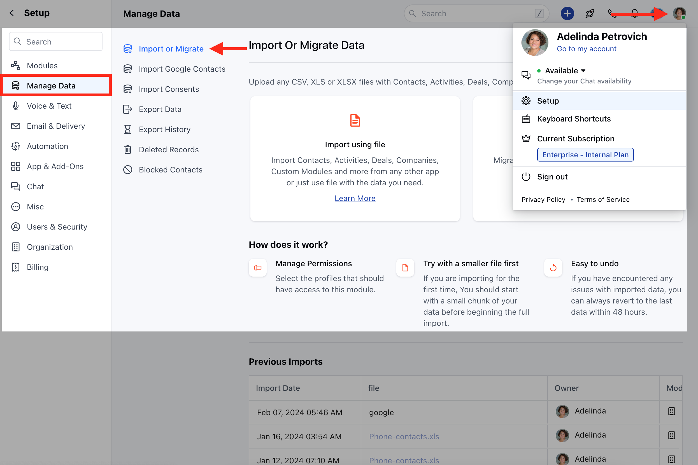
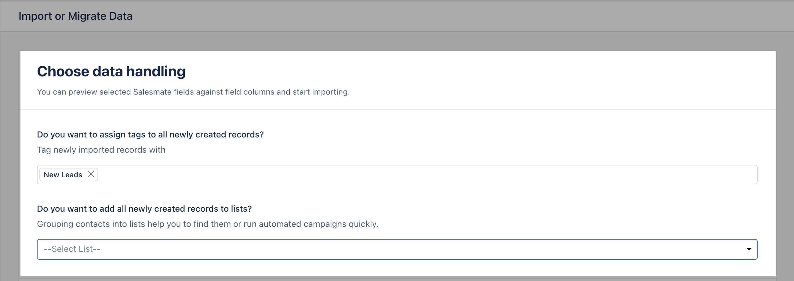

It could be a painful task to import/migrate data from CRMs, but**Salesmate**has eased this process by providing you with an easy, click-to-go Import feature.

You can directly import data from CRM with a few clicks.**Salesmate**not only allows you to import the**Companies**or**Contacts**but also the**Deals, Activities,**and**Notes**associated with them.

### Salesmate-supported CRMs:

* **[** Pipedrive ](https://support.salesmate.io/hc/en-us/articles/360050914871-Import-data-from-Pipedrive-CRM)

***HubSpot****Pre-requisite for HubSpot import**### Please keep the following pre-requisite list in mind before importing data from HubSpot

* Create all the users that are present in HubSpot (active or inactive) in Salesmate.

* Create all the pipelines & stages present in HubSpot in Salesmate.

## Please follow the below steps to import your data from**HubSpot**:

* **Navigate to the** Profile Icon at the top right corner

* **Click on** Setup

* Head over to the**Manage****Data**category

* **Select** Import Or Migrate

* **Select** Import from other CRM

* **Select** HubSpot **

*** Here, you need to enter your**HubSpot API Key**to connect to HubSpot.

**To find your HubSpot API key,*** Log in to your**HubSpot account**.

* **Go to** Settings on the top left.

* **Navigate to** Account SetUp >> Integrations >> Private Apps

* Here, you'll be redirected to the page where you'll need to create a**Private app**.

* **Click on** the Create a Private App option or Create One Now

* **Add In the** Basic Info . Give an appropriate

* **App Name, Add the Logo,**and Mention the**Description**for the app.

* **Next go to** Scopes , here you'll be presented with the list of Scopes to select from before you start the Import.

<Note>
**NOTE:**

</Note>

<Note>
Please note that below mentioned Scopes are required to be selected to be able to successfully authenticate the Apps:
</Note>

<Note>
**Under Standard**

</Note>

<Note>
"oauth",
"files",

"files.ui\_hidden.read",**Under CRM**"crm.objects.contacts.read",
"crm.objects.companies.read",
"crm.objects.deals.read",

"crm.schemas.contacts.read",
"crm.schemas.companies.read",
"crm.schemas.deals.read",
"crm.objects.owners.read"
</Note>

* **Click on** Create App

***Continue Creating App**.

* That's it, your API key is now generated

* Copy the key and paste it to Salesmate.

* **Click on** Connect .

* **Once the Account is successfully connected, you can select the** modules from which you would like to migrate the data.

* **Now click on** Continue .

* You will now get an option to Map the HubSpot fields with Salesmate fields.

* Map the HubSpot fields of all the selected modules to Salesmate.

* **If any HubSpot field does not exist in the system, then you can directly create it by clicking “Create New Field” at the bottom of the** Select Field and a popup will open with the field name and data type pre-filled into it.

* **If fields are mapped with different data types, a** warning icon will be displayed with the message as you hover on it.

* If the fields are not mapped correctly the below error would pop up on the screen.

* On the Next screen, you can assign an Owner

* you could assign a Tag to the newly created records or add them to the list in Salesmate which will help you to track the records.

* **You will be able to** Preview the import and start the import.

* Preview of mapping columns by the module.

* You could assign a Tag to the newly created records or add them to the list in Salesmate which will help you to track the records.

* By clicking on the I have verified, start the import will start the import process.

<Note>
**NOTE:**Two simultaneous imports are not allowed in a single link to manage data concurrency. So if you have scheduled one import, you or any other user from your link has to wait until the import/revert finishes.

</Note>

* Now, you can view the import progress on this page.

* **Once Imported, the details of the Import will be visible for your reference under "** Details "

**Previous Import:*****Import Date**\- Gives you the status of the day the file was imported

***File**\- It helps you identify if the records were imported through a**CRM**system or**Excel**/**CSV**Files

***Owner:**This will show the details of the User that imported the records

***Module**\- The icons help you identify the**module**in which the records that were imported

***Actions**\- With Actions, you check the**details**of the import or**Revert**the import which is available up to 48 hours after the import is completed.

