If you are migrating from another CRM to Salesmate. We have eased this transition by providing you with an easy, click-to-go Import feature.

It allows you to import data from another CRM directly.

Not just contacts or companies, we allow you to import your **Deals, Activities, and Notes** too. Making it a quick migration for your Sales teams to get accustomed to a new system.

- **Supported CRMs:** Pipedrive

- [HubSpot](https://support.salesmate.io/hc/en-us/articles/18151400752409)

- **Others will be added soon. Please reach support with your requirement.

- ** Pre-requisite for Pipedrive import #

###  Please keep below the pre-requisite list in mind before importing data from Pipedrive.

- Create all the users that are present in Pipedrive (active or inactive) in Salesmate.

- Create all the pipelines & stages present in Pipedrive in Salesmate.

# Please follow the below steps to import your data from Pipedrive:

- **Navigate to the** Profile Icon at the top right corner

- **Click on** Setup

- Head over to the **Manage **Data ** category

- **Select** Import Or Migrate

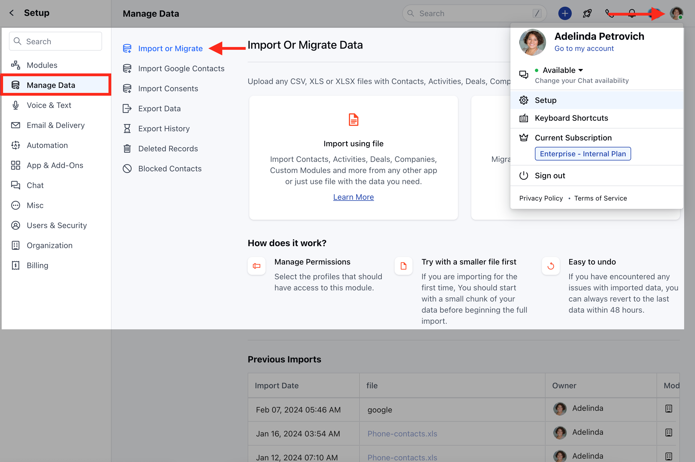

- **Select** Import from other CRM

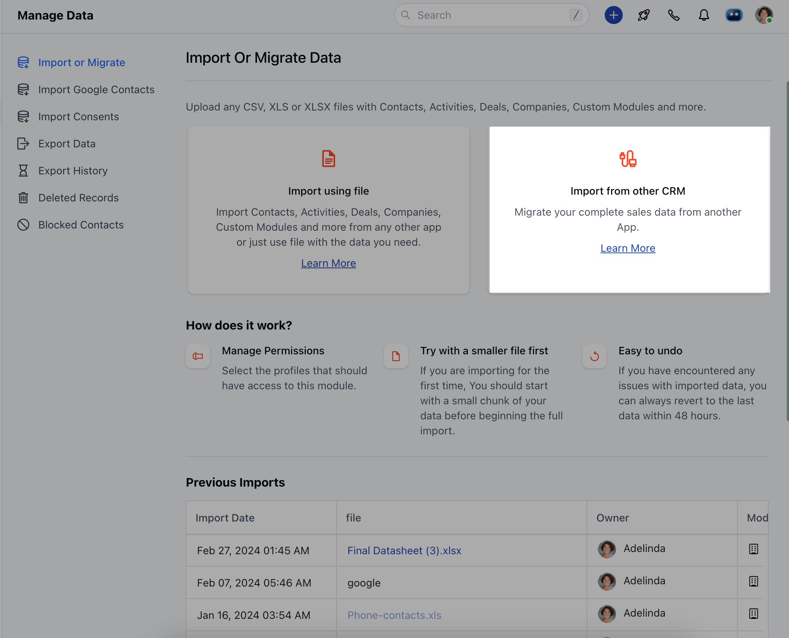

- **Now on the next screen, select** Pipedrive .

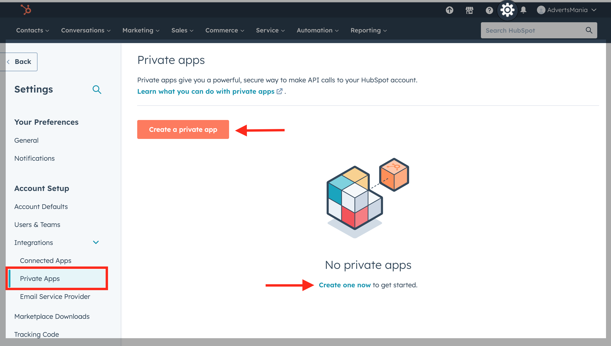

- You will be redirected to the below screen after you select Pipedrive where you need to add the API key of your Pipedrive account into Salesmate.

- **The** API Key should be available under

- Profile icon * Personal Preferences

- API [(How to find Pipedrive API Keys)](https://support.pipedrive.com/hc/en-us/articles/207344545-How-can-I-find-my-personal-API-key-) * Your API token - COPY

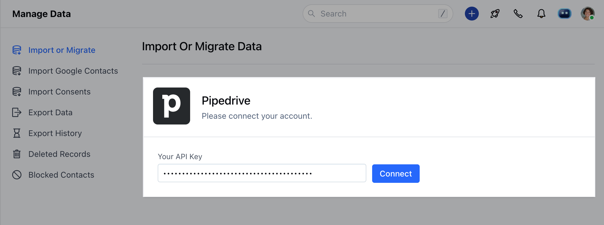

- Once you click on Connect, it will redirect you to the module selection page where you can select the modules you want to import

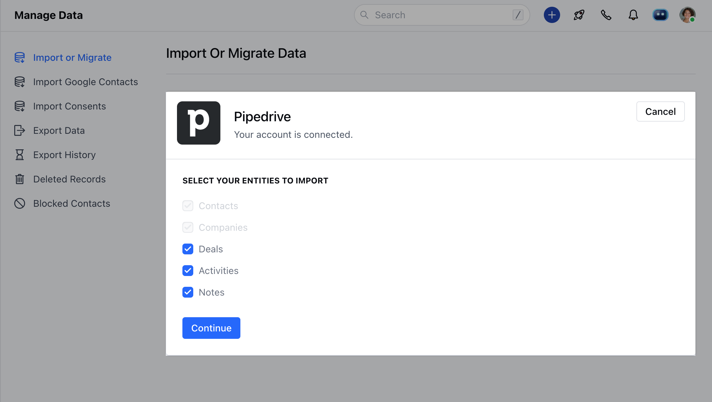

- **Here, you can select the** modules from which you would like to migrate the data

- After selecting modules, you will be redirected to the field mapping screen

- Now, you can map the Pipedrive fields to the Salesmate fields.

- Map the Pipedrive fields of all the selected modules to Salesmate.

- You can check the First record from the Pipedrive under each field. It can help you to map the correct fields.

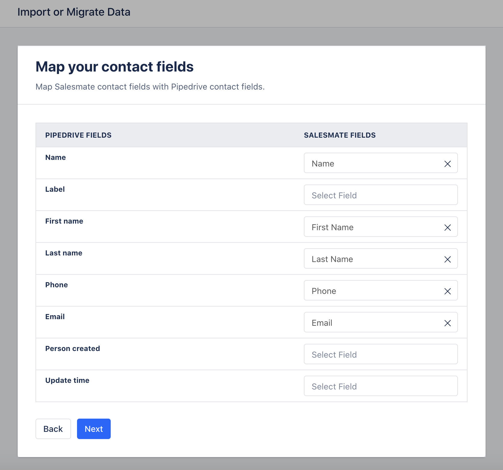

- If any Pipedrive field does not exist in the system, then you can directly create it by clicking “Create New Field” at the bottom of the popper and a popup will open with the field name and data type pre-filled into it.

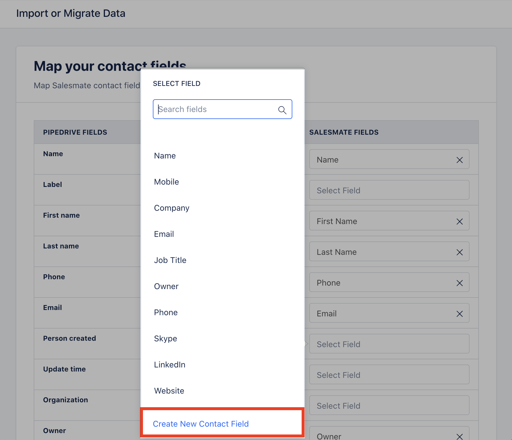

- **Click on "** Create New Contact Field ".
- [Learn More](https://support.salesmate.io/hc/en-us/articles/360041831032-How-to-Create-Custom-fields)

- **If fields are mapped with different data, a** warning icon will be displayed and a tool tip when hovering over it.

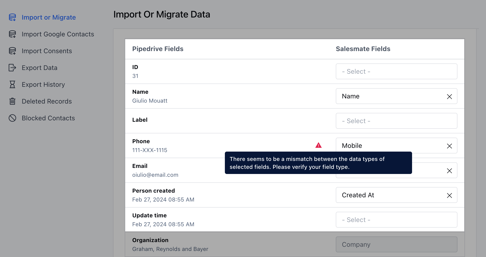

- On the Next screen, you can assign the Owner.

- Add Tags, and Add the newly created records to the List in Salesmate which will help you to track the records.

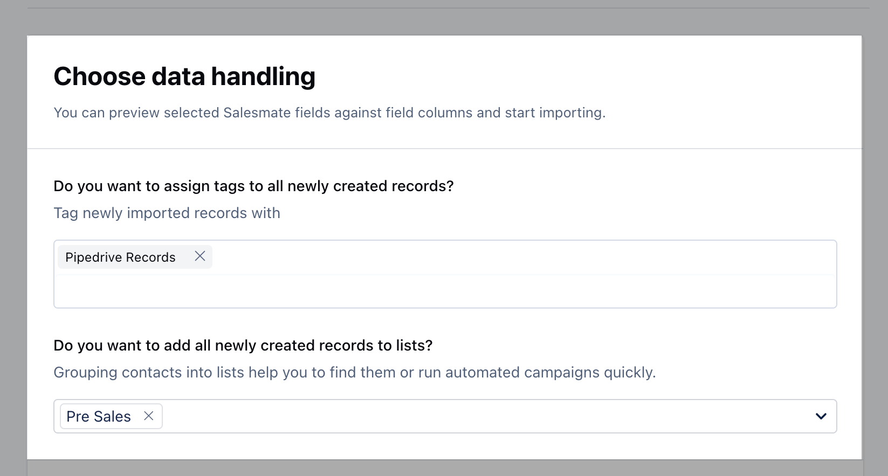

- **You will be able to** preview the import and start the import

- Preview of mapping columns by the module.

- By clicking on the I have verified, start the import will start the import process.

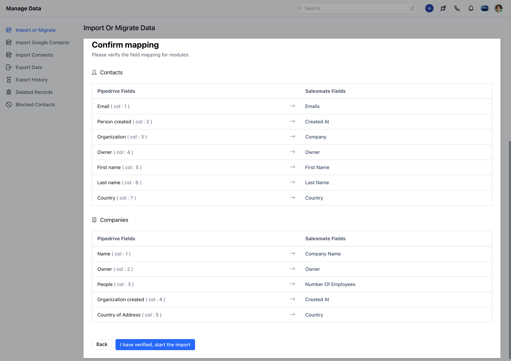

<Note>

**Note:** Two simultaneous imports are not allowed in a single link to manage data concurrency. So if you have scheduled one import, you or any other user from your link has to wait until the import/revert finishes.

</Note>

- Now, you can view the import progress on this page.

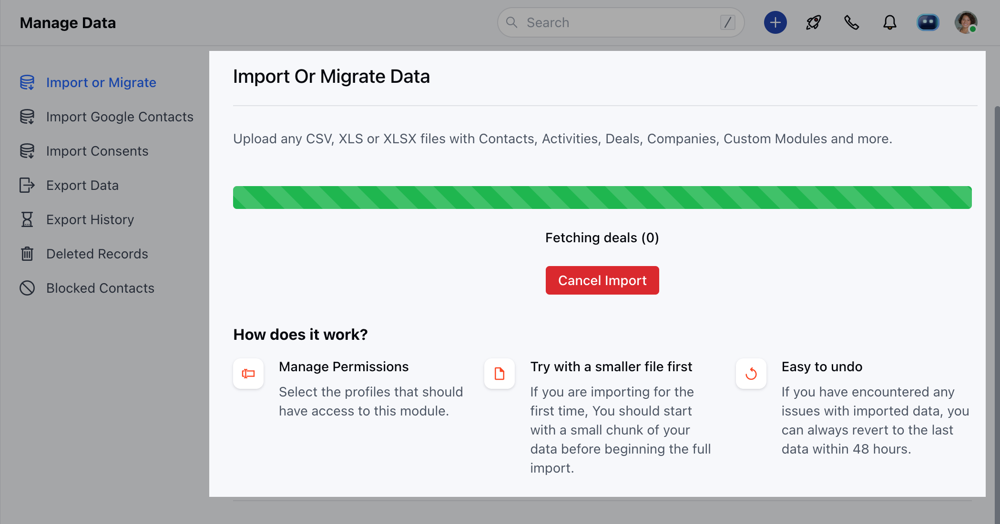

- **Once Imported, the details of the Import will be visible for your reference under "** Details "

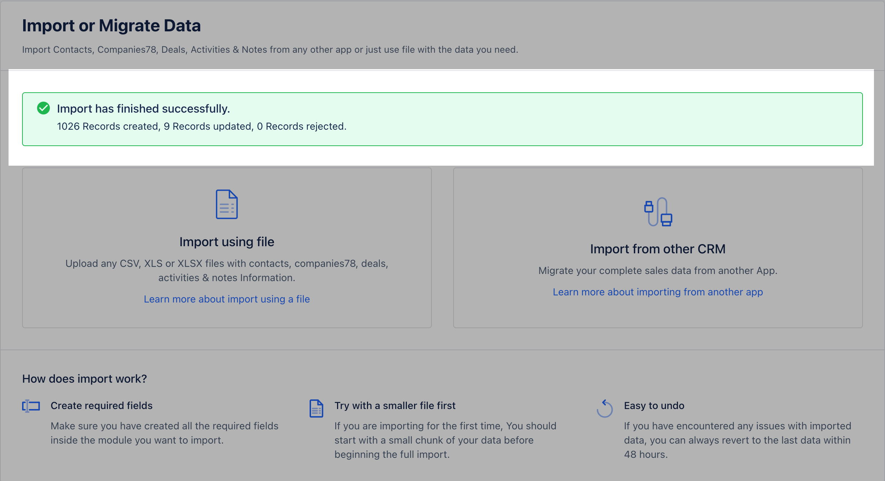

- *Previous Import:***Import Date:** Gives you the status of the day the file was imported

- **File:**It helps you identify if the records were imported through a** CRM **system or** Excel **/** CSV** Files

* Owner: The User that imported the Records

- **Module:**The icons help you identify the** module ** in which the records that were imported

- **_Actions:_** With Actions, you check the **details** of the import

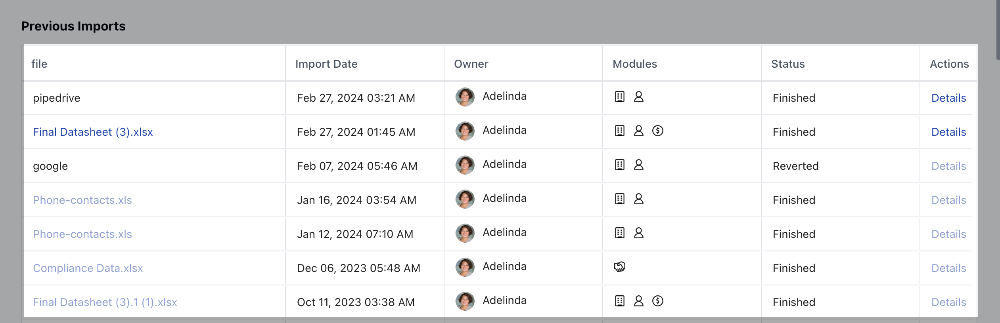

- **Revert ** the import which is available up to 48 hours after the import is completed.

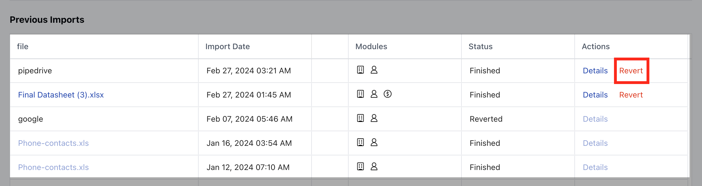
