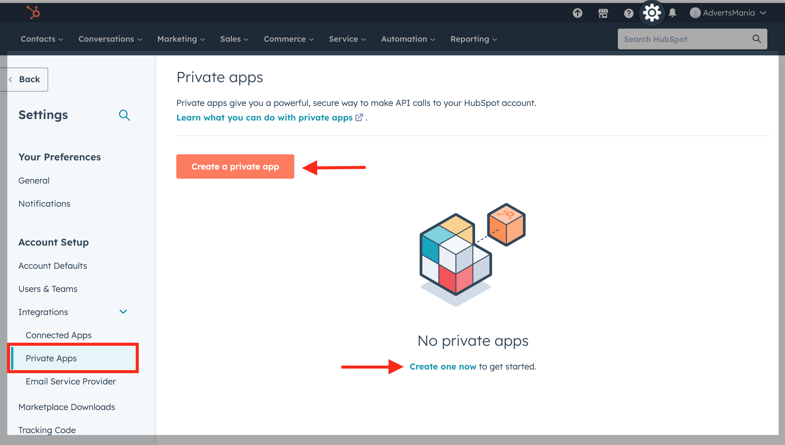
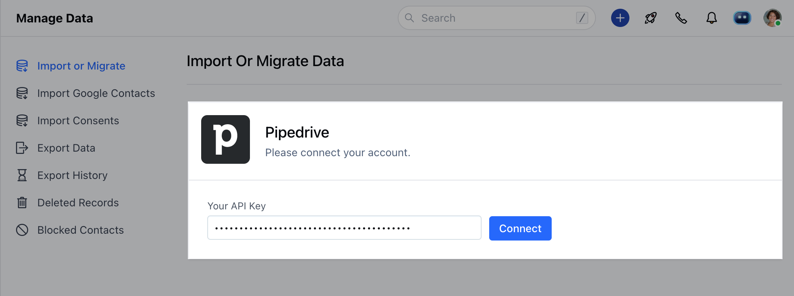
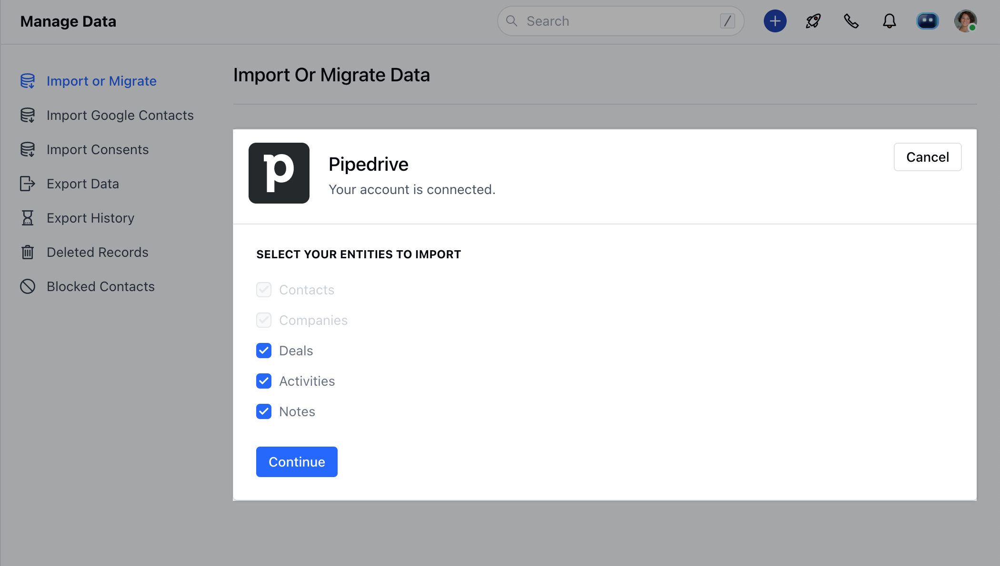
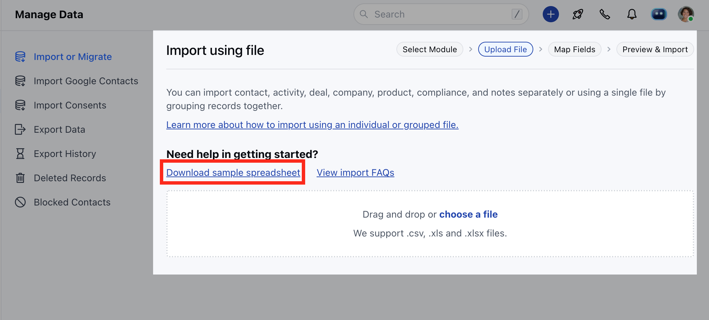
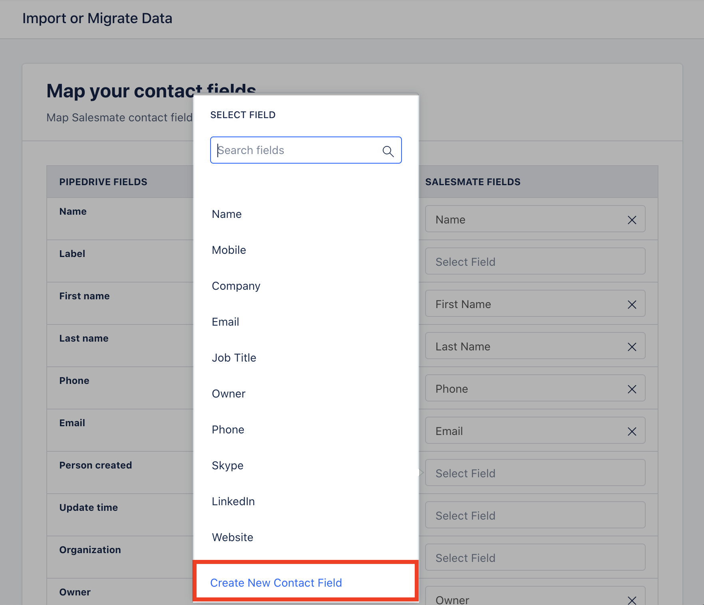
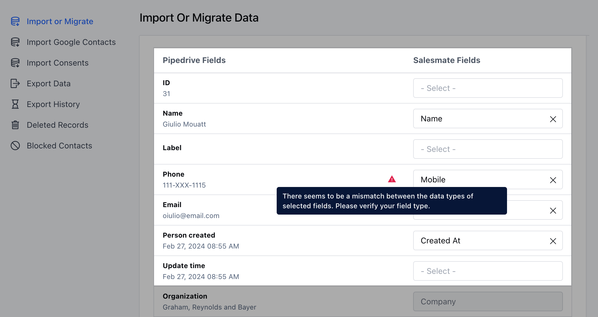
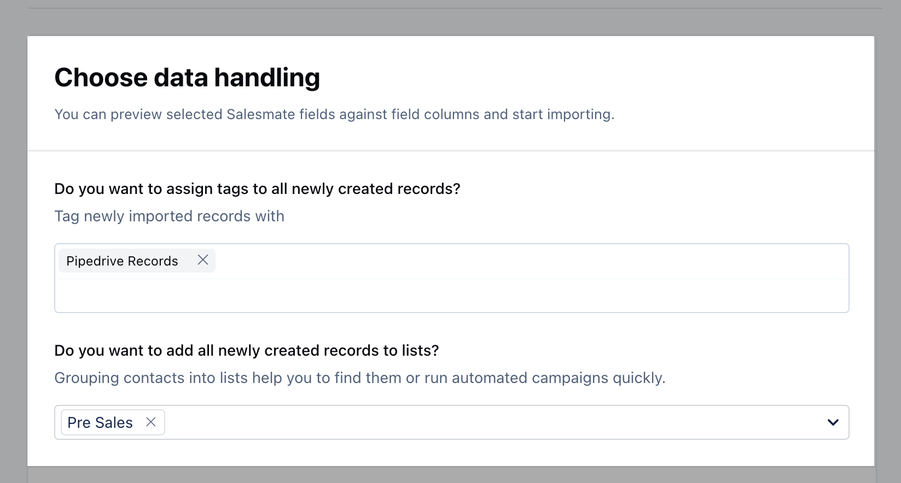

**Can I undo the import?*** If you have encountered any issues with imported data, you can always revert to the last data within 48 hours.

To revert the import,

* **Navigate to the** Profile Icon on the top right corner

* **Click on** Setup

* Head over to**Manage Data*** Click on**Import Or Migrate Data*** Go to the sheet that you have imported

* **Click on "** Revert ".

**Can multiple users import their records at the same time?**Import will be Salesmate link (Account) wise ie.

* Only one user of the same link (Account) can run the import/revert process at a time

* Other users will have to wait till the import/revert finishes performed earlier by their teammates

* Salesmate will give you a warning message if two users perform the same operation at a time

* You can try after again once the other process is completed

**What if there are no values present in the required fields while importing?*** If there are no values present in Required fields, It will reject those fields and import the records.  After import, if you open and Edit the record it will prompt you to update the required fields.**What is the maximum size of the file that you can import?*** We support file sizes up to**25MB**. If your file is larger than 25MB, we suggest you break it up into multiple files.**What happens if Salesmate doesn't find a matching pipeline/stage?*** The**default****pipeline**and the first stage of the pipeline would be auto-selected to import data if Salesmate doesn't find the matching pipeline or stage name.**Can I import multiple records in a single file at once?*** Yes, You can import your**Contacts**,**Companies**,**Deals**,**Activities**, and**Notes**all at once via CSV/excel file.**Is there any limitation to the number of columns that can be imported at once?*** There is no limitation to the number of columns in a sheet that you can import at once.**Is there any limit to the number of rows that can be imported at once in the Salesmate?*** There is a limit of 50,000 rows in the sheet to upload in Salesmate in a single file.**How to avoid duplicate records?*** The chance always exists that you may have records with the same data. Whenever you run an import in Salesmate, you'll be given the option to merge duplicates. You can also choose to bypass this merging step.

**What are the date formats supported in Salesmate?*** When you try to import any date-based fields in Salesmate, it gives you the option to choose your date and time format.

**Why does my imported currency value appear as "0"?*** When importing from sheets, make sure all monetary values (for default fields such as Deal Value, and for any custom fields where you have currencies) are formatted as numbers without currency symbols (so as 1000000 as opposed to $1000000).

* **If numbers include currency symbols, the import system won't detect them properly and thus all values will be formatted as 0.** Why can't I import data?

* If you receive an error when attempting to import a spreadsheet, the issue may stem from your spreadsheet: while there is no maximum limit on the number of columns in the spreadsheet, the maximum file size is limited to 50mb, with a maximum limit of 50,000 rows within the spreadsheet.

* **You can find import errors by clicking on the profile icon>>Setup>>Data Administration>>Import History.** How to identify the field mappings that have been done against which particular module?

* You can identify the field mappings for a particular module via the icons that are visible against each field mapped.

**How Can I map the Company field while importing the Contacts?*** While trying to import the Contacts, If you want to automatically create companies associated with the contacts, You can map them with the Company field.

**What Happens if I have multiple fields with the same name in each module?*** If you have multiple fields with the same name, It will by default map contact fields.

* You can select fields of another module by clicking on the mapped field.

