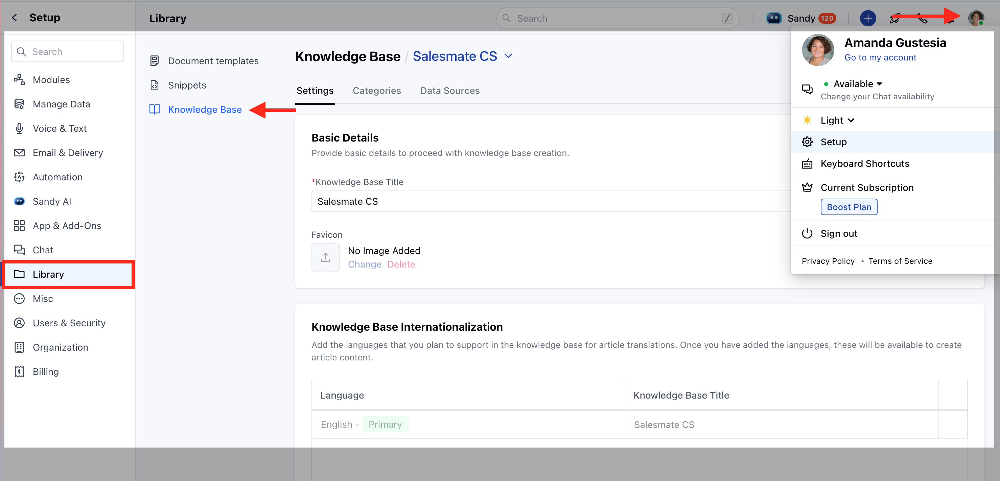
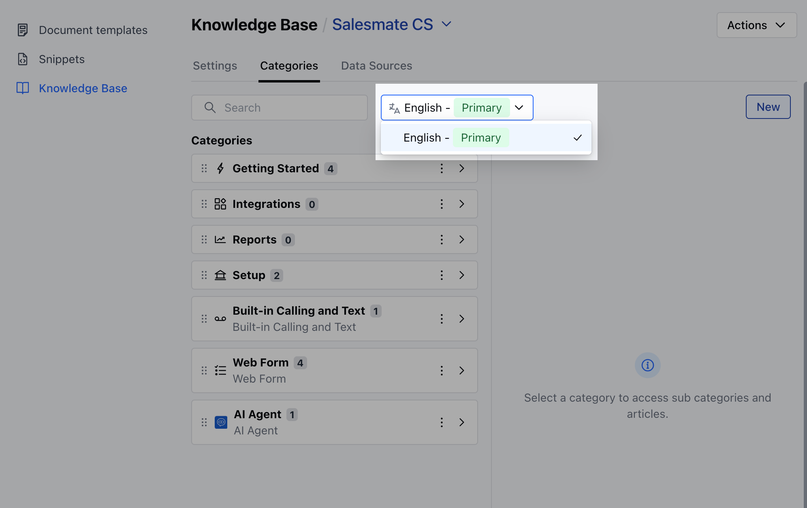

Creating a knowledge base is essential to organizing and managing articles efficiently for internal or external users. By setting up a knowledge base, you can customize the appearance, organize articles by categories, and set up multi-lingual support.

### Topics Covered

* [Steps to Set Up Knowledge Base](https://support.salesmate.io/hc/en-us/articles/44523545166489-Create-and-Organize-Knowledge-Base#h_01JS2WM3HAR5JEMJ5E1JWF34HQ)

* [Adding a Second Knowledge Base](https://support.salesmate.io/hc/en-us/articles/44523545166489-Create-and-Organize-Knowledge-Base#h_01JS2WM3HA96GPCSD27879JF1P)

### Steps to Set Up Knowledge Base

* * Navigate to**Setup**from the profile icon * Click on**Library*** Select**Knowledge Base**

* If there is no knowledge base created, you will land on the knowledge base’s landing page.

* If there’s an existing knowledge base, [follow the steps](https://support.salesmate.io/hc/en-us/articles/44523545166489-Create-and-Organize-Knowledge-Base#h_01JS2WM3HA96GPCSD27879JF1P) to proceed further.

### Create Knowledge Base

* **Click on the “** Setup Knowledge Base ” button.

***Enter Details in the Knowledge Base Creation Wizard*****Knowledge Base Title:**Enter a unique name for the knowledge base visible within the system and to external visitors. ***Brand:**Select a brand associated with the knowledge base. The style, theme, and colors will be copied from the brand guide. ***Primary Language:**Select the primary/default language for the knowledge base. Default: English. ***Favicon:**Upload an optional favicon for the knowledge base. The favicon will be displayed when the knowledge base URL is shared. ***Internationalization:**If you want to support multiple languages, enable internationalization and add the languages you plan to support. This will allow article translations in the selected languages.

* * Once you've entered the details, click the**Next**button to move to the next step.**Organize Articles with Categories*** * You can organize your articles using predefined categories like**Getting Started, FAQs, Troubleshooting, General**, and others. * Categories are displayed in the selected primary language, and their translated labels will be automatically created for added languages.

* * Click on the**Save**button to create the knowledge base. On success, an alert message will appear: “**Your knowledge base is ready. Start adding your articles!**”

* The knowledge base will be created with a default layout and colors. You can customize it further in the knowledge base settings.

* **After the knowledge base is set up, click the “** Create Your First Article ” button to start adding articles.

<Note>
**Note:**You need to**manage Knowledge Base**permissions to do this. If you don’t have it, the button will be disabled and show a message: “You don’t have permission to perform this action. Please contact your admin." [Learn more](https://support.salesmate.io/hc/en-us/articles/44391129991449)

</Note>

### Adding a Second Knowledge Base

***From the Article Listing Screen*** Click on the**Knowledge Base Title**at the top and then select**Add New Knowledge Base**.

***From the Setup Screen*** Go to**Setup*** Click on**Library*** Select**Knowledge Base*** Click on the**Knowledge Base Title dropdown**and select**Add New Knowledge Base**.

