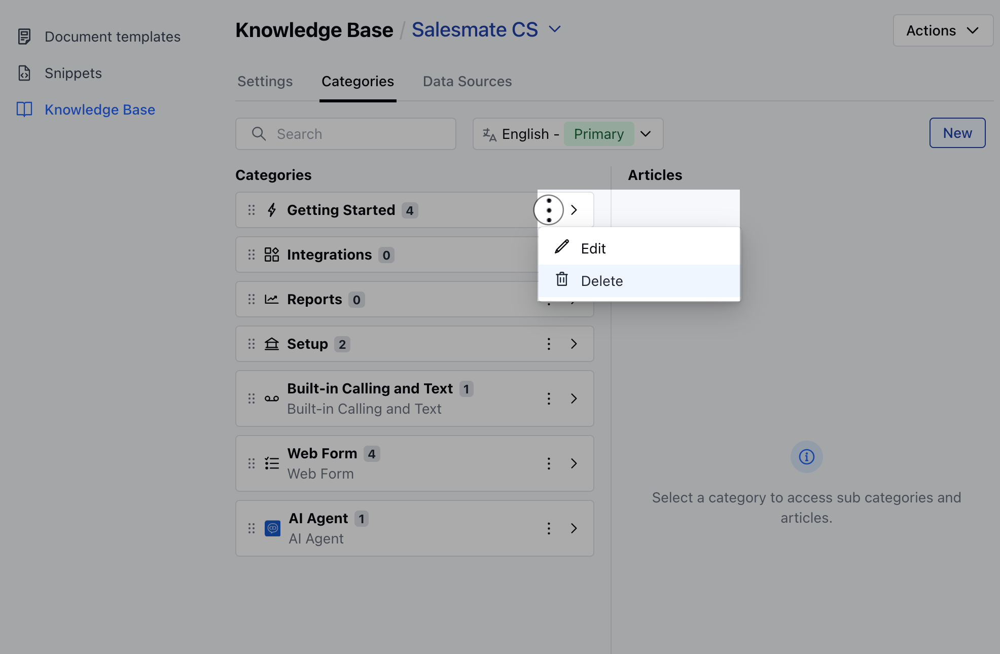

Deleting a category helps keep your knowledge base clear and organized by removing outdated or unnecessary sections. This ensures users can easily find accurate, up-to-date information without being distracted by irrelevant content.

<Note>

**Note:** You need **Organize Categories** permission to perform any action on categories.

</Note>

To Delete the Category,

- **Navigate to the** Profile Icon from the top right corner.

- **Click on the** Set Up

- Headover to the **Library** category

- **Select the** Knowledge Base option

- **Click on the** Categories tab

- **Select the category you want to delete, click the three-dot menu, and choose the** Delete option.

- Confirm the Delete action

- **A confirmation message saying** Deleted Successfully will appear upon successful deletion.

<Note>

**Note:** If the category contains articles or subcategories with articles, an error message will appear.

- Deleting a category will also remove any empty subcategories it contains.

- When you delete a category, all its translations will be deleted as well.

</Note>
