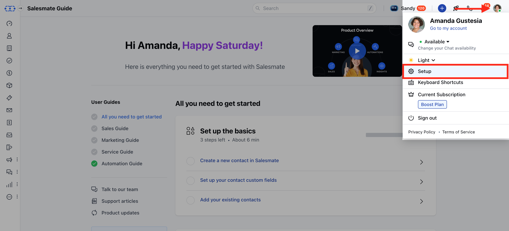
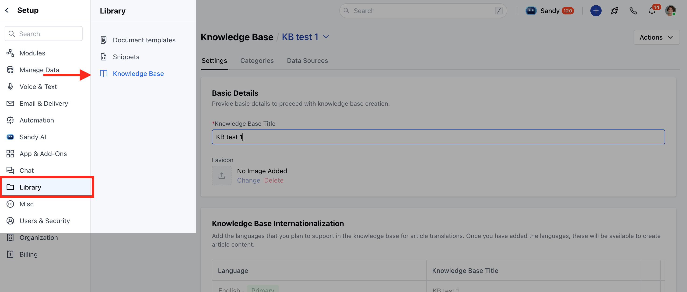
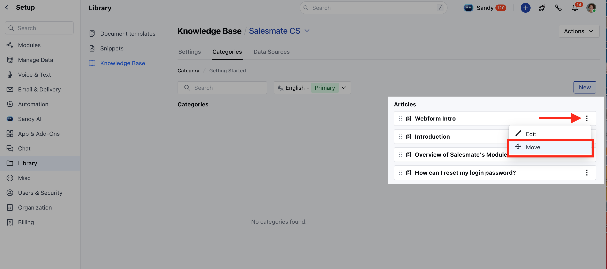
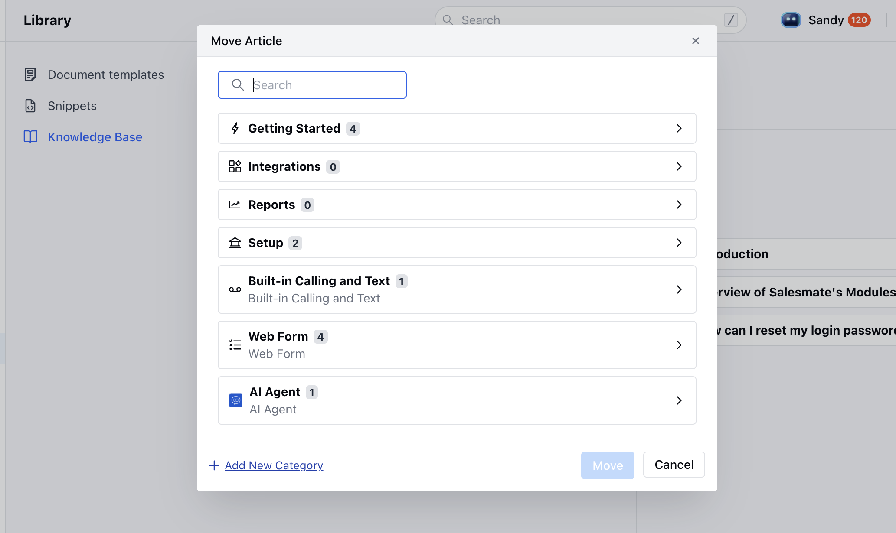

As your knowledge base grows, you might want to reorganize it to keep things easy to navigate. You may find that some articles would fit better in a different category. Salesmate makes it simple to move articles from one category to another.

<Note>

**Note:** You need **Edit Articles** and **Organize Categories** permissions to move articles or reorder categories.
- [Learn More](https://support.salesmate.io/hc/en-us/articles/44391129991449)

</Note>

###  How to Move Articles

- **Navigate to the** Profile Icon from the top right corner.

- **Click on the** Setup **

- ** Headover to the ** Library** category

- **Select the** Knowledge Base option

- **Click on the** Categories tab

- **Open any category and locate the article you want to move. Click the three dots next to it and select** Move .

- **A** Move Article popup will appear, showing the article’s current category path.

- Click on the path to search for or browse the category where you’d like to move the article.

- **On success, the article moves to the new category with an** Updated successfully message.

- Salesmate offers several flexible options to move articles between categories:

[**From the Article List:**](https://support.salesmate.io/hc/en-us/articles/Retrieving%20data.%20Wait%20a%20few%20seconds%20and%20try%20to%20cut%20or%20copy%20again.)
Use quick actions directly in the article listing view. _
[**Bulk Update:**](https://support.salesmate.io/hc/en-us/articles/44524733757977)
Select multiple articles and change their category in one go. _
[**From the Article Detail Page:**](https://support.salesmate.io/hc/en-us/articles/Retrieving%20data.%20Wait%20a%20few%20seconds%20and%20try%20to%20cut%20or%20copy%20again.)
Move the article using options available in its detail view. *
[**By Editing the Article:**](https://support.salesmate.io/hc/en-us/articles/44524638853785)
Open the article editor and select a new category.
